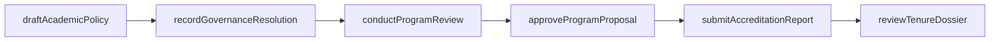
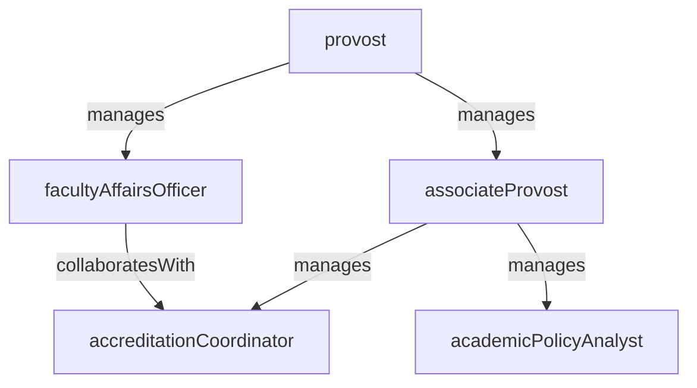

# Academic Affairs

> Business-as-Code definition for the Academic Affairs department. Models responsibilities, actions, events, and searches.

## Overview

Academic Affairs oversees faculty governance, program accreditation, tenure and promotion processes, and institutional academic policy. The office ensures academic quality and integrity across all programs, coordinating between faculty, administration, and external accrediting bodies.

## Responsibilities

| Responsibility | Description |
|---------------|-------------|
| governAcademicPolicy | Develop, review, and enforce academic policies including grading standards, academic integrity, and catalog requirements |
| manageAccreditation | Coordinate institutional and programmatic accreditation reviews, self-studies, and compliance reporting |
| administerTenureAndPromotion | Oversee the faculty tenure-track process including dossier review, committee deliberation, and provost recommendations |
| supportFacultyDevelopment | Provide professional development resources, sabbatical coordination, and teaching effectiveness programs |
| overseeAcademicPrograms | Review proposals for new programs, program modifications, and program discontinuations |

## Roles

| Role | Description |
|------|-------------|
| provost | Chief academic officer responsible for institutional academic strategy and policy |
| associateProvost | Supports the provost in managing accreditation, program review, and faculty affairs |
| accreditationCoordinator | Manages self-study documentation, site visit logistics, and ongoing compliance reporting |
| facultyAffairsOfficer | Administers tenure and promotion processes, faculty contracts, and grievance procedures |
| academicPolicyAnalyst | Researches policy benchmarks, drafts policy proposals, and tracks governance approvals |

## Entities

| Entity | Description |
|--------|-------------|
| AccreditationReport | A self-study or compliance document submitted to an accrediting body for review |
| TenureDossier | A faculty member's portfolio of teaching, research, and service submitted for tenure or promotion review |
| AcademicPolicy | A formal rule governing academic standards such as grading, academic standing, or course withdrawal |
| ProgramReview | A periodic evaluation of an academic program's quality, outcomes, and resource adequacy |
| FacultyAppointment | A record of a faculty member's rank, department, contract terms, and tenure status |
| GovernanceResolution | A formal decision or recommendation from a faculty senate or academic governance committee |

## Actions

| Action | Description |
|--------|-------------|
| submitAccreditationReport | Compile and file a self-study or compliance report with the relevant accrediting body |
| reviewTenureDossier | Evaluate a faculty member's dossier and record a committee recommendation for tenure or promotion |
| draftAcademicPolicy | Author a new or revised academic policy for governance committee review and approval |
| conductProgramReview | Initiate and manage a periodic review of an academic program's effectiveness and outcomes |
| approveProgramProposal | Review and approve a proposal for a new academic program, concentration, or certificate |
| recordGovernanceResolution | Document and publish a formal decision from a faculty governance body |

## Events

| Event | Description |
|-------|-------------|
| accreditationReportSubmitted | A self-study or compliance report was filed with the accrediting body |
| tenureDossierReviewed | A tenure or promotion dossier was evaluated and a committee recommendation was recorded |
| academicPolicyApproved | A new or revised academic policy was approved by the governance body |
| programReviewCompleted | A periodic program review was finalized with findings and recommendations |
| programProposalApproved | A new academic program, concentration, or certificate was formally approved |
| governanceResolutionRecorded | A faculty governance resolution was documented and distributed |

## Searches

| Search | Description |
|--------|-------------|
| findPendingAccreditationActions | Retrieve accreditation reports or responses with upcoming deadlines |
| listTenureCandidatesByStatus | Query faculty members in the tenure pipeline filtered by review stage |
| searchAcademicPolicies | Find academic policies by keyword, category, or effective date |
| getUpcomingProgramReviews | List academic programs scheduled for periodic review in a given cycle |
| findGovernanceResolutions | Retrieve governance resolutions by committee, date range, or topic |

## Workflow



## Actor Relationships



## Related Processes

| Process | APQC ID | Relationship |
|---------|---------|-------------|
| Manage Customer Service | 5.1 | Academic Affairs serves faculty and departments as internal clients for policy and accreditation support |
| Develop and Manage Products and Services | 5.2 | Program review and approval directly govern the institution's academic portfolio |

## Related Departments

| Department | Relationship |
|-----------|-------------|
| Curriculum Development | Collaborates on course and program design that must align with accreditation standards |
| Registrar | Implements academic policies governing registration, grading, and degree requirements |
| Human Resources | Partners on faculty hiring, contracts, and tenure-related employment actions |

## Usage

```typescript
import { db } from '@headlessly/db'

const dept = await db.departments.get('academicAffairs')
const pendingAccreditation = await db.departments.search('findPendingAccreditationActions', { dueBefore: '2026-06-01' })
const tenureCandidates = await db.departments.search('listTenureCandidatesByStatus', { stage: 'committeeReview' })
```
