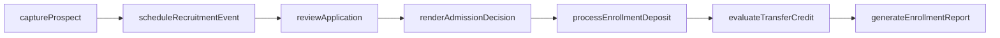
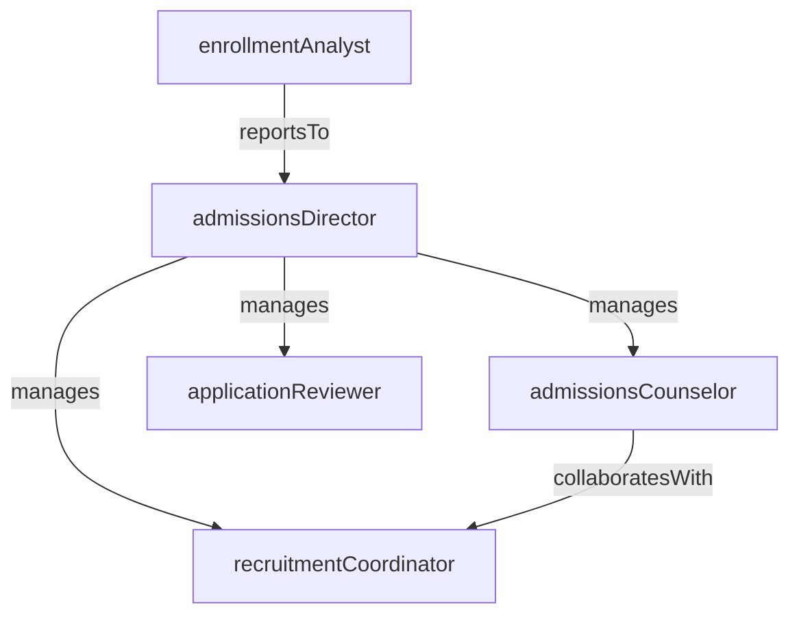

# Admissions

> Business-as-Code definition for the Admissions department. Models responsibilities, actions, events, and searches.

## Overview

Admissions manages the full student recruitment and enrollment pipeline, from prospect outreach through application review, decision notification, and enrollment confirmation. The department balances institutional enrollment targets with academic selectivity standards to shape each incoming class.

## Responsibilities

| Responsibility | Description |
|---------------|-------------|
| manageRecruitment | Plan and execute outreach campaigns, campus visits, and recruitment events to attract prospective students |
| reviewApplications | Evaluate applications including transcripts, essays, test scores, and recommendations against admission criteria |
| administerEnrollmentTargets | Monitor application volume, yield rates, and class composition to meet institutional enrollment goals |
| processEnrollmentDeposits | Collect and track enrollment deposits to confirm admitted students' intent to enroll |
| coordinateTransferAdmissions | Evaluate transfer credit and articulation agreements for students from other institutions |

## Roles

| Role | Description |
|------|-------------|
| admissionsDirector | Sets recruitment strategy, enrollment targets, and oversees the admissions team |
| admissionsCounselor | Guides prospective students through the application process and represents the institution at events |
| applicationReviewer | Evaluates submitted applications against published admission criteria and rubrics |
| recruitmentCoordinator | Plans campus tours, information sessions, and outreach events for prospective students |
| enrollmentAnalyst | Analyzes application funnel metrics, yield rates, and demographic data to inform strategy |

## Entities

| Entity | Description |
|--------|-------------|
| Application | A prospective student's formal submission including transcripts, essays, and supporting documents |
| ProspectProfile | Contact and interest data for a prospective student in the recruitment pipeline |
| AdmissionDecision | The official determination (admit, deny, waitlist, defer) for an application |
| EnrollmentDeposit | A financial commitment from an admitted student confirming intent to enroll |
| RecruitmentEvent | A campus visit, information session, college fair, or virtual event for prospective students |
| TransferEvaluation | An assessment of transfer credits from another institution against degree requirements |

## Actions

| Action | Description |
|--------|-------------|
| captureProspect | Record a new prospective student's contact information and academic interests |
| reviewApplication | Evaluate a submitted application against admission criteria and assign a recommendation |
| renderAdmissionDecision | Issue an admit, deny, waitlist, or deferral decision for a completed application |
| processEnrollmentDeposit | Record and confirm an admitted student's enrollment deposit |
| evaluateTransferCredit | Assess transfer coursework for equivalency and applicability to degree requirements |
| scheduleRecruitmentEvent | Create and publish a campus visit, open house, or information session |
| generateEnrollmentReport | Compile application volume, yield, and class composition metrics into a report |

## Events

| Event | Description |
|-------|-------------|
| prospectCaptured | A new prospective student record was created in the recruitment system |
| applicationSubmitted | A prospective student completed and submitted their application |
| applicationReviewed | An application reviewer completed their evaluation and recorded a recommendation |
| admissionDecisionRendered | An official admission decision was issued for an application |
| enrollmentDepositReceived | An admitted student submitted their enrollment deposit |
| transferCreditEvaluated | Transfer coursework was assessed and equivalencies were recorded |
| recruitmentEventScheduled | A new recruitment event was created and published to the calendar |

## Searches

| Search | Description |
|--------|-------------|
| findApplicationsByStatus | Retrieve applications filtered by decision status (pending, admitted, denied, waitlisted) |
| searchProspectsByRegion | List prospective students by geographic region or high school |
| getYieldMetrics | Query enrollment deposit rates by admission cycle, program, or demographic cohort |
| findPendingTransferEvaluations | Retrieve transfer credit evaluations awaiting review |
| listUpcomingRecruitmentEvents | List scheduled recruitment events by date range and type |

## Workflow



## Actor Relationships



## Related Processes

| Process | APQC ID | Relationship |
|---------|---------|-------------|
| Manage Customer Service | 5.1 | Admissions serves as the primary service interface for prospective students and families |
| Develop and Manage Products and Services | 5.2 | Enrollment data informs program development and capacity planning |

## Related Departments

| Department | Relationship |
|-----------|-------------|
| Registrar | Receives enrolled students for course registration and academic record creation |
| Financial Aid | Coordinates aid packages that influence admitted students' enrollment decisions |
| Student Services | Provides orientation and support services for newly enrolled students |

## Usage

```typescript
import { db } from '@headlessly/db'

const dept = await db.departments.get('admissions')
const pendingApps = await db.departments.search('findApplicationsByStatus', { status: 'pending' })
const yieldData = await db.departments.search('getYieldMetrics', { cycle: '2026-fall' })
```
