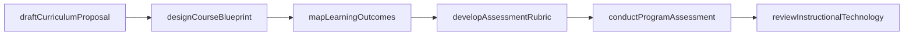
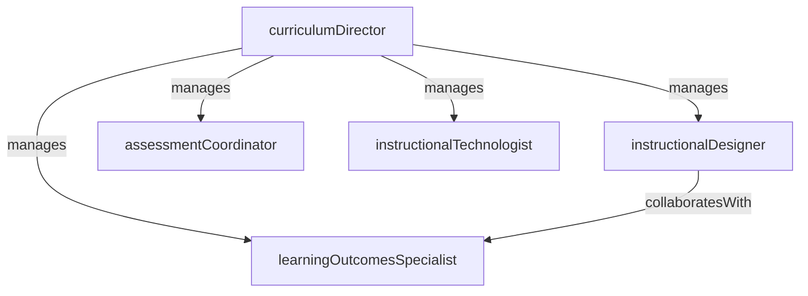

# Curriculum Development

> Business-as-Code definition for the Curriculum Development department. Models responsibilities, actions, events, and searches.

## Overview

Curriculum Development designs, reviews, and maintains the institution's academic offerings, ensuring courses and programs align with learning outcomes, accreditation standards, and workforce needs. The department partners with faculty to create syllabi, integrate instructional technology, and conduct program-level assessments.

## Responsibilities

| Responsibility | Description |
|---------------|-------------|
| designCourses | Collaborate with faculty to create new course proposals including learning outcomes, assessments, and instructional strategies |
| alignLearningOutcomes | Map course and program objectives to institutional learning outcomes and accreditation competencies |
| integrateInstructionalTechnology | Evaluate and deploy learning management systems, digital tools, and multimedia resources to enhance instruction |
| conductProgramAssessment | Collect and analyze student learning data to evaluate program effectiveness and inform improvements |
| manageCurriculumProposals | Shepherd new course and program proposals through faculty governance and approval workflows |

## Roles

| Role | Description |
|------|-------------|
| curriculumDirector | Leads the curriculum office, sets design standards, and coordinates with academic governance |
| instructionalDesigner | Partners with faculty to develop course materials, assessments, and learning activities |
| learningOutcomesSpecialist | Maps and maintains alignment between course objectives, program outcomes, and accreditation standards |
| assessmentCoordinator | Designs assessment instruments, collects learning data, and produces program-level effectiveness reports |
| instructionalTechnologist | Evaluates, configures, and supports learning management systems and educational technology tools |

## Entities

| Entity | Description |
|--------|-------------|
| CurriculumProposal | A formal request to create, modify, or discontinue a course or academic program |
| CourseDesign | The structured blueprint of a course including objectives, assessments, schedule, and instructional methods |
| LearningOutcome | A measurable statement of what students should know or be able to do upon completing a course or program |
| AssessmentRubric | A scoring guide used to evaluate student work against defined learning outcome criteria |
| ProgramAssessmentReport | A periodic analysis of student achievement data measuring program-level learning effectiveness |

## Actions

| Action | Description |
|--------|-------------|
| draftCurriculumProposal | Author a new or revised course/program proposal for faculty governance review |
| designCourseBlueprint | Create a course structure with objectives, weekly topics, assessments, and instructional methods |
| mapLearningOutcomes | Align course objectives to program-level and institutional learning outcomes |
| developAssessmentRubric | Create a rubric to consistently evaluate student work against learning outcome criteria |
| conductProgramAssessment | Collect and analyze student achievement data to evaluate a program's learning effectiveness |
| reviewInstructionalTechnology | Evaluate an educational technology tool for adoption based on pedagogical fit and accessibility |

## Events

| Event | Description |
|-------|-------------|
| curriculumProposalDrafted | A new course or program proposal was authored and submitted for review |
| courseBlueprintDesigned | A course blueprint with objectives, assessments, and schedule was completed |
| learningOutcomesMapped | Course objectives were aligned to program and institutional learning outcomes |
| assessmentRubricDeveloped | A new rubric was created for evaluating student work against outcome criteria |
| programAssessmentConducted | A program-level learning effectiveness analysis was completed and reported |
| instructionalTechnologyReviewed | An educational technology tool was evaluated and a recommendation was issued |

## Searches

| Search | Description |
|--------|-------------|
| findProposalsByStatus | Retrieve curriculum proposals filtered by governance stage (draft, submitted, approved, returned) |
| searchCourseDesigns | Find course blueprints by department, modality, or design date |
| getLearningOutcomeAlignment | Query the mapping of course objectives to program and institutional outcomes |
| listAssessmentReports | Retrieve program assessment reports by program, cycle year, or finding category |
| findCoursesWithoutRubrics | Identify courses that lack published assessment rubrics |

## Workflow



## Actor Relationships



## Related Processes

| Process | APQC ID | Relationship |
|---------|---------|-------------|
| Develop and Manage Products and Services | 5.2 | Courses and programs are the institution's core product, developed and maintained by this department |
| Manage Customer Service | 5.1 | Faculty are internal clients served by the curriculum office during course design and revision |

## Related Departments

| Department | Relationship |
|-----------|-------------|
| Academic Affairs | Curriculum proposals require governance approval managed by Academic Affairs |
| Registrar | Approved courses are added to the catalog and master schedule by the Registrar |
| Student Services | Assessment data on student outcomes informs co-curricular support programming |

## Usage

```typescript
import { db } from '@headlessly/db'

const dept = await db.departments.get('curriculumDevelopment')
const pendingProposals = await db.departments.search('findProposalsByStatus', { status: 'submitted' })
const alignmentMap = await db.departments.search('getLearningOutcomeAlignment', { program: 'computerScience' })
```
