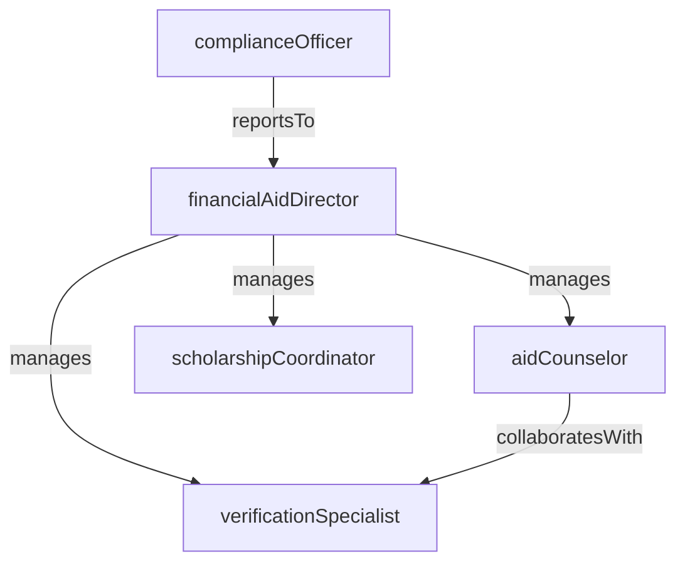

# Financial Aid

> Business-as-Code definition for the Financial Aid department. Models responsibilities, actions, events, and searches.

## Overview

Financial Aid administers federal, state, and institutional aid programs including grants, scholarships, loans, and work-study. The department processes FAFSA applications, packages award offers, monitors satisfactory academic progress, and ensures compliance with Title IV regulations.

## Responsibilities

| Responsibility | Description |
|---------------|-------------|
| processFafsaApplications | Receive, verify, and process Free Application for Federal Student Aid submissions each cycle |
| packageAwardOffers | Assemble financial aid packages combining grants, scholarships, loans, and work-study for each student |
| administerScholarships | Manage institutional and donor-funded scholarship selection, awarding, and renewal criteria |
| monitorSatisfactoryAcademicProgress | Track enrolled students' GPA and credit completion to ensure continued aid eligibility |
| ensureTitleIvCompliance | Maintain compliance with federal Title IV regulations including return-of-funds calculations and audit requirements |

## Roles

| Role | Description |
|------|-------------|
| financialAidDirector | Oversees all aid programs, sets packaging policy, and manages federal compliance obligations |
| aidCounselor | Advises students and families on aid eligibility, application procedures, and award details |
| verificationSpecialist | Reviews selected FAFSA applications for accuracy by collecting and validating supporting documents |
| scholarshipCoordinator | Manages scholarship funds, selection committees, award notifications, and renewal tracking |
| complianceOfficer | Monitors federal and state regulatory requirements and prepares audit documentation |

## Entities

| Entity | Description |
|--------|-------------|
| FafsaApplication | A student's completed Free Application for Federal Student Aid for an award year |
| AwardPackage | The combined financial aid offer including grants, scholarships, loans, and work-study for a student |
| ScholarshipFund | An institutional or donor-funded award with defined eligibility criteria and disbursement rules |
| SatisfactoryAcademicProgressReport | A periodic evaluation of a student's GPA and credit completion against aid eligibility thresholds |
| DisbursementRecord | A record of financial aid funds released to a student's account for a given term |
| VerificationWorksheet | A document collection checklist used to validate FAFSA data for selected applicants |

## Actions

| Action | Description |
|--------|-------------|
| processFafsaSubmission | Receive and load a student's FAFSA data into the aid system for evaluation |
| verifyApplication | Collect supporting documents and validate FAFSA data for a selected application |
| packageAward | Assemble and present a financial aid offer based on need analysis and available funds |
| awardScholarship | Select a student for a scholarship and record the award amount and conditions |
| disburseFunds | Release approved aid funds to the student's institutional account for the term |
| evaluateAcademicProgress | Assess a student's GPA and credit hours against satisfactory academic progress standards |
| processReturnOfFunds | Calculate and return unearned federal aid when a student withdraws before the term ends |

## Events

| Event | Description |
|-------|-------------|
| fafsaSubmissionProcessed | A FAFSA application was received and loaded into the aid system |
| applicationVerified | A selected FAFSA application passed document verification |
| awardPackaged | A financial aid package was assembled and made available to the student |
| scholarshipAwarded | A student was selected for a scholarship and the award was recorded |
| fundsDisbursed | Financial aid was released to the student's account for the term |
| academicProgressEvaluated | A satisfactory academic progress review was completed for a student |
| returnOfFundsProcessed | Unearned federal aid was calculated and returned after a student withdrawal |

## Searches

| Search | Description |
|--------|-------------|
| findUnverifiedApplications | Retrieve FAFSA applications selected for verification that have not been completed |
| searchAwardPackagesByStatus | List award packages by status (pending, accepted, revised, declined) |
| getScholarshipRecipients | Query students awarded a specific scholarship fund by year |
| findStudentsOnAidWarning | Identify students whose academic progress has triggered a financial aid warning or suspension |
| listDisbursementsByTerm | Retrieve all disbursement records for a given term and fund source |

## Workflow


## Actor Relationships



## Related Processes

| Process | APQC ID | Relationship |
|---------|---------|-------------|
| Manage Customer Service | 5.1 | Financial Aid counselors serve students and families navigating the aid application and award process |
| Develop and Manage Products and Services | 5.2 | Aid packaging policies and scholarship programs are designed to support enrollment and retention goals |

## Related Departments

| Department | Relationship |
|-----------|-------------|
| Student Admissions | Award packages influence admitted students' enrollment decisions and yield rates |
| Registrar | Enrollment status and credit load determine aid eligibility and disbursement timing |
| Student Services | Housing and meal plan costs factor into cost-of-attendance calculations for aid packaging |

## Usage

```typescript
import { db } from '@headlessly/db'

const dept = await db.departments.get('financialAid')
const unverified = await db.departments.search('findUnverifiedApplications', { awardYear: '2026-2027' })
const warnings = await db.departments.search('findStudentsOnAidWarning', { status: 'warning' })
```
