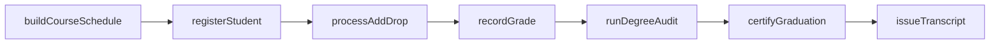
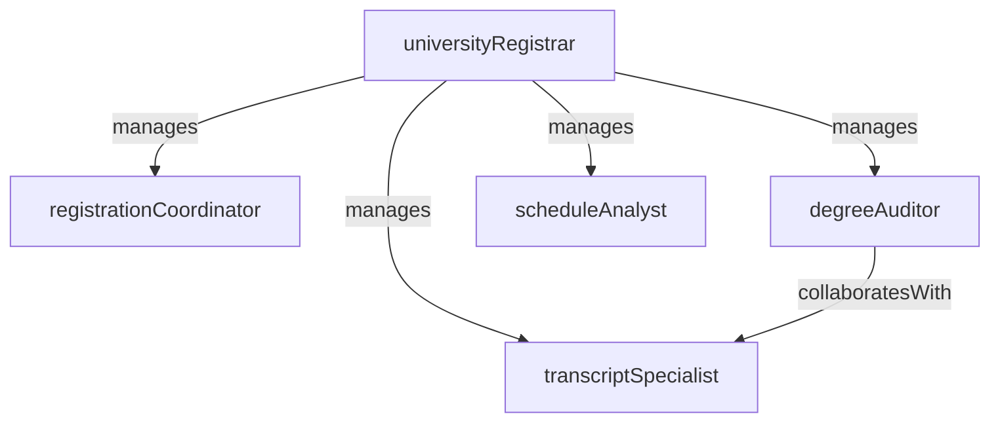

# Registrar

> Business-as-Code definition for the Registrar department. Models responsibilities, actions, events, and searches.

## Overview

The Registrar maintains the official academic record system, manages course registration and scheduling, performs degree audits, certifies graduates, and issues transcripts. The office serves as the authoritative source for student enrollment status and academic history.

## Responsibilities

| Responsibility | Description |
|---------------|-------------|
| manageCourseRegistration | Operate the registration system including add/drop periods, waitlists, and enrollment caps |
| maintainAcademicRecords | Serve as the official custodian of student transcripts, grades, and enrollment history |
| performDegreeAudits | Evaluate student progress against degree requirements and certify completion |
| administerClassSchedule | Build and publish the master course schedule each term in coordination with academic departments |
| certifyCommencement | Verify degree completion and process graduation clearance for eligible students |
| manageFerpaCompliance | Ensure student record access, disclosure, and privacy comply with FERPA regulations |

## Roles

| Role | Description |
|------|-------------|
| universityRegistrar | Leads the office and sets policy for academic records, registration, and degree certification |
| registrationCoordinator | Manages the course registration process, resolves enrollment conflicts, and maintains waitlists |
| transcriptSpecialist | Processes transcript requests, verifies academic records, and issues official documents |
| degreeAuditor | Reviews student academic progress against catalog requirements and certifies degree completion |
| scheduleAnalyst | Builds the master course schedule, manages room assignments, and resolves time conflicts |

## Entities

| Entity | Description |
|--------|-------------|
| CourseSection | A scheduled instance of a course with instructor, room, time, and enrollment cap |
| Transcript | The official academic record of a student's coursework, grades, and credits earned |
| DegreeAudit | A structured comparison of a student's completed coursework against degree requirements |
| EnrollmentRecord | A student's registration in a specific course section for a given term |
| AcademicCalendar | The institution's schedule of terms, registration periods, deadlines, and commencement dates |
| GraduationApplication | A student's formal request for degree conferral review and commencement participation |

## Actions

| Action | Description |
|--------|-------------|
| registerStudent | Enroll a student in a course section for the current or upcoming term |
| processAddDrop | Handle a student's request to add or drop a course during the adjustment period |
| runDegreeAudit | Evaluate a student's transcript against their declared degree requirements |
| issueTranscript | Generate and release an official or unofficial transcript to the student or a third party |
| buildCourseSchedule | Assemble the master schedule of course sections, times, rooms, and instructors for a term |
| certifyGraduation | Verify degree completion and approve a student for commencement and diploma issuance |
| recordGrade | Post a final grade submitted by an instructor to a student's permanent academic record |

## Events

| Event | Description |
|-------|-------------|
| studentRegistered | A student was successfully enrolled in a course section |
| addDropProcessed | A course addition or drop was completed during the adjustment period |
| degreeAuditCompleted | A degree audit was run and the results were recorded for a student |
| transcriptIssued | An official transcript was generated and delivered to the requestor |
| courseSchedulePublished | The master course schedule for an upcoming term was finalized and released |
| graduationCertified | A student was cleared for degree conferral and commencement participation |
| gradeRecorded | A final course grade was posted to a student's academic record |

## Searches

| Search | Description |
|--------|-------------|
| findStudentsByEnrollmentStatus | Retrieve students by registration status (full-time, part-time, withdrawn, on leave) |
| getCourseSectionAvailability | Query open seats and waitlist counts for course sections by term |
| searchTranscriptRequests | List pending and completed transcript requests filtered by date or status |
| findStudentsNearingCompletion | Identify students within a threshold of credits or requirements from degree completion |
| listGradeSubmissionStatus | Show which instructors have submitted or are pending final grade entry for a term |

## Workflow



## Actor Relationships



## Related Processes

| Process | APQC ID | Relationship |
|---------|---------|-------------|
| Manage Customer Service | 5.1 | The registrar serves students and faculty as the central records and registration service |
| Develop and Manage Products and Services | 5.2 | Course schedule data feeds program planning and capacity management |

## Related Departments

| Department | Relationship |
|-----------|-------------|
| Admissions | Receives newly enrolled students and creates their initial academic records |
| Academic Affairs | Enforces academic policies governing registration, grading, and degree requirements |
| Financial Aid | Enrollment status changes affect financial aid eligibility and disbursement |
| Curriculum Development | New or revised courses require catalog updates and schedule integration |

## Usage

```typescript
import { db } from '@headlessly/db'

const dept = await db.departments.get('registrar')
const openSections = await db.departments.search('getCourseSectionAvailability', { term: '2026-fall' })
const nearGrad = await db.departments.search('findStudentsNearingCompletion', { creditsRemaining: 15 })
```
