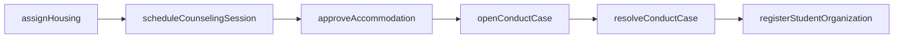
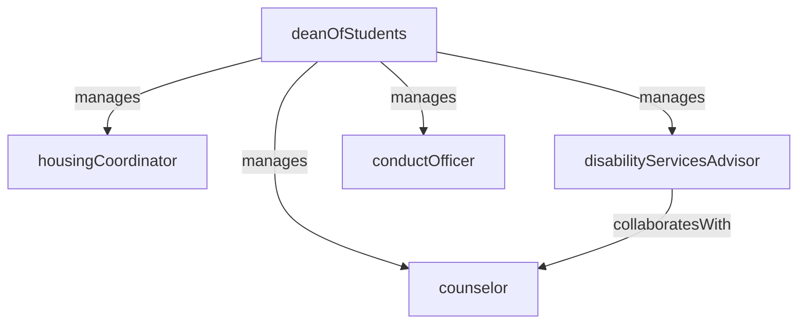

# Student Services

> Business-as-Code definition for the Student Services department. Models responsibilities, actions, events, and searches.

## Overview

Student Services supports student well-being and success outside the classroom, encompassing housing assignments, counseling, disability accommodations, student conduct adjudication, and campus life programming. The department ensures students have the non-academic resources they need to persist and thrive.

## Responsibilities

| Responsibility | Description |
|---------------|-------------|
| administerStudentHousing | Manage residence hall assignments, roommate matching, and housing contracts |
| provideCounselingServices | Offer mental health counseling, crisis intervention, and wellness programming to students |
| coordinateDisabilityAccommodations | Process accommodation requests, verify documentation, and notify instructors of approved adjustments |
| adjudicateStudentConduct | Investigate alleged conduct violations, convene hearings, and issue sanctions per the student code |
| programCampusLife | Plan orientation, student organization support, leadership development, and co-curricular events |

## Roles

| Role | Description |
|------|-------------|
| deanOfStudents | Senior administrator overseeing student welfare, conduct, and the student services portfolio |
| housingCoordinator | Manages residence assignments, housing contracts, and facilities coordination for student housing |
| counselor | Licensed professional providing individual and group counseling and crisis support to students |
| disabilityServicesAdvisor | Reviews accommodation requests, verifies eligibility, and coordinates adjustments with faculty |
| conductOfficer | Investigates conduct complaints, facilitates hearings, and administers the student conduct process |

## Entities

| Entity | Description |
|--------|-------------|
| HousingAssignment | A student's assigned residence hall, room, and meal plan for a given term |
| CounselingAppointment | A scheduled session between a student and a licensed counselor |
| AccommodationPlan | An approved set of academic adjustments for a student with a documented disability |
| ConductCase | A formal record of an alleged student code of conduct violation and its resolution |
| StudentOrganization | A registered campus club, society, or student government group |

## Actions

| Action | Description |
|--------|-------------|
| assignHousing | Place a student in a residence hall and room based on preferences and availability |
| scheduleCounselingSession | Book a counseling appointment for a student with an available counselor |
| approveAccommodation | Review disability documentation and issue an approved accommodation plan |
| openConductCase | Create a formal conduct case for an alleged student code of conduct violation |
| resolveConductCase | Record the outcome, sanctions, and appeal status for a conduct case |
| registerStudentOrganization | Approve a new student organization's charter, advisor, and constitution |

## Events

| Event | Description |
|-------|-------------|
| housingAssigned | A student was placed in a residence hall room for the upcoming term |
| counselingSessionScheduled | A counseling appointment was booked and the student was notified |
| accommodationApproved | A disability accommodation plan was approved and sent to instructors |
| conductCaseOpened | A new student conduct case was created and the respondent was notified |
| conductCaseResolved | A conduct case was adjudicated and the outcome was recorded |
| studentOrganizationRegistered | A new student organization was officially recognized and activated |

## Searches

| Search | Description |
|--------|-------------|
| findAvailableHousing | Query open rooms by residence hall, room type, or term |
| listCounselingAppointments | Retrieve upcoming and past counseling sessions for a student or counselor |
| searchAccommodationPlans | Find active accommodation plans by disability category or student |
| findOpenConductCases | Retrieve conduct cases pending investigation or hearing |
| listStudentOrganizations | Browse registered student organizations by category or status |

## Workflow



## Actor Relationships



## Related Processes

| Process | APQC ID | Relationship |
|---------|---------|-------------|
| Manage Customer Service | 5.1 | Student Services functions as the primary student support and case management operation |
| Develop and Manage Products and Services | 5.2 | Student feedback and utilization data inform programming and resource allocation |

## Related Departments

| Department | Relationship |
|-----------|-------------|
| Student Admissions | Transitions newly enrolled students into orientation and housing placement |
| Registrar | Enrollment status changes trigger housing eligibility and accommodation notification updates |
| Financial Aid | Housing costs and meal plans factor into financial aid cost-of-attendance calculations |
| Academic Affairs | Conduct sanctions may affect academic standing and require policy coordination |

## Usage

```typescript
import { db } from '@headlessly/db'

const dept = await db.departments.get('studentServices')
const openRooms = await db.departments.search('findAvailableHousing', { term: '2026-fall', roomType: 'single' })
const conductCases = await db.departments.search('findOpenConductCases', { status: 'pendingHearing' })
```
