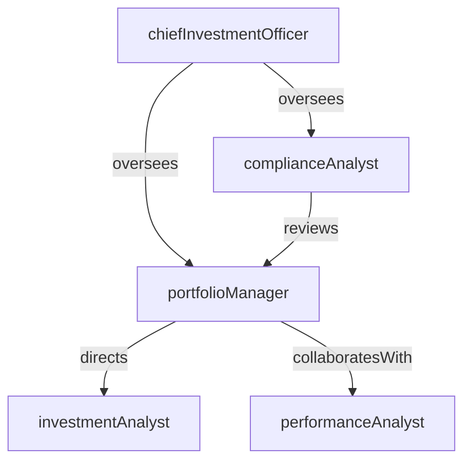

# Asset Management

> Business-as-Code definition for the Asset Management department. Models responsibilities, actions, events, and searches.

## Overview

Asset Management constructs and manages investment portfolios across equities, fixed income, alternatives, and multi-asset strategies for institutional and retail clients. The department conducts security selection, portfolio construction, risk budgeting, and performance attribution while adhering to investment policy guidelines and fiduciary standards.

## Responsibilities

| Responsibility | Description |
|---------------|-------------|
| constructPortfolios | Build diversified portfolios aligned with client investment objectives and risk tolerances |
| performSecurityAnalysis | Evaluate individual securities through fundamental, quantitative, and technical research |
| rebalanceAllocations | Adjust portfolio weights to maintain target asset allocation and risk budgets |
| monitorPortfolioPerformance | Track returns, benchmark comparisons, and attribution analytics for managed portfolios |
| ensureInvestmentCompliance | Verify all investment decisions comply with prospectus guidelines, IPS constraints, and regulations |

## Roles

| Role | Description |
|------|-------------|
| portfolioManager | Makes investment decisions and manages model portfolios for assigned strategies |
| investmentAnalyst | Conducts fundamental and quantitative research to generate investment recommendations |
| chiefInvestmentOfficer | Sets firm-wide investment philosophy, asset allocation strategy, and chairs the investment committee |
| complianceAnalyst | Monitors pre-trade and post-trade compliance with investment guidelines and regulatory requirements |
| performanceAnalyst | Calculates returns, performs attribution analysis, and produces client performance reports |

## Entities

| Entity | Description |
|--------|-------------|
| InvestmentPortfolio | A managed collection of securities held on behalf of a client or fund |
| InvestmentPolicy | A document specifying permissible asset classes, concentration limits, and benchmark targets |
| SecurityHolding | A position in a specific equity, bond, or alternative investment within a portfolio |
| BenchmarkIndex | A market index used to measure relative portfolio performance |
| PerformanceReport | A periodic report showing portfolio returns, attribution, and benchmark comparison |
| TradeRecommendation | An analyst's proposal to buy, sell, or hold a specific security with supporting rationale |

## Actions

| Action | Description |
|--------|-------------|
| analyzeSecurityFundamentals | Evaluate a security's financial health, valuation, and growth prospects |
| constructModelPortfolio | Build a target portfolio based on asset allocation, sector, and security selection |
| executeRebalance | Adjust portfolio holdings to realign with target weights and risk budgets |
| performAttributionAnalysis | Decompose portfolio returns into allocation, selection, and interaction effects |
| generatePerformanceReport | Produce client-facing reports showing returns, risk metrics, and benchmark comparisons |
| reviewInvestmentCompliance | Validate portfolio positions against investment policy and regulatory constraints |
| presentInvestmentThesis | Deliver security or market research findings to the investment committee |

## Events

| Event | Description |
|-------|-------------|
| securityFundamentalsAnalyzed | Research completed on a security's financial health and valuation |
| modelPortfolioConstructed | Target portfolio built with specified asset allocation and security selection |
| rebalanceExecuted | Portfolio holdings adjusted to realign with target weights |
| attributionAnalysisPerformed | Portfolio return decomposition completed for the reporting period |
| performanceReportGenerated | Client performance report produced and ready for distribution |
| investmentComplianceReviewed | Portfolio validated against investment policy constraints |
| investmentThesisPresented | Security or market research presented to the investment committee |

## Searches

| Search | Description |
|--------|-------------|
| getPortfolioHoldings | Retrieve current security positions for a specific portfolio |
| findPortfoliosByStrategy | List portfolios managed under a specific investment strategy |
| getPerformanceVsBenchmark | Compare portfolio returns against the assigned benchmark index |
| listDriftingPortfolios | Identify portfolios where asset allocation deviates beyond rebalance thresholds |
| searchSecurityCoverage | Find securities currently covered by investment analysts |
| getComplianceExceptions | Retrieve investment guideline violations for a specific portfolio or period |

## Workflow

```mermaid
graph LR
  analyzeSecurityFundamentals --> presentInvestmentThesis
  presentInvestmentThesis --> constructModelPortfolio
  constructModelPortfolio --> reviewInvestmentCompliance
  reviewInvestmentCompliance --> executeRebalance
  executeRebalance --> performAttributionAnalysis
  performAttributionAnalysis --> generatePerformanceReport
```



## Actor Relationships



## Related Processes

| Process | APQC ID | Relationship |
|---------|---------|-------------|
| Manage Debt and Investment | 9.7.5 | Governs investment transaction processing and portfolio accounting |
| Monitor and Execute Risk and Hedging Transactions | 9.7.6 | Provides risk management and hedging execution for portfolio positions |
| Manage Enterprise Risk | 11.4 | Aligns investment risk with enterprise risk appetite and tolerance |

## Related Departments

| Department | Relationship |
|-----------|-------------|
| Trading Desk | Executes buy and sell orders generated from portfolio rebalancing and investment decisions |
| Wealth Management | Delivers investment management services to high-net-worth client accounts |
| Trust Services | Provides investment management for trust and estate portfolios |
| Credit Risk | Assesses issuer credit quality for fixed income portfolio holdings |

## Usage

```typescript
import { db } from '@headlessly/db'

const am = await db.departments.get('assetManagement')
const drifting = await db.departments.search('listDriftingPortfolios', { threshold: 0.05 })
const performance = await db.departments.search('getPerformanceVsBenchmark', { portfolio: 'largeCap', period: '2025-Q4' })
```
