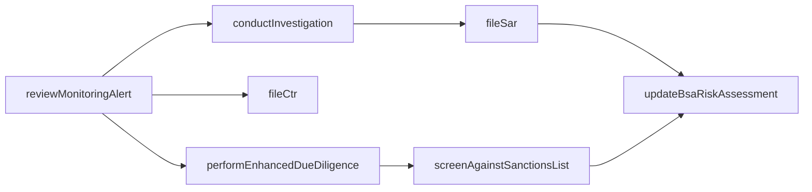
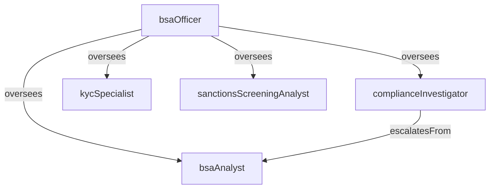

# BSA/AML Compliance

> Business-as-Code definition for the BSA/AML Compliance department. Models responsibilities, actions, events, and searches.

## Overview

BSA/AML Compliance administers the Bank Secrecy Act and anti-money laundering program including customer due diligence, transaction monitoring, suspicious activity reporting, and OFAC sanctions screening. The department safeguards the institution from financial crime risk and ensures regulatory compliance with FinCEN requirements.

## Responsibilities

| Responsibility | Description |
|---------------|-------------|
| performCustomerDueDiligence | Conduct know-your-customer reviews including identity verification and beneficial ownership identification |
| monitorTransactions | Operate automated transaction monitoring systems to detect unusual or suspicious patterns |
| investigateSuspiciousActivity | Analyze alerts, gather evidence, and determine whether activity warrants a SAR filing |
| fileRegulatoryReports | Prepare and submit SARs, CTRs, and other FinCEN-required reports within mandated timelines |
| screenSanctionedParties | Check customers, counterparties, and transactions against OFAC and other sanctions lists |
| maintainBsaProgram | Develop and update BSA/AML policies, procedures, risk assessments, and training materials |

## Roles

| Role | Description |
|------|-------------|
| bsaAnalyst | Reviews transaction monitoring alerts, documents investigations, and prepares SAR narratives |
| complianceInvestigator | Conducts in-depth investigations of complex or high-risk suspicious activity cases |
| bsaOfficer | Manages the BSA/AML program, oversees filings, and serves as the primary regulatory liaison |
| kycSpecialist | Performs customer due diligence reviews, enhanced due diligence, and ongoing monitoring |
| sanctionsScreeningAnalyst | Reviews OFAC and sanctions screening hits, determines true matches, and escalates blocked transactions |

## Entities

| Entity | Description |
|--------|-------------|
| SuspiciousActivityReport | A SAR filed with FinCEN documenting potentially suspicious financial activity |
| CurrencyTransactionReport | A CTR filed for cash transactions exceeding the $10,000 regulatory threshold |
| TransactionMonitoringAlert | An automated alert generated when transaction patterns exceed defined thresholds |
| CustomerRiskProfile | A risk assessment of a customer based on geography, product usage, and transaction behavior |
| SanctionsScreeningHit | A potential match against OFAC or other sanctions and watch lists |
| BsaRiskAssessment | An institution-wide assessment of BSA/AML risk across products, services, and customer segments |

## Actions

| Action | Description |
|--------|-------------|
| reviewMonitoringAlert | Analyze a transaction monitoring alert to determine if escalation to investigation is warranted |
| conductInvestigation | Gather evidence, interview relationship managers, and document findings for a suspicious activity case |
| fileSar | Prepare the SAR narrative and submit the report to FinCEN within the 30-day filing window |
| fileCtr | Generate and file a Currency Transaction Report for qualifying cash transactions |
| performEnhancedDueDiligence | Conduct deeper review of high-risk customers including source of funds and beneficial ownership |
| screenAgainstSanctionsList | Check customer or transaction data against OFAC SDN and other sanctions databases |
| updateBsaRiskAssessment | Revise the institution-wide BSA/AML risk assessment based on new products, geographies, or findings |

## Events

| Event | Description |
|-------|-------------|
| monitoringAlertReviewed | Transaction monitoring alert analyzed and dispositioned |
| investigationCompleted | Suspicious activity investigation concluded with documented findings |
| sarFiled | Suspicious Activity Report submitted to FinCEN |
| ctrFiled | Currency Transaction Report generated and filed with FinCEN |
| enhancedDueDiligenceCompleted | High-risk customer review finished with updated risk profile |
| sanctionsHitResolved | Sanctions screening match analyzed and cleared or escalated |
| bsaRiskAssessmentUpdated | Institution-wide BSA/AML risk assessment revised and published |

## Searches

| Search | Description |
|--------|-------------|
| findOpenAlerts | List unresolved transaction monitoring alerts awaiting analyst review |
| getInvestigationsByStatus | Retrieve suspicious activity investigations filtered by case status |
| listSarFilings | Query SAR filings by date range, subject, or filing status |
| searchHighRiskCustomers | Find customers with elevated risk profiles requiring enhanced monitoring |
| findPendingSanctionsHits | List unresolved sanctions screening matches awaiting disposition |
| getCtrFilingHistory | Retrieve Currency Transaction Reports filed for a specific customer |

## Workflow



## Actor Relationships



## Related Processes

| Process | APQC ID | Relationship |
|---------|---------|-------------|
| Screen Sanctioned Party List | 9.11.1 | Core process for sanctions screening of customers and transactions |
| Manage Internal Controls | 9.8 | Provides the internal controls framework for BSA/AML program governance |
| Manage Enterprise Risk | 11.4 | Financial crime risk is a key component of the enterprise risk framework |

## Related Departments

| Department | Relationship |
|-----------|-------------|
| Underwriting | Requires BSA/AML clearance before credit approval for new borrowers |
| Loan Servicing | Provides transaction data consumed by monitoring systems for suspicious activity detection |
| Credit Risk | Shares customer risk assessments that inform credit and compliance decisions |
| Regulatory Compliance | Coordinates on regulatory matters, examination responses, and SAR program oversight |

## Usage

```typescript
import { db } from '@headlessly/db'

const bsa = await db.departments.get('bsaAmlCompliance')
const alerts = await db.departments.search('findOpenAlerts', { priority: 'high' })
const sars = await db.departments.search('listSarFilings', { period: '2025-Q4' })
```
