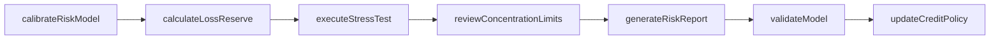
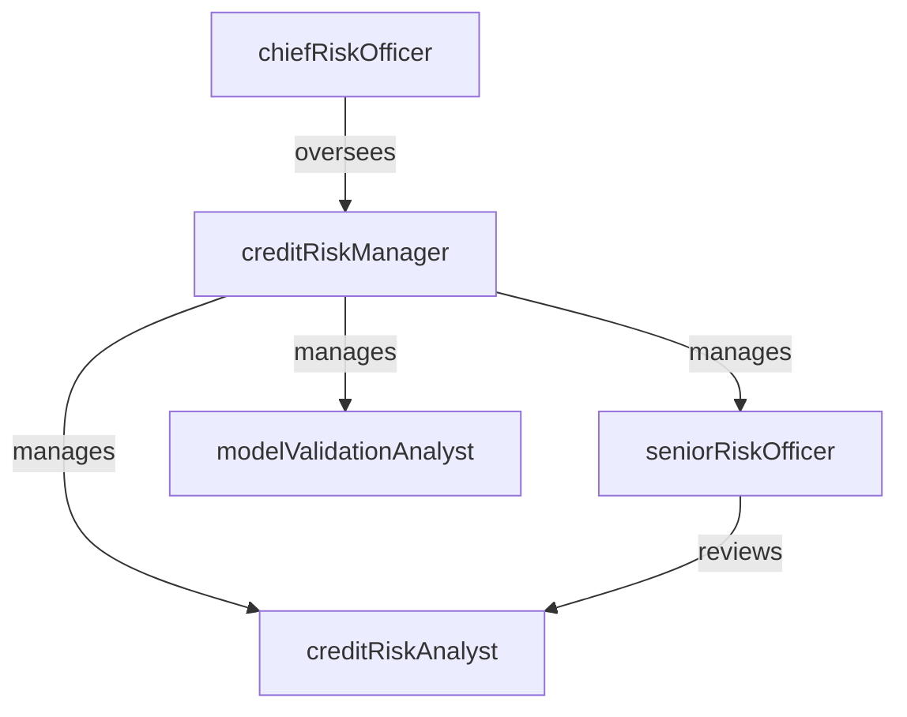

# Credit Risk

> Business-as-Code definition for the Credit Risk department. Models responsibilities, actions, events, and searches.

## Overview

Credit Risk manages portfolio-level credit exposure through risk modeling, loss reserving, stress testing, and credit policy governance. The department quantifies expected and unexpected losses across the lending portfolio and ensures the institution operates within approved risk appetite thresholds set by the board and regulators.

## Responsibilities

| Responsibility | Description |
|---------------|-------------|
| modelCreditRisk | Develop and maintain probability of default, loss given default, and exposure at default models |
| manageLossReserves | Calculate the allowance for credit losses under CECL and ensure adequate provisioning |
| conductStressTesting | Execute portfolio stress tests under baseline, adverse, and severely adverse scenarios |
| governCreditPolicy | Draft, review, and update lending policies and concentration limits |
| monitorPortfolioQuality | Track migration trends, watch-list accounts, and early warning indicators |
| reportRegulatoryCapital | Calculate risk-weighted assets and capital adequacy ratios for regulatory filings |

## Roles

| Role | Description |
|------|-------------|
| creditRiskAnalyst | Builds risk models, analyzes portfolio data, and produces risk reports |
| seniorRiskOfficer | Reviews model outputs, validates assumptions, and advises on risk appetite |
| creditRiskManager | Leads the credit risk team, coordinates stress tests, and manages policy updates |
| chiefRiskOfficer | Sets enterprise risk framework, chairs risk committee, and reports to the board |
| modelValidationAnalyst | Independently validates credit risk models for accuracy and regulatory compliance |

## Entities

| Entity | Description |
|--------|-------------|
| CreditPortfolio | An aggregated view of all outstanding credit exposures by segment, geography, or product |
| RiskModel | A statistical or machine-learning model estimating probability of default or loss severity |
| LossReserve | The allowance for credit losses booked on the balance sheet under CECL accounting |
| StressTestScenario | A hypothetical economic scenario used to estimate potential portfolio losses |
| ConcentrationReport | Analysis of portfolio exposure by industry, geography, borrower, or product type |
| RiskAppetiteStatement | Board-approved document defining acceptable levels of credit risk exposure |

## Actions

| Action | Description |
|--------|-------------|
| calibrateRiskModel | Fit model parameters to historical default and loss data |
| calculateLossReserve | Estimate the allowance for credit losses using CECL methodology and forward-looking scenarios |
| executeStressTest | Run portfolio through adverse economic scenarios and quantify potential losses |
| reviewConcentrationLimits | Assess portfolio exposure against approved concentration thresholds |
| generateRiskReport | Produce periodic credit risk dashboards for management and the board |
| validateModel | Perform independent back-testing and challenger analysis on credit risk models |
| updateCreditPolicy | Revise lending guidelines based on portfolio performance and market conditions |

## Events

| Event | Description |
|-------|-------------|
| riskModelCalibrated | Credit risk model re-fitted with updated historical data |
| lossReserveCalculated | Quarterly allowance for credit losses computed and ready for booking |
| stressTestExecuted | Portfolio stress test completed with loss estimates under each scenario |
| concentrationBreachDetected | Portfolio exposure exceeded an approved concentration limit |
| riskReportGenerated | Credit risk dashboard produced and distributed to stakeholders |
| modelValidated | Independent model validation completed with findings documented |
| creditPolicyUpdated | Lending policy revised and published to the organization |

## Searches

| Search | Description |
|--------|-------------|
| getPortfolioByRiskGrade | Retrieve credit exposures grouped by internal risk rating |
| findConcentrationBreaches | Identify portfolio segments exceeding approved concentration limits |
| listWatchListAccounts | Query credits on the watch list requiring elevated monitoring |
| getStressTestResults | Retrieve loss projections for a specific stress scenario |
| searchModelInventory | Look up risk models by type, owner, or validation status |
| getLossReserveHistory | Retrieve historical allowance for credit losses by quarter |

## Workflow



## Actor Relationships



## Related Processes

| Process | APQC ID | Relationship |
|---------|---------|-------------|
| Perform Planning and Management Accounting | 9.1 | Loss reserve calculations feed into financial planning and budgeting |
| Manage Enterprise Risk | 11.4 | Credit risk is a primary component of the enterprise risk framework |
| Manage Internal Controls | 9.8 | Risk models and policies are subject to internal control validation |

## Related Departments

| Department | Relationship |
|-----------|-------------|
| Underwriting | Implements credit policies and risk ratings defined by Credit Risk |
| Loan Servicing | Provides portfolio performance data used in risk modeling and loss reserving |
| Accounting | Books loss reserves and risk-weighted asset calculations for financial statements |
| Internal Audit | Audits credit risk models, policies, and governance processes |

## Usage

```typescript
import { db } from '@headlessly/db'

const risk = await db.departments.get('creditRisk')
const watchList = await db.departments.search('listWatchListAccounts', { rating: 'substandard' })
const breaches = await db.departments.search('findConcentrationBreaches', { asOfDate: '2025-12-31' })
```
