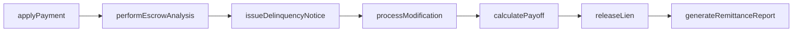
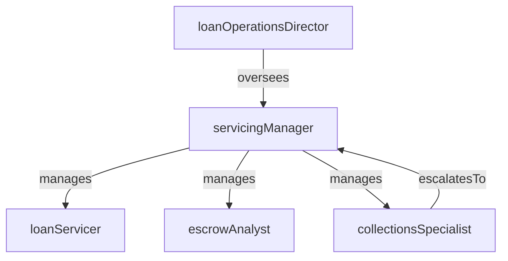

# Loan Servicing

> Business-as-Code definition for the Loan Servicing department. Models responsibilities, actions, events, and searches.

## Overview

Loan Servicing manages the post-origination lifecycle of commercial and consumer loans including payment processing, escrow administration, and borrower communications. The department handles modifications, payoffs, collections escalation, and investor reporting to ensure portfolio performance and regulatory compliance.

## Responsibilities

| Responsibility | Description |
|---------------|-------------|
| processLoanPayments | Apply principal, interest, and escrow payments to borrower accounts on schedule |
| administerEscrowAccounts | Manage escrow funds for taxes, insurance, and other impounds |
| manageLoanModifications | Process forbearance agreements, rate changes, term extensions, and restructures |
| monitorDelinquencies | Track past-due accounts, issue notices, and escalate to collections when thresholds are met |
| generateInvestorReporting | Produce remittance reports and loan-level data for secondary market investors |
| processPayoffs | Calculate payoff amounts, process proceeds, and release liens upon full repayment |

## Roles

| Role | Description |
|------|-------------|
| loanServicer | Processes daily payments, handles borrower inquiries, and maintains account records |
| escrowAnalyst | Manages escrow analysis, shortage calculations, and disbursement of impound funds |
| servicingManager | Oversees servicing operations, staffing, and service-level compliance |
| collectionsSpecialist | Contacts delinquent borrowers, negotiates payment arrangements, and escalates defaults |
| loanOperationsDirector | Sets servicing strategy, manages vendor relationships, and ensures regulatory compliance |

## Entities

| Entity | Description |
|--------|-------------|
| LoanAccount | An active credit facility with outstanding principal, accrued interest, and payment schedule |
| PaymentTransaction | A principal, interest, or escrow payment applied to a loan account |
| EscrowAccount | A sub-account holding impounded funds for property taxes and insurance premiums |
| ModificationAgreement | A formal amendment to original loan terms such as rate, maturity, or payment amount |
| PayoffStatement | A document showing the total amount required to satisfy and close a loan |
| DelinquencyNotice | A formal communication sent to a borrower whose account is past due |

## Actions

| Action | Description |
|--------|-------------|
| applyPayment | Post a borrower payment to the correct loan account allocating principal, interest, and escrow |
| performEscrowAnalysis | Calculate annual escrow requirements and adjust monthly impound amounts |
| processModification | Execute a loan modification by amending terms and updating the servicing system |
| issueDelinquencyNotice | Generate and send a past-due notice to the borrower per regulatory timelines |
| calculatePayoff | Compute the total amount due to satisfy and close a loan including per-diem interest |
| generateRemittanceReport | Produce investor-facing reports showing payment collections and pool performance |
| releaseLien | File lien release documents after payoff confirmation |

## Events

| Event | Description |
|-------|-------------|
| paymentApplied | Borrower payment posted and allocated to principal, interest, and escrow |
| escrowAnalysisCompleted | Annual escrow review finished with updated monthly impound amounts |
| modificationProcessed | Loan terms amended and servicing system updated with new schedule |
| delinquencyNoticeIssued | Past-due notice sent to borrower per regulatory requirements |
| payoffCalculated | Total payoff amount computed and statement issued to borrower or title company |
| lienReleased | Lien release filed with the recording office after loan payoff |
| remittanceReportGenerated | Investor remittance report produced and delivered |

## Searches

| Search | Description |
|--------|-------------|
| findDelinquentLoans | List loan accounts past due by a specified number of days |
| getLoansByOfficer | Retrieve active loans assigned to a specific loan officer |
| listUpcomingPayoffs | Find loans with scheduled payoff dates within a given period |
| searchModificationHistory | Query modification records for a specific loan account |
| getEscrowShortages | Identify escrow accounts with projected shortages requiring borrower notification |
| findLoansByInvestor | List loans in a specific investor pool for remittance reporting |

## Workflow



## Actor Relationships



## Related Processes

| Process | APQC ID | Relationship |
|---------|---------|-------------|
| Process Accounts Receivable | 9.2.3 | Governs payment receipt, posting, and cash application for loan accounts |
| Manage and Process Collections | 9.2.4 | Defines collection procedures for delinquent accounts |
| Manage Internal Controls | 9.8 | Ensures servicing operations comply with regulatory and investor requirements |

## Related Departments

| Department | Relationship |
|-----------|-------------|
| Underwriting | Originates approved loans that transfer into the servicing portfolio |
| Mortgage Operations | Handles residential mortgage-specific servicing requirements and investor guidelines |
| Credit Risk | Monitors portfolio delinquency trends that inform servicing loss mitigation strategies |
| Accounting | Receives loan-level transaction data for general ledger posting and financial reporting |

## Usage

```typescript
import { db } from '@headlessly/db'

const loan = await db.departments.get('loanServicing')
const delinquent = await db.departments.search('findDelinquentLoans', { daysOverdue: 30 })
const payoffs = await db.departments.search('listUpcomingPayoffs', { period: '2025-Q4' })
```
