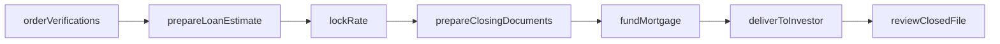
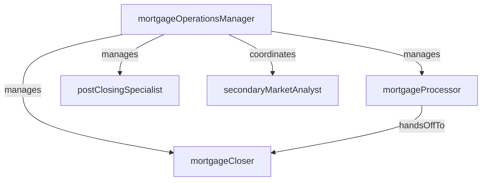

# Mortgage Operations

> Business-as-Code definition for the Mortgage Operations department. Models responsibilities, actions, events, and searches.

## Overview

Mortgage Operations manages the end-to-end residential mortgage lifecycle from application intake through closing, funding, and secondary market delivery. The department coordinates processors, closers, and post-closing staff to ensure loans are originated in compliance with RESPA, TILA, and investor guidelines.

## Responsibilities

| Responsibility | Description |
|---------------|-------------|
| processLoanApplications | Collect and verify borrower documentation including income, assets, and employment |
| coordinateLoanClosing | Schedule closings, prepare settlement documents, and disburse mortgage funds |
| managePipelineLocks | Lock interest rates with investors and manage pipeline exposure for rate commitments |
| ensureRegulatoryCompliance | Maintain compliance with RESPA, TILA, HMDA, and state-specific lending regulations |
| executeSecondaryMarketDelivery | Package and deliver closed loans to investors and agencies for sale or securitization |
| performPostClosingReview | Audit closed loan files for document completeness and correct recording |

## Roles

| Role | Description |
|------|-------------|
| mortgageProcessor | Collects borrower documents, orders verifications, and prepares the file for underwriting |
| mortgageCloser | Prepares closing documents, coordinates with title companies, and manages funding |
| mortgageOperationsManager | Oversees processing and closing teams, monitors pipeline throughput, and ensures SLA compliance |
| secondaryMarketAnalyst | Manages rate locks, best-efforts commitments, and loan delivery to investors |
| postClosingSpecialist | Reviews closed files for trailing documents, recording confirmations, and investor purchase conditions |

## Entities

| Entity | Description |
|--------|-------------|
| MortgageApplication | A borrower's request for a residential home loan including property and financial details |
| LoanEstimate | A TILA-RESPA disclosure provided to the borrower within three days of application |
| ClosingDisclosure | A final settlement statement itemizing all costs and terms of the mortgage |
| RateLockCommitment | An agreement fixing the interest rate for a specified period with an investor |
| MortgageNote | The promissory note signed by the borrower evidencing the debt obligation |
| InvestorDeliveryPackage | A bundle of closed loan documents submitted to the purchasing investor |

## Actions

| Action | Description |
|--------|-------------|
| orderVerifications | Request employment, income, and asset verifications from third-party sources |
| prepareLoanEstimate | Generate and deliver the initial Loan Estimate disclosure to the borrower |
| lockRate | Secure an interest rate with an investor for the specified commitment period |
| prepareClosingDocuments | Compile the closing package including the note, deed of trust, and closing disclosure |
| fundMortgage | Disburse loan proceeds to the title company or settlement agent |
| deliverToInvestor | Submit the closed loan package to the investor for purchase and boarding |
| reviewClosedFile | Audit the post-closing file for document completeness and recording confirmation |

## Events

| Event | Description |
|-------|-------------|
| verificationsOrdered | Employment, income, and asset verifications requested from third parties |
| loanEstimatePrepared | Initial Loan Estimate disclosure generated and delivered to the borrower |
| rateLocked | Interest rate commitment secured with the investor |
| closingDocumentsPrepared | Closing package compiled and ready for borrower execution |
| mortgageFunded | Loan proceeds disbursed to the settlement agent |
| loanDeliveredToInvestor | Closed loan package submitted to the purchasing investor |
| closedFileReviewed | Post-closing audit completed with all exceptions cleared |

## Searches

| Search | Description |
|--------|-------------|
| findApplicationsByStatus | List mortgage applications filtered by processing stage |
| getExpiringRateLocks | Retrieve rate lock commitments approaching expiration |
| listLoansPendingClosing | Find loans with all conditions cleared awaiting closing schedule |
| searchByPropertyAddress | Query mortgage applications by subject property address |
| getInvestorDeliveryQueue | List closed loans awaiting secondary market delivery |
| findPostClosingExceptions | Identify closed files with outstanding trailing documents or recording issues |

## Workflow



## Actor Relationships



## Related Processes

| Process | APQC ID | Relationship |
|---------|---------|-------------|
| Process Customer Credit | 9.2.1 | Governs the credit approval process for mortgage borrowers |
| Manage Internal Controls | 9.8 | Ensures mortgage origination complies with RESPA, TILA, and investor guidelines |
| Perform Revenue Accounting | 9.2 | Recognizes origination fees and secondary market gain-on-sale revenue |

## Related Departments

| Department | Relationship |
|-----------|-------------|
| Underwriting | Reviews and approves mortgage applications forwarded by processing |
| Loan Servicing | Receives funded mortgages for post-closing payment administration |
| BSA/AML Compliance | Screens mortgage borrowers for sanctions and suspicious activity indicators |
| Accounting | Records origination revenue, warehouse line draws, and investor sale proceeds |

## Usage

```typescript
import { db } from '@headlessly/db'

const mort = await db.departments.get('mortgageOperations')
const expiring = await db.departments.search('getExpiringRateLocks', { daysToExpiry: 7 })
const queue = await db.departments.search('getInvestorDeliveryQueue', { investor: 'FNMA' })
```
