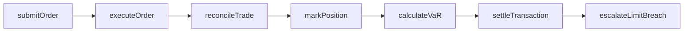
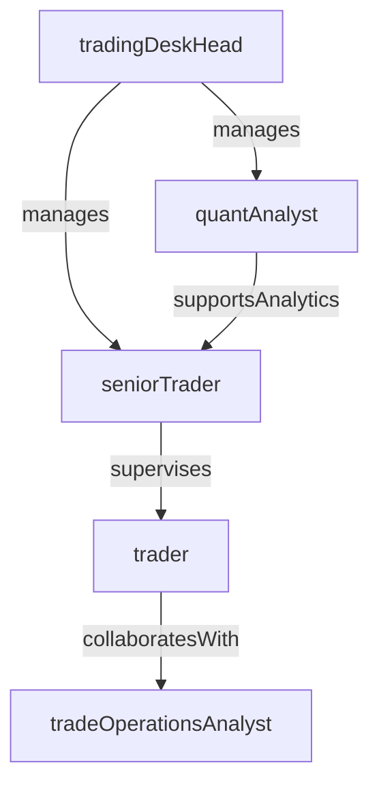

# Trading Desk

> Business-as-Code definition for the Trading Desk department. Models responsibilities, actions, events, and searches.

## Overview

The Trading Desk executes buy and sell orders for securities, fixed income instruments, foreign exchange, and derivatives on behalf of the institution and its clients. The department manages market-making activities, real-time position management, and trade settlement while operating within strict risk limits and regulatory controls.

## Responsibilities

| Responsibility | Description |
|---------------|-------------|
| executeTrades | Place and fill orders for equities, bonds, FX, and derivatives across exchanges and OTC venues |
| managePositions | Monitor and adjust open positions to stay within approved risk limits |
| provideMarketMaking | Quote bid-ask spreads and maintain liquidity for designated instruments |
| manageTradSettlement | Ensure timely clearing, settlement, and confirmation of executed trades |
| monitorMarketRisk | Track real-time P&L, VaR, and Greeks to identify and escalate limit breaches |

## Roles

| Role | Description |
|------|-------------|
| trader | Executes orders, manages intra-day positions, and interacts with counterparties |
| seniorTrader | Handles large or complex trades and mentors junior desk members |
| tradingDeskHead | Manages desk strategy, P&L targets, and staffing across product lines |
| quantAnalyst | Develops pricing models, risk analytics, and algorithmic trading strategies |
| tradeOperationsAnalyst | Processes trade confirmations, reconciles breaks, and handles settlement exceptions |

## Entities

| Entity | Description |
|--------|-------------|
| TradeOrder | An instruction to buy or sell a specific instrument at a specified price or market |
| Position | The net holding in a particular security or derivative at a point in time |
| TradeConfirmation | A record confirming the executed terms of a trade with the counterparty |
| MarketDataFeed | Real-time price and volume data consumed from exchanges and data providers |
| RiskLimitProfile | Approved thresholds for VaR, notional exposure, and concentration by desk or product |
| SettlementInstruction | Delivery-versus-payment or free-of-payment instructions for trade clearing |

## Actions

| Action | Description |
|--------|-------------|
| submitOrder | Route a buy or sell order to the appropriate exchange or counterparty |
| executeOrder | Fill an order at the best available price and confirm execution details |
| markPosition | Revalue open positions to current market prices at end of day or intra-day |
| reconcileTrade | Match trade details between internal books, counterparties, and clearing houses |
| calculateVaR | Compute value-at-risk for the desk's open positions using approved methodology |
| settleTransaction | Complete the clearing and settlement process for an executed trade |
| escalateLimitBreach | Notify risk management when a position or P&L limit is exceeded |

## Events

| Event | Description |
|-------|-------------|
| orderSubmitted | Trade order routed to exchange or counterparty for execution |
| orderExecuted | Trade filled at confirmed price and quantity |
| positionMarked | Open positions revalued to current market prices |
| tradeReconciled | Internal and external trade records matched and confirmed |
| varCalculated | Value-at-risk computed for the desk's portfolio |
| transactionSettled | Trade clearing and settlement completed successfully |
| limitBreachEscalated | Risk limit violation reported to risk management for resolution |

## Searches

| Search | Description |
|--------|-------------|
| getOpenPositions | Retrieve all open positions for a desk or product line |
| findUnreconciledTrades | List trades with unmatched confirmations or settlement breaks |
| getTradesByCounterparty | Query executed trades for a specific counterparty within a date range |
| getDailyPnL | Retrieve daily profit and loss for a desk or trader |
| listLimitBreaches | Find risk limit violations for a given period |
| searchOrderHistory | Query historical trade orders by instrument, date, or status |

## Workflow



## Actor Relationships



## Related Processes

| Process | APQC ID | Relationship |
|---------|---------|-------------|
| Manage Debt and Investment | 9.7.5 | Governs investment transaction processing and foreign currency operations |
| Monitor and Execute Risk and Hedging Transactions | 9.7.6 | Provides the hedging execution framework for interest rate and FX risk |
| Manage Enterprise Risk | 11.4 | Sets market risk limits and escalation procedures for limit breaches |

## Related Departments

| Department | Relationship |
|-----------|-------------|
| Asset Management | Sources trade orders from portfolio rebalancing and investment decisions |
| Credit Risk | Provides counterparty credit limits that constrain trading exposure |
| Accounting | Receives trade-level data for general ledger posting and P&L reporting |
| BSA/AML Compliance | Monitors trading activity for market manipulation and suspicious patterns |

## Usage

```typescript
import { db } from '@headlessly/db'

const desk = await db.departments.get('tradingDesk')
const openPositions = await db.departments.search('getOpenPositions', { desk: 'fixedIncome' })
const unreconciled = await db.departments.search('findUnreconciledTrades', { asOfDate: '2025-12-31' })
```
