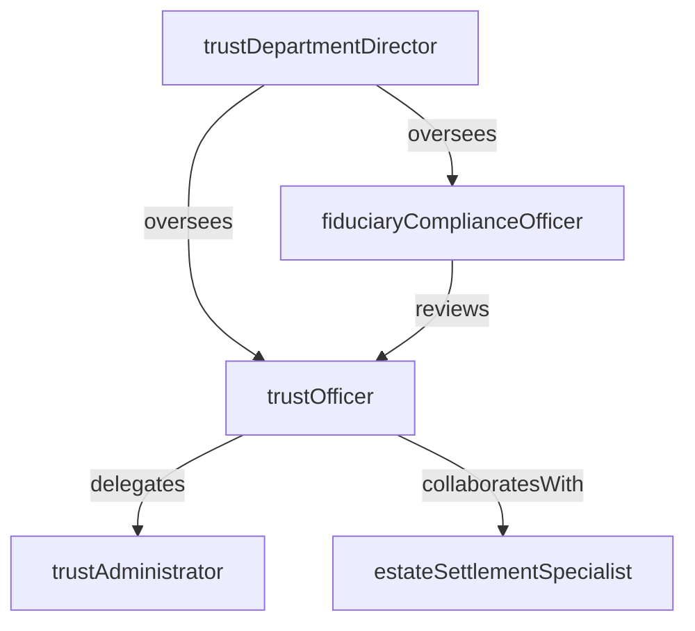

# Trust Services

> Business-as-Code definition for the Trust Services department. Models responsibilities, actions, events, and searches.

## Overview

Trust Services provides fiduciary administration for trusts, estates, guardianships, and agency accounts. The department manages trust assets, ensures compliance with governing instruments and applicable law, executes distributions to beneficiaries, and delivers tax reporting for fiduciary accounts.

## Responsibilities

| Responsibility | Description |
|---------------|-------------|
| administerTrustAccounts | Manage trust assets, investments, and cash in accordance with governing documents |
| executeDistributions | Process income and principal distributions to beneficiaries per trust terms |
| ensureFiduciaryCompliance | Ensure all actions comply with the trust instrument, state fiduciary law, and prudent investor standards |
| manageEstateSettlement | Administer decedent estates through probate, asset marshaling, and final distribution |
| prepareFiduciaryTaxReturns | Compile and file fiduciary income tax returns for trust and estate accounts |

## Roles

| Role | Description |
|------|-------------|
| trustOfficer | Serves as the primary fiduciary contact for assigned trust and estate accounts |
| trustAdministrator | Handles day-to-day account operations including distributions, receipts, and record keeping |
| fiduciaryComplianceOfficer | Reviews trust actions for compliance with governing instruments and regulatory requirements |
| trustDepartmentDirector | Leads the trust department, sets strategic priorities, and manages client relationships |
| estateSettlementSpecialist | Coordinates probate proceedings, asset collection, and final estate distributions |

## Entities

| Entity | Description |
|--------|-------------|
| TrustAccount | A fiduciary account established under a trust agreement or court order |
| EstateAccount | An account created to administer the assets of a deceased individual through probate |
| TrustInstrument | The governing legal document defining trust terms, beneficiaries, and trustee powers |
| BeneficiaryDistribution | A payment of income or principal to a named beneficiary per the trust terms |
| FiduciaryTaxReturn | An IRS Form 1041 or state equivalent reporting fiduciary income and deductions |
| AssetInventory | A comprehensive listing of all assets held in a trust or estate account |

## Actions

| Action | Description |
|--------|-------------|
| onboardTrustAccount | Establish a new trust account, record the governing instrument, and register assets |
| reviewGoverningInstrument | Analyze trust terms to determine distribution standards, investment authority, and restrictions |
| processDistribution | Calculate and disburse income or principal to beneficiaries per the trust instrument |
| conductAccountReview | Perform periodic review of trust investments, distributions, and fee assessments |
| prepareAccountStatement | Generate statements showing account activity, holdings, and performance for beneficiaries |
| fileFiduciaryReturn | Compile income, deductions, and distributable net income for fiduciary tax filing |
| settleEstate | Marshal estate assets, pay debts and taxes, and distribute remaining assets to heirs |

## Events

| Event | Description |
|-------|-------------|
| trustAccountOnboarded | New trust account established and registered in the system |
| governingInstrumentReviewed | Trust terms analyzed and compliance requirements documented |
| distributionProcessed | Beneficiary distribution calculated and disbursed |
| accountReviewCompleted | Periodic trust account review finished with findings documented |
| accountStatementPrepared | Beneficiary account statement generated and delivered |
| fiduciaryReturnFiled | Fiduciary income tax return completed and submitted to tax authorities |
| estateSettled | All estate assets distributed and account closed |

## Searches

| Search | Description |
|--------|-------------|
| findTrustsByBeneficiary | Retrieve trust accounts associated with a specific beneficiary |
| listPendingDistributions | Find scheduled distributions awaiting processing |
| getAccountsByTrustOfficer | List trust and estate accounts assigned to a specific trust officer |
| searchEstatesInProbate | Query estate accounts currently in probate proceedings |
| getFiduciaryFeeSchedule | Retrieve the fee schedule applied to a trust or estate account |
| listAccountsForReview | Identify trust accounts due for periodic administrative review |

## Workflow


## Actor Relationships



## Related Processes

| Process | APQC ID | Relationship |
|---------|---------|-------------|
| Manage Debt and Investment | 9.7.5 | Governs investment management activities for trust portfolios |
| Manage Taxes | 9.9 | Covers fiduciary income tax preparation and filing |
| Manage Internal Controls | 9.8 | Ensures fiduciary actions comply with regulatory standards and governing instruments |

## Related Departments

| Department | Relationship |
|-----------|-------------|
| Wealth Management | Refers high-net-worth clients needing estate planning and trust structures |
| Asset Management | Provides investment management services for trust portfolios |
| Accounting | Receives fiduciary account transactions for institutional financial reporting |
| Corporate Legal | Advises on trust interpretation, fiduciary duties, and probate proceedings |

## Usage

```typescript
import { db } from '@headlessly/db'

const trust = await db.departments.get('trustServices')
const pending = await db.departments.search('listPendingDistributions', { status: 'scheduled' })
const probate = await db.departments.search('searchEstatesInProbate', { state: 'CA' })
```
