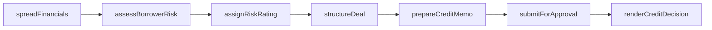
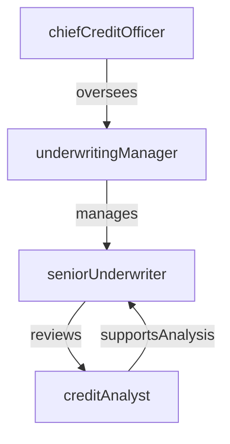

# Underwriting

> Business-as-Code definition for the Underwriting department. Models responsibilities, actions, events, and searches.

## Overview

Underwriting evaluates borrower creditworthiness and structures loan terms by analyzing financial statements, collateral, and market conditions. The department owns credit decisioning from application intake through final approval or decline, ensuring risk-adjusted pricing and adherence to lending policies.

## Responsibilities

| Responsibility | Description |
|---------------|-------------|
| evaluateCreditworthiness | Analyze borrower financials, credit history, and repayment capacity to assess default risk |
| structureLoanTerms | Determine pricing, covenants, collateral requirements, and repayment schedules |
| enforceLendingPolicies | Ensure all credit decisions comply with internal credit policy and regulatory guidelines |
| manageConcentrationLimits | Monitor portfolio exposure by industry, geography, and borrower to stay within risk appetite |
| reviewExceptionRequests | Evaluate and approve or decline requests that fall outside standard underwriting criteria |

## Roles

| Role | Description |
|------|-------------|
| creditAnalyst | Prepares credit memos, spreads financial statements, and models cash flows |
| seniorUnderwriter | Reviews complex credits and renders approval or decline decisions within delegated authority |
| underwritingManager | Manages the underwriting team, assigns pipelines, and enforces quality standards |
| chiefCreditOfficer | Sets credit policy, approves large exposures, and chairs the credit committee |

## Entities

| Entity | Description |
|--------|-------------|
| LoanApplication | A borrower's request for credit including financial data and purpose of funds |
| CreditMemo | Analytical document summarizing borrower risk, deal structure, and underwriter recommendation |
| RiskRating | Internal grade assigned to a credit facility reflecting probability of default and loss severity |
| CollateralAppraisal | Valuation report for assets pledged to secure a loan |
| CreditPolicy | Documented lending guidelines governing acceptable risk thresholds and deal structures |
| CreditCommitteeDecision | Formal approval, conditional approval, or decline issued by the credit committee |

## Actions

| Action | Description |
|--------|-------------|
| spreadFinancials | Extract and normalize borrower financial statements for ratio analysis |
| assessBorrowerRisk | Evaluate probability of default using financial ratios, industry trends, and credit scores |
| assignRiskRating | Assign an internal risk grade to the credit facility based on analysis results |
| structureDeal | Define loan amount, tenor, pricing, covenants, and collateral requirements |
| prepareCreditMemo | Draft the credit analysis narrative and recommendation for approval authority |
| submitForApproval | Route the completed credit package to the appropriate approval authority |
| renderCreditDecision | Approve, conditionally approve, or decline the credit request |

## Events

| Event | Description |
|-------|-------------|
| financialsSpread | Borrower financial statements extracted and normalized for analysis |
| riskRatingAssigned | Internal risk grade applied to the credit facility |
| creditMemoPrepared | Credit analysis and recommendation document completed |
| creditDecisionRendered | Approval authority issued approve, conditional approve, or decline |
| dealStructured | Loan terms, covenants, and collateral requirements finalized |
| exceptionApproved | Policy exception granted by authorized approval level |
| applicationDeclined | Credit request declined due to unacceptable risk profile |

## Searches

| Search | Description |
|--------|-------------|
| findPendingApplications | List loan applications awaiting underwriting review |
| getApplicationsByRiskRating | Retrieve credit facilities filtered by internal risk grade |
| listExceptionRequests | Find credit requests with policy exception flags |
| searchBorrowerExposure | Look up aggregate outstanding exposure for a specific borrower |
| getCreditPipelineByOfficer | Retrieve active underwriting pipeline assigned to a loan officer |

## Workflow



## Actor Relationships



## Related Processes

| Process | APQC ID | Relationship |
|---------|---------|-------------|
| Process Customer Credit | 9.2.1 | Core process for credit evaluation and approval |
| Manage Internal Controls | 9.8 | Provides controls framework governing credit authority limits |
| Manage Enterprise Risk | 11.4 | Aligns credit decisioning with enterprise risk appetite |

## Related Departments

| Department | Relationship |
|-----------|-------------|
| Credit Risk | Provides portfolio-level risk models and loss reserve inputs used during underwriting |
| Loan Servicing | Receives approved credits for post-closing administration and payment processing |
| BSA/AML Compliance | Screens borrowers for sanctions and suspicious activity before credit approval |
| Mortgage Operations | Originates residential mortgage applications requiring underwriting review |

## Usage

```typescript
import { db } from '@headlessly/db'

const uw = await db.departments.get('underwriting')
const pending = await db.departments.search('findPendingApplications', { status: 'pending' })
const highRisk = await db.departments.search('getApplicationsByRiskRating', { rating: 'watchlist' })
```
