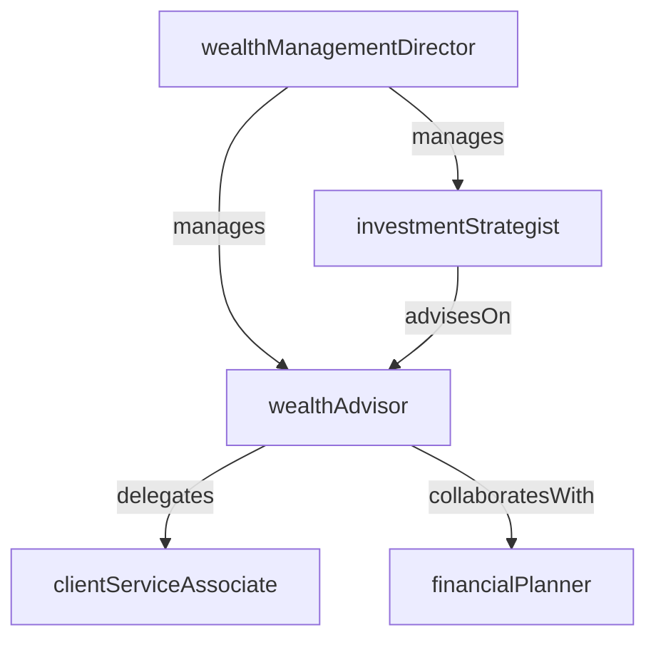

# Wealth Management

> Business-as-Code definition for the Wealth Management department. Models responsibilities, actions, events, and searches.

## Overview

Wealth Management provides comprehensive financial advisory services to high-net-worth and ultra-high-net-worth individuals and families. The department delivers holistic financial planning, investment advisory, tax-efficient strategies, and intergenerational wealth transfer guidance to grow and preserve client assets.

## Responsibilities

| Responsibility | Description |
|---------------|-------------|
| deliverFinancialPlanning | Develop comprehensive financial plans covering investments, retirement, tax, and estate considerations |
| adviseOnInvestments | Provide personalized investment recommendations aligned with client objectives and risk tolerance |
| planWealthTransfer | Structure intergenerational wealth transfer strategies including gifting, trusts, and succession plans |
| manageClientRelationships | Serve as the primary point of contact for high-net-worth clients across all banking services |
| coordinateTaxStrategy | Collaborate with tax advisors to optimize after-tax returns through asset location and harvesting |

## Roles

| Role | Description |
|------|-------------|
| wealthAdvisor | Provides holistic financial advice and manages the overall client relationship |
| financialPlanner | Develops detailed financial plans covering retirement, education, insurance, and estate needs |
| wealthManagementDirector | Leads the wealth practice, sets revenue targets, and manages advisor teams |
| clientServiceAssociate | Supports advisors with account administration, document preparation, and client communications |
| investmentStrategist | Formulates house investment views and model portfolios for the wealth advisory platform |

## Entities

| Entity | Description |
|--------|-------------|
| ClientProfile | A comprehensive record of a client's financial situation, goals, and risk tolerance |
| FinancialPlan | A document outlining strategies for investments, retirement, tax, estate, and insurance |
| InvestmentProposal | A personalized recommendation of portfolio strategy and asset allocation for a client |
| WealthTransferPlan | A strategy for transferring assets to heirs using trusts, gifting, and other structures |
| ClientReviewMeeting | A scheduled meeting to review portfolio performance, plan progress, and life changes |
| FeeSchedule | The advisory fee structure applied to a client's managed assets |

## Actions

| Action | Description |
|--------|-------------|
| onboardClient | Complete new client intake including KYC, suitability assessment, and account opening |
| developFinancialPlan | Create a comprehensive financial plan addressing investment, retirement, tax, and estate goals |
| presentInvestmentProposal | Deliver a customized investment recommendation with asset allocation and product selection |
| conductClientReview | Meet with the client to review portfolio performance, plan updates, and evolving needs |
| executeWealthTransfer | Implement gifting, trust funding, and other wealth transfer transactions per the plan |
| assessSuitability | Evaluate whether proposed investments align with the client's objectives and risk profile |
| harvestTaxLosses | Identify and execute tax-loss harvesting opportunities in taxable client accounts |

## Events

| Event | Description |
|-------|-------------|
| clientOnboarded | New client intake completed with all accounts opened and funded |
| financialPlanDeveloped | Comprehensive financial plan created and delivered to the client |
| investmentProposalPresented | Customized investment recommendation delivered to the client |
| clientReviewConducted | Periodic review meeting completed with documented action items |
| wealthTransferExecuted | Gifting or trust funding transaction completed per the transfer plan |
| suitabilityAssessed | Client investment suitability evaluation completed and documented |
| taxLossesHarvested | Tax-loss harvesting transactions identified and executed in taxable accounts |

## Searches

| Search | Description |
|--------|-------------|
| findClientsByAdvisor | List clients assigned to a specific wealth advisor |
| getClientsByAUM | Retrieve clients filtered by assets under management tier |
| listUpcomingReviews | Find client review meetings scheduled within a given period |
| searchClientsByGoal | Query client profiles by primary financial goal such as retirement or education |
| getRevenueByAdvisor | Calculate advisory fee revenue attributed to a specific wealth advisor |
| findClientsNeedingRebalance | Identify client portfolios requiring rebalancing based on drift thresholds |

## Workflow


## Actor Relationships



## Related Processes

| Process | APQC ID | Relationship |
|---------|---------|-------------|
| Manage Debt and Investment | 9.7.5 | Governs investment transaction execution and portfolio accounting for client accounts |
| Manage Taxes | 9.9 | Informs tax-efficient investment strategies and wealth transfer planning |
| Manage Enterprise Risk | 11.4 | Ensures suitability and fiduciary compliance across advisory activities |

## Related Departments

| Department | Relationship |
|-----------|-------------|
| Asset Management | Provides model portfolios and investment strategies used in client proposals |
| Trust Services | Administers trust accounts established as part of wealth transfer plans |
| Trading Desk | Executes trades for client investment portfolios and rebalancing activity |
| BSA/AML Compliance | Performs customer due diligence and ongoing monitoring for high-net-worth clients |

## Usage

```typescript
import { db } from '@headlessly/db'

const wm = await db.departments.get('wealthManagement')
const reviews = await db.departments.search('listUpcomingReviews', { period: '2025-Q4' })
const topClients = await db.departments.search('getClientsByAUM', { minAUM: 5000000 })
```
