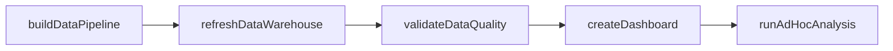
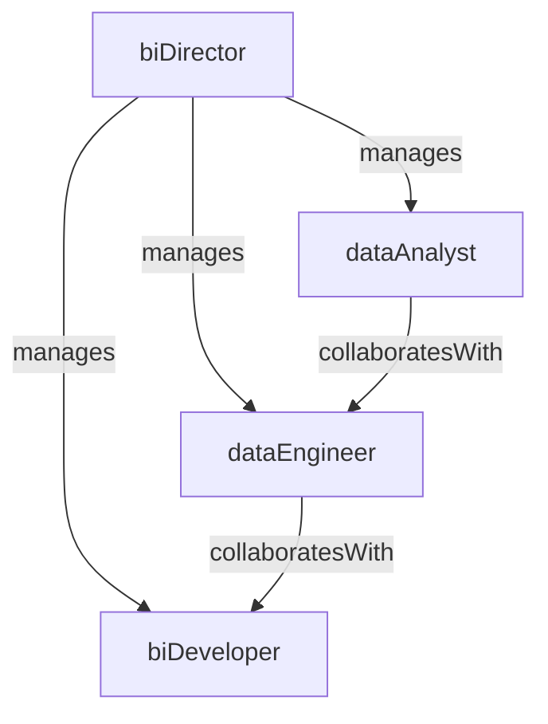

# Business Intelligence

> Business-as-Code definition for the Business Intelligence department. Models responsibilities, actions, events, and searches.

## Overview

Analytics, reporting, dashboards, and data-driven insights

## Responsibilities

| Responsibility | Description |
|---------------|-------------|
| buildAnalyticsPlatform | Design, develop, and maintain the enterprise data warehouse, ETL pipelines, and BI tools |
| deliverReportingAndDashboards | Create and publish self-service dashboards, scheduled reports, and ad hoc analyses for business stakeholders |
| defineDataGovernance | Establish data quality standards, naming conventions, and metric definitions across the organization |
| performAdvancedAnalytics | Apply statistical modeling, predictive analytics, and machine learning to drive business insights |
| enableDataLiteracy | Train business users on BI tools, data interpretation, and self-service analytics capabilities |

## Roles

| Role | Description |
|------|-------------|
| biDirector | Leads the BI team strategy, prioritizes analytics projects, and manages stakeholder relationships |
| dataAnalyst | Builds reports, dashboards, and ad hoc analyses to answer business questions |
| dataEngineer | Designs and maintains ETL pipelines, data models, and the enterprise data warehouse |
| biDeveloper | Develops and optimizes BI platform features, semantic layers, and data visualizations |

## Entities

| Entity | Description |
|--------|-------------|
| Dashboard | An interactive visualization presenting key metrics and KPIs for a business domain |
| DataPipeline | An automated workflow that extracts, transforms, and loads data from source systems into the warehouse |
| MetricDefinition | A documented standard defining how a specific business metric is calculated and interpreted |
| Report | A scheduled or ad hoc data output distributed to stakeholders in a defined format |
| DataSource | An upstream system or dataset integrated into the BI platform for analysis |

## Actions

| Action | Description |
|--------|-------------|
| createDashboard | Design and publish a new interactive dashboard for a business team |
| buildDataPipeline | Develop an ETL pipeline to ingest and transform data from a source system |
| defineMetric | Document the calculation logic, data sources, and business context for a new KPI |
| runAdHocAnalysis | Perform an exploratory data analysis in response to a specific business question |
| refreshDataWarehouse | Execute scheduled or on-demand data loads to update the warehouse |
| validateDataQuality | Run data quality checks and alert on anomalies or failures in pipeline outputs |

## Events

| Event | Description |
|-------|-------------|
| dashboardPublished | A new or updated dashboard was deployed and made available to users |
| pipelineCompleted | A data pipeline run finished successfully and updated the warehouse |
| pipelineFailed | A data pipeline run encountered errors and did not complete successfully |
| metricDefined | A new business metric was formally documented and approved |
| dataQualityAlertTriggered | A data quality check detected an anomaly or threshold violation |
| reportDistributed | A scheduled report was generated and delivered to its recipients |

## Searches

| Search | Description |
|--------|-------------|
| findDashboards | List dashboards by business domain, owner, or last-updated date |
| searchMetricDefinitions | Look up metric definitions by name, category, or data source |
| listPipelinesByStatus | Retrieve data pipelines filtered by running, succeeded, or failed status |
| getDataSourceCatalog | Browse available data sources and their schemas integrated into the BI platform |
| findReportSubscribers | List users subscribed to a specific scheduled report |

## Workflow



## Actor Relationships



## Related Processes

| Process | APQC ID | Relationship |
|---------|---------|-------------|
| Develop Business Capabilities | 13.1 | Core process for building analytics and data-driven decision-making capabilities |
| Manage Enterprise Information | 13.3 | Governs data governance, quality standards, and information architecture |

## Related Departments

| Department | Relationship |
|-----------|-------------|
| Corporate Development | Provides market intelligence and competitive data for M&A screening |
| Financial Planning & Analysis | Partners on financial reporting, forecasting models, and executive dashboards |
| Innovation & Transformation | Collaborates on data-driven innovation projects and digital transformation metrics |

## Usage

```typescript
import { db } from '@headlessly/db'

const dept = await db.departments.get('businessIntelligence')
const dashboards = await db.departments.search('findDashboards', { domain: 'sales' })
const pipelines = await db.departments.search('listPipelinesByStatus', { status: 'failed' })
```
