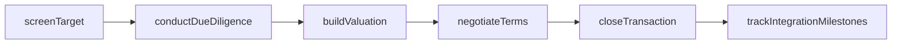
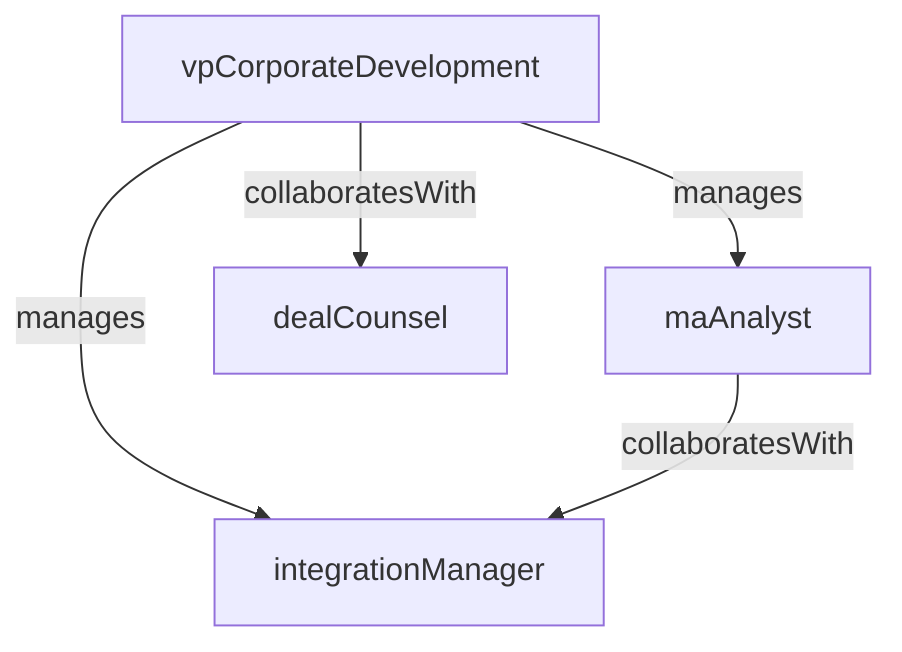

# Corporate Development

> Business-as-Code definition for the Corporate Development department. Models responsibilities, actions, events, and searches.

## Overview

M&A execution, due diligence, and post-merger integration

## Responsibilities

| Responsibility | Description |
|---------------|-------------|
| sourceDealPipeline | Identify, screen, and prioritize acquisition targets, investment opportunities, and strategic partnerships |
| executeDueDiligence | Lead cross-functional due diligence covering financial, legal, operational, and technology dimensions |
| structureTransactions | Design deal terms, valuation models, and financing structures for acquisitions and divestitures |
| managePMI | Plan and oversee post-merger integration including organizational alignment, systems migration, and synergy capture |
| evaluateStrategicPartnerships | Assess joint venture, licensing, and strategic alliance opportunities that complement organic growth |

## Roles

| Role | Description |
|------|-------------|
| vpCorporateDevelopment | Leads M&A strategy, manages the deal pipeline, and presents transactions to the board |
| maAnalyst | Builds financial models, performs valuation analyses, and supports due diligence workstreams |
| integrationManager | Plans and executes post-merger integration activities across business functions |
| dealCounsel | Manages external advisors and coordinates legal, tax, and regulatory aspects of transactions |

## Entities

| Entity | Description |
|--------|-------------|
| AcquisitionTarget | A company or business unit being evaluated as a potential acquisition |
| DueDiligenceReport | A comprehensive assessment of a target's financials, operations, legal risks, and technology |
| DealPipeline | A structured pipeline tracking all prospective transactions from sourcing through close |
| IntegrationPlan | A detailed plan for merging the acquired entity into the parent organization |
| TermSheet | A non-binding document outlining the key terms and conditions of a proposed transaction |

## Actions

| Action | Description |
|--------|-------------|
| screenTarget | Evaluate a potential acquisition against strategic fit, valuation, and synergy criteria |
| conductDueDiligence | Execute a cross-functional investigation of a target's business, finances, and risks |
| buildValuation | Create a financial model estimating the target's intrinsic value and deal economics |
| negotiateTerms | Negotiate price, representations, warranties, and closing conditions with the target |
| closeTransaction | Finalize the acquisition by executing definitive agreements and obtaining regulatory approvals |
| trackIntegrationMilestones | Monitor progress against the post-merger integration plan and synergy targets |

## Events

| Event | Description |
|-------|-------------|
| targetIdentified | A potential acquisition target was added to the deal pipeline |
| dueDiligenceCompleted | Cross-functional due diligence on a target was finalized |
| termSheetSigned | A non-binding term sheet was executed with the target |
| transactionClosed | A definitive agreement was signed and all closing conditions were satisfied |
| integrationCompleted | Post-merger integration was finalized and the acquired entity was fully absorbed |
| dealTerminated | A transaction was abandoned due to failed negotiations, due diligence findings, or regulatory issues |

## Searches

| Search | Description |
|--------|-------------|
| findDealsByStage | List transactions in the pipeline filtered by sourcing, due diligence, negotiation, or closed stage |
| searchAcquisitionTargets | Look up potential targets by industry, revenue range, or strategic fit score |
| listActiveIntegrations | Retrieve post-merger integrations currently in progress with milestone status |
| getValuationComps | Find comparable transaction data by sector, deal size, or valuation multiple |

## Workflow



## Actor Relationships



## Related Processes

| Process | APQC ID | Relationship |
|---------|---------|-------------|
| Develop Business Capabilities | 13.1 | Core process for inorganic growth through acquisitions and partnerships |
| Manage Mergers, Acquisitions, and Divestitures | 13.2 | Governs the end-to-end M&A lifecycle |

## Related Departments

| Department | Relationship |
|-----------|-------------|
| Corporate Legal | Provides legal support for transaction structuring and definitive agreements |
| Financial Planning & Analysis | Partners on valuation modeling and synergy quantification |
| Business Intelligence | Supplies market and competitive data to inform target screening |

## Usage

```typescript
import { db } from '@headlessly/db'

const dept = await db.departments.get('corporateDevelopment')
const pipeline = await db.departments.search('findDealsByStage', { stage: 'due-diligence' })
const targets = await db.departments.search('searchAcquisitionTargets', { industry: 'saas', minRevenue: 10000000 })
```
