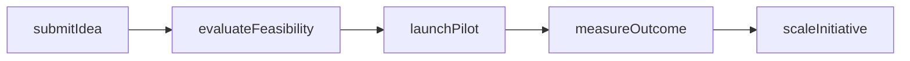
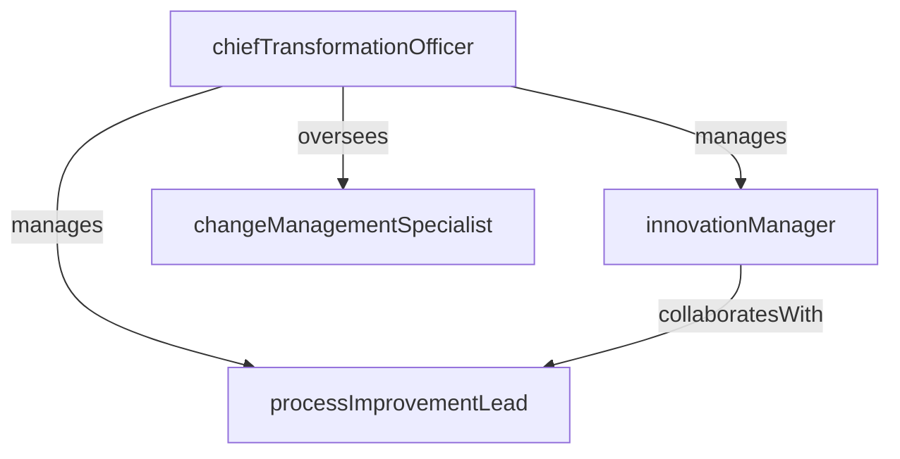

# Innovation & Transformation

> Business-as-Code definition for the Innovation & Transformation department. Models responsibilities, actions, events, and searches.

## Overview

Digital transformation, process improvement, and change management

## Responsibilities

| Responsibility | Description |
|---------------|-------------|
| driveDigitalTransformation | Lead enterprise-wide digital initiatives that modernize processes, systems, and customer experiences |
| manageInnovationPipeline | Source, evaluate, and incubate new ideas from employees, partners, and emerging technology scouts |
| executeProcessImprovement | Apply lean, six sigma, and automation methodologies to eliminate waste and improve operational efficiency |
| leadChangeManagement | Design and deliver change management programs that drive adoption of new tools, processes, and ways of working |
| evaluateEmergingTechnologies | Research and pilot emerging technologies such as AI, blockchain, and IoT for strategic application |

## Roles

| Role | Description |
|------|-------------|
| chiefTransformationOfficer | Leads the transformation agenda and reports to the executive team on innovation portfolio performance |
| innovationManager | Manages the idea pipeline, innovation labs, and proof-of-concept programs |
| processImprovementLead | Identifies and executes operational improvement opportunities using structured methodologies |
| changeManagementSpecialist | Develops communication plans, training programs, and stakeholder engagement strategies for change initiatives |

## Entities

| Entity | Description |
|--------|-------------|
| TransformationInitiative | A strategic program designed to modernize a business process, system, or operating model |
| InnovationIdea | A submitted concept from an employee or partner being evaluated for feasibility and strategic value |
| ProofOfConcept | A small-scale pilot validating the viability of a new technology or approach before scaling |
| ChangeManagementPlan | A structured plan for driving adoption and managing the people side of a transformation |
| ProcessMap | A documented current-state or future-state model of a business process targeted for improvement |

## Actions

| Action | Description |
|--------|-------------|
| submitIdea | Capture a new innovation idea through the ideation portal or workshop |
| evaluateFeasibility | Assess an idea's technical feasibility, business value, and resource requirements |
| launchPilot | Initiate a proof-of-concept or pilot program for a validated innovation concept |
| measureOutcome | Evaluate the results of a pilot or transformation initiative against success criteria |
| scaleInitiative | Expand a successful pilot into full production deployment across the organization |
| facilitateChangeWorkshop | Conduct a stakeholder workshop to build awareness, alignment, and readiness for change |

## Events

| Event | Description |
|-------|-------------|
| ideaSubmitted | A new innovation idea was captured and entered into the pipeline |
| feasibilityAssessed | An idea was evaluated and either advanced to pilot or deprioritized |
| pilotLaunched | A proof-of-concept or pilot program was initiated |
| pilotCompleted | A pilot concluded and results were documented for scale or no-go decision |
| initiativeScaled | A validated initiative was expanded to enterprise-wide deployment |
| transformationCompleted | A major transformation program achieved its target outcomes and was closed |

## Searches

| Search | Description |
|--------|-------------|
| findInitiativesByStatus | List transformation initiatives filtered by planning, in-progress, completed, or on-hold status |
| searchIdeasByTheme | Look up innovation ideas by technology theme, business area, or submission date |
| listActivePilots | Retrieve proof-of-concept programs currently running with their progress and timelines |
| getTransformationROI | Find completed initiatives with measured return on investment and business impact data |
| findProcessImprovements | Search process improvement opportunities by department, methodology, or estimated savings |

## Workflow



## Actor Relationships



## Related Processes

| Process | APQC ID | Relationship |
|---------|---------|-------------|
| Develop Business Capabilities | 13.1 | Core process for building new organizational capabilities through innovation |
| Manage Change | 13.4 | Governs the change management framework supporting transformation programs |

## Related Departments

| Department | Relationship |
|-----------|-------------|
| Business Intelligence | Provides data and analytics to measure transformation outcomes and identify improvement opportunities |
| Engineering | Partners on technology evaluation, prototyping, and digital initiative implementation |
| Corporate Development | Collaborates on strategic capability acquisition through M&A and partnerships |

## Usage

```typescript
import { db } from '@headlessly/db'

const dept = await db.departments.get('innovationTransformation')
const initiatives = await db.departments.search('findInitiativesByStatus', { status: 'in-progress' })
const pilots = await db.departments.search('listActivePilots', { theme: 'ai-automation' })
```
