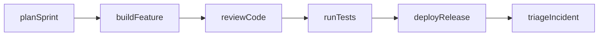
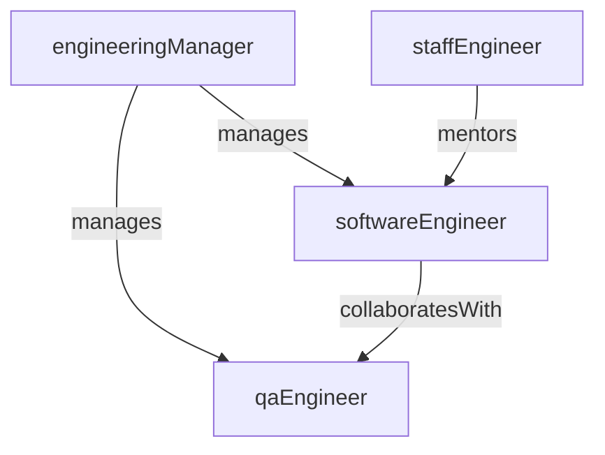

# Departments Business-as-Code

This folder contains MDX definitions for organizational departments modeled as Business-as-Code APIs.

## Your Task

When assigned a department file, fill in the TODO sections following the template below. Each department should be a complete, programmable API definition with all 12 sections populated.

## Schema

Departments have two levels controlled by the `level` field:

- **Category** (`level: Category`): A top-level grouping (e.g., Operations, Finance). Categories have `children` but no `parent`.
- **Department** (`level: Department`): A concrete organizational unit (e.g., Engineering, Accounts Payable). Departments have a `parent` category and may have `children` sub-departments.

### APQC Mapping

The `apqcCategories` field links a department to APQC Process Classification Framework categories (e.g., `['9.0']` for Finance). This enables cross-referencing between departments and the process definitions in `.org.ai/processes/`.

### Industry-Specific Departments

The `industries` field supports future industry-specific departments. Leave it empty (`[]`) for universal departments that exist in most organizations. When modeling industry-specific departments (e.g., Underwriting for Insurance), populate it with relevant NAICS codes.

## Template Reference

```mdx
---
name: Engineering
code: ENG
level: Department
category: Product
parent: Operations
apqcCategories:
  - '7.0'
---

# Engineering

> Business-as-Code definition for the engineering department. Models responsibilities, roles, entities, actions, events, searches, workflows, and relationships.

## Overview

Engineering builds, ships, and maintains the product and platform. The department owns the full software delivery lifecycle from architecture through deployment and operational support.

## Responsibilities

| Responsibility | Description |
|---------------|-------------|
| buildProduct | Deliver customer-facing features and capabilities |
| maintainPlatform | Operate and evolve core infrastructure |
| ensureQuality | Define and enforce quality standards across codebases |

## Roles

| Role | Description |
|------|-------------|
| softwareEngineer | Designs and implements software components |
| engineeringManager | Manages team delivery and career growth |
| staffEngineer | Drives architecture decisions and technical strategy |
| qaEngineer | Validates quality, performance, and reliability |

## Entities

| Entity | Description |
|--------|-------------|
| Repository | Source code repository for a service or library |
| Service | Deployed application or microservice |
| Incident | Production issue requiring investigation |
| Sprint | Time-boxed delivery iteration |

## Actions

| Action | Description |
|--------|-------------|
| planSprint | Create delivery plans and milestones for the iteration |
| buildFeature | Implement features and services |
| reviewCode | Perform peer code review |
| runTests | Validate quality and performance |
| deployRelease | Release software to production |
| triageIncident | Assess and prioritize production issues |

## Events

| Event | Description |
|-------|-------------|
| sprintPlanned | Sprint backlog finalized and committed |
| buildCompleted | Feature implementation finished and merged |
| deploymentSucceeded | Release deployed to production successfully |
| incidentOpened | New production incident created |
| incidentResolved | Production incident resolved and closed |

## Searches

| Search | Description |
|--------|-------------|
| findTeams | List teams within the department |
| getRoadmap | Retrieve current delivery roadmap |
| listServices | List services owned by the department |
| findOpenIncidents | Retrieve unresolved production incidents |
| getSprintProgress | Check current sprint completion metrics |

## Workflow



## Actor Relationships



## Related Processes

- [7.6 - Manage Information Technology](../processes/07-ManageInformationTechnology/7.6-ManageItOperations/)
- [7.7 - Develop and Manage IT Workforce](../processes/07-ManageInformationTechnology/7.7-DevelopAndManageItWorkforce/)

## Related Departments

- [Product Management](./ProductManagement.mdx)
- [DevOps](./DevOps.mdx)
- [Quality Assurance](./QualityAssurance.mdx)

## Usage

```ts
import { db } from '@headlessly/db'

const eng = await db.departments.get('engineering')
const teams = await db.departments.search('findTeams', { department: 'engineering' })
const incidents = await db.departments.search('findOpenIncidents', { status: 'open' })
```
```

## Key Guidelines

1. **Categories vs Departments**: Set `level: Category` for top-level groupings, `level: Department` for concrete units. Categories group related departments under a shared umbrella.
2. **APQC mapping**: Populate `apqcCategories` with the relevant APQC category codes (e.g., `['9.0']` for Finance, `['7.0']` for IT). This links departments to process definitions in `.org.ai/processes/`.
3. **Industry-specific departments**: Leave `industries` empty for universal departments. Only populate it with NAICS codes for departments unique to specific industries.
4. **Cross-referencing with processes**: The "Related Processes" section should link to relevant APQC process categories. Use relative paths to `.org.ai/processes/`.
5. **Keep verbs in camelCase**: Actions, events, searches, and responsibilities all use camelCase identifiers (e.g., `planSprint`, `buildCompleted`, `findTeams`).
6. **Use concise, realistic department responsibilities**: Each responsibility should map to a concrete operational concern the department owns.
7. **Align actions/events/searches with day-to-day operations**: Model what the department actually does, not abstract capabilities. Actions should be verbs, events should be past-tense state changes, searches should be queries practitioners run.
8. **Keep terminology consistent across departments**: Reuse common role names, entity names, and event patterns where departments overlap.
9. **Populate all 12 sections**: Every department file should have Overview, Responsibilities, Roles, Entities, Actions, Events, Searches, Workflow, Actor Relationships, Related Processes, Related Departments, and Usage.
10. **Workflow diagrams**: Use `graph LR` for left-to-right process flows showing the primary action sequence.
11. **Actor Relationship diagrams**: Use `graph TD` for top-down org/collaboration graphs showing how roles interact.
