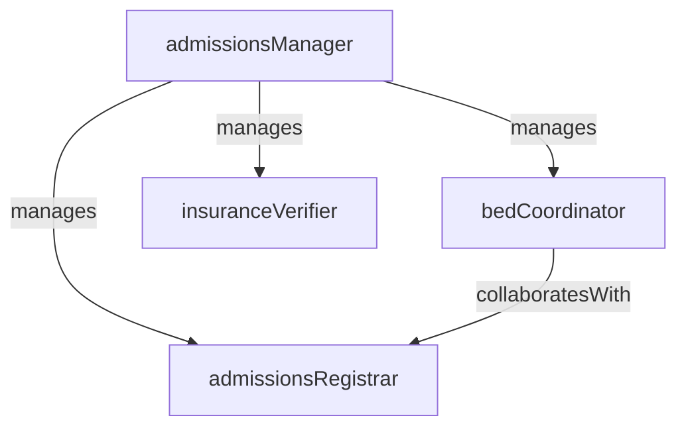

# Patient Admissions

> Business-as-Code definition for the Patient Admissions department. Models responsibilities, actions, events, and searches.

## Overview

Patient Admissions manages the front door of the hospital, handling patient registration, identity verification, insurance eligibility checks, bed assignment, and the administrative processing of inpatient and observation admissions. The department ensures accurate demographic and financial data capture to support clinical care and downstream revenue cycle operations.

## Responsibilities

| Responsibility | Description |
|---------------|-------------|
| registerPatients | Collect and verify patient demographics, identifiers, and contact information at intake |
| verifyInsurance | Confirm insurance eligibility, benefits, and prior authorization status before admission |
| assignBeds | Coordinate bed placement based on clinical need, isolation requirements, and unit availability |
| processAdmissions | Complete the administrative workflow to formally admit patients to inpatient or observation status |
| obtainConsents | Secure required consent forms including general consent, financial agreements, and advance directives |

## Roles

| Role | Description |
|------|-------------|
| admissionsManager | Oversees registration operations, staff performance, and bed management workflows |
| admissionsRegistrar | Registers patients, collects demographic and insurance data, and processes admissions paperwork |
| bedCoordinator | Manages real-time bed availability and assigns beds based on clinical and logistical factors |
| insuranceVerifier | Confirms payer eligibility, obtains authorization numbers, and communicates coverage details |

## Entities

| Entity | Description |
|--------|-------------|
| AdmissionRecord | Formal record of a patient admission including admit date, type, attending physician, and bed assignment |
| PatientRegistration | Demographic and contact data captured at intake including identifiers, emergency contacts, and preferences |
| InsuranceVerification | Documentation of payer eligibility, coverage details, copay amounts, and authorization status |
| BedAssignment | Record linking a patient to a specific bed, unit, and room with check-in and checkout timestamps |
| ConsentForm | Signed authorization from the patient for treatment, information sharing, or financial responsibility |

## Actions

| Action | Description |
|--------|-------------|
| registerPatient | Create or update a patient record with verified demographics and contact information |
| verifyEligibility | Check insurance coverage, benefits, and prior authorization status with the payer |
| assignBed | Place a patient into an available bed based on clinical requirements and unit capacity |
| admitPatient | Complete the formal admission by linking registration, insurance, bed, and physician assignment |
| collectConsent | Obtain and scan required consent forms from the patient or authorized representative |
| transferPatient | Move a patient from one bed or unit to another and update the bed management system |

## Events

| Event | Description |
|-------|-------------|
| patientRegistered | Patient demographics and identifiers captured and verified in the system |
| eligibilityVerified | Insurance coverage confirmed and authorization obtained for the planned admission |
| bedAssigned | Patient placed in a bed and unit with assignment recorded in the bed management system |
| patientAdmitted | Formal admission completed with all required documentation and system entries |
| consentCollected | Required consent forms signed by the patient and scanned into the medical record |
| patientTransferred | Patient moved to a new bed or unit and bed board updated accordingly |

## Searches

| Search | Description |
|--------|-------------|
| findPendingAdmissions | List patients with orders to admit who have not yet been formally processed |
| getBedAvailability | View available beds filtered by unit, room type, and isolation capability |
| findUnverifiedInsurance | List admissions with pending or incomplete insurance verification |
| getAdmissionsByDate | Retrieve all admissions within a date range filtered by admission type |
| findPendingConsents | Identify patients missing required consent forms |

## Workflow


## Actor Relationships



## Related Processes

| Process | APQC ID | Relationship |
|---------|---------|-------------|
| Deliver Services | 5.0 | Supports clinical care by ensuring patients are registered, verified, and placed appropriately |
| Manage Customer Service | 6.0 | Provides the first point of contact for patients and families entering the facility |

## Related Departments

| Department | Relationship |
|-----------|-------------|
| Emergency Department | Receives admit orders and coordinates bed placement for ED patients |
| Revenue Cycle Management | Provides verified insurance and registration data that initiates the billing cycle |
| Case Management | Collaborates on bed utilization and length-of-stay management |
| Nursing | Communicates bed assignments and patient arrivals to receiving nursing units |

## Usage

```typescript
import { db } from '@headlessly/db'

const admissions = await db.departments.get('patientAdmissions')
const pending = await db.departments.search('findPendingAdmissions', { source: 'emergency' })
const beds = await db.departments.search('getBedAvailability', { unit: 'medical-surgical' })
```
