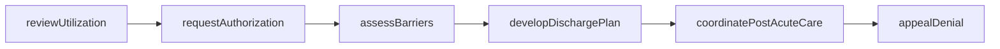
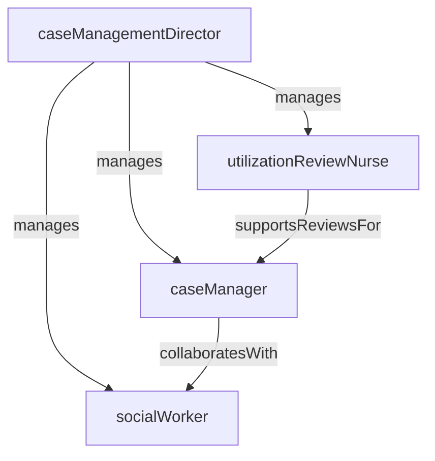

# Case Management

> Business-as-Code definition for the Case Management department. Models responsibilities, actions, events, and searches.

## Overview

Case Management coordinates the continuum of patient care from admission through discharge, ensuring appropriate utilization of resources, timely transitions, and optimal clinical and financial outcomes. The department conducts utilization reviews, manages payer authorizations, develops discharge plans, and connects patients with post-acute services and community resources.

## Responsibilities

| Responsibility | Description |
|---------------|-------------|
| conductUtilizationReview | Evaluate medical necessity and appropriateness of inpatient stays using evidence-based criteria |
| planDischarges | Develop individualized discharge plans addressing post-acute care, equipment, and follow-up needs |
| obtainAuthorizations | Secure and manage concurrent payer authorizations to prevent denials and ensure reimbursement |
| coordinateTransitions | Arrange transfers to skilled nursing facilities, rehabilitation centers, or home health agencies |
| manageLengthOfStay | Monitor patient days against benchmarks and intervene on barriers to timely discharge |

## Roles

| Role | Description |
|------|-------------|
| caseManagementDirector | Sets departmental strategy, manages staffing, and oversees utilization and denial metrics |
| caseManager | Conducts utilization reviews, coordinates discharges, and manages payer communications for a patient caseload |
| socialWorker | Addresses psychosocial barriers, connects patients with community resources, and supports complex dispositions |
| utilizationReviewNurse | Reviews clinical documentation against payer criteria to validate admission status and continued stay |

## Entities

| Entity | Description |
|--------|-------------|
| CareCoordinationPlan | Comprehensive plan documenting discharge goals, barriers, services, and target transition date |
| UtilizationReview | Assessment of medical necessity using InterQual or Milliman criteria for a specific admission |
| PayerAuthorization | Approval from an insurance payer for a specific level of care, service, or length of stay |
| DischargeSummary | Record of discharge disposition, follow-up appointments, medications, and post-acute referrals |
| DenialAppeal | Documentation supporting an appeal of a payer denial for a service or admission |

## Actions

| Action | Description |
|--------|-------------|
| reviewUtilization | Evaluate the medical necessity of a patient's current admission status against payer criteria |
| developDischargePlan | Create a discharge plan addressing care needs, services, equipment, and follow-up appointments |
| requestAuthorization | Submit clinical documentation to the payer to obtain or extend a concurrent stay authorization |
| coordinatePostAcuteCare | Arrange skilled nursing, rehabilitation, home health, or hospice services for a discharging patient |
| appealDenial | Prepare and submit clinical evidence to overturn a payer denial for a service or admission day |
| assessBarriers | Identify and document psychosocial, clinical, or logistical barriers preventing timely discharge |

## Events

| Event | Description |
|-------|-------------|
| utilizationReviewed | Medical necessity assessment completed and documented for a patient admission |
| dischargePlanDeveloped | Individualized discharge plan created and shared with the care team |
| authorizationObtained | Payer authorization secured for the patient's current level of care or extension |
| postAcuteCareArranged | Post-discharge services confirmed with the receiving facility or agency |
| denialReceived | Payer issued a denial for an admission day, service, or procedure |
| patientDischarged | Patient discharged from the facility with all transition arrangements completed |

## Searches

| Search | Description |
|--------|-------------|
| findPatientsNeedingReview | List inpatients due for utilization review based on admission date or authorization expiration |
| getPendingDischarges | Retrieve patients with discharge plans in progress but not yet completed |
| findDenialsToAppeal | List payer denials with appeal deadlines and current appeal status |
| getPatientsByLengthOfStay | Identify patients exceeding expected length of stay by diagnosis or payer |
| findUnauthorizedDays | List patient days lacking current payer authorization |

## Workflow



## Actor Relationships



## Related Processes

| Process | APQC ID | Relationship |
|---------|---------|-------------|
| Deliver Services | 5.0 | Coordinates care transitions and ensures appropriate utilization of clinical resources |
| Manage Customer Service | 6.0 | Supports patient and family navigation through discharge and post-acute care arrangements |

## Related Departments

| Department | Relationship |
|-----------|-------------|
| Nursing | Collaborates on discharge readiness assessments and patient education |
| Patient Admissions | Shares admission status and expected length of stay for bed planning |
| Revenue Cycle Management | Provides authorization data and appeals documentation to support claims |
| Patient Safety | Partners on readmission prevention and safe discharge practices |

## Usage

```typescript
import { db } from '@headlessly/db'

const caseMgmt = await db.departments.get('caseManagement')
const reviews = await db.departments.search('findPatientsNeedingReview', { unit: 'medical' })
const denials = await db.departments.search('findDenialsToAppeal', { deadline: 'next-7-days' })
```
