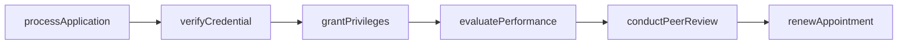
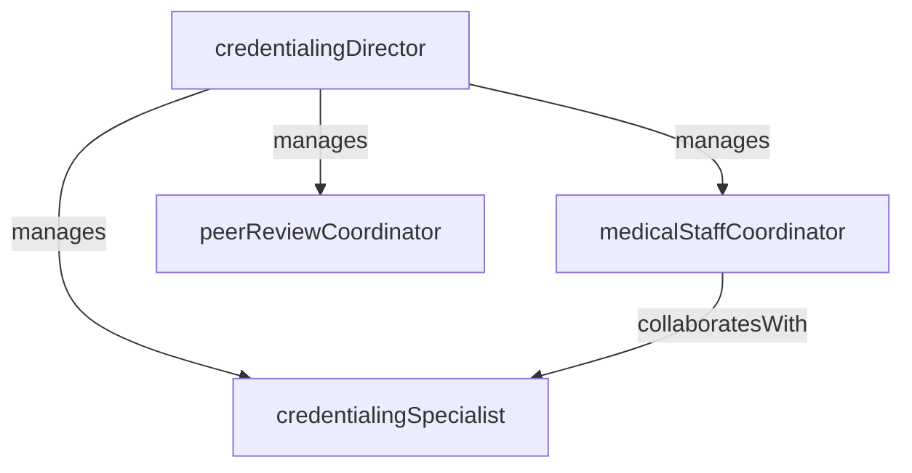

# Credentialing

> Business-as-Code definition for the Credentialing department. Models responsibilities, actions, events, and searches.

## Overview

Credentialing verifies the qualifications, licensure, training, and professional history of physicians, advanced practice providers, and allied health professionals seeking to practice at the facility. The department manages initial credentialing, reappointment cycles, privilege delineation, peer review processes, and ongoing professional practice evaluation to ensure provider competency and patient safety.

## Responsibilities

| Responsibility | Description |
|---------------|-------------|
| verifyCredentials | Perform primary source verification of licenses, education, board certifications, and work history |
| managePrivileging | Define, grant, and maintain clinical privileges aligned with provider training and competency |
| processReappointments | Conduct biennial reappointment reviews including updated verifications and performance data |
| coordinatePeerReview | Facilitate peer review committee activities and maintain confidential review documentation |
| monitorOngoingPerformance | Track provider quality metrics, complaints, and sentinel events for ongoing professional practice evaluation |

## Roles

| Role | Description |
|------|-------------|
| credentialingDirector | Oversees the medical staff office, sets credentialing policies, and reports to the governing board |
| credentialingSpecialist | Processes applications, performs verifications, and manages provider files through the credentialing cycle |
| medicalStaffCoordinator | Supports committee meetings, tracks reappointment schedules, and maintains medical staff bylaws |
| peerReviewCoordinator | Organizes peer review cases, distributes records to reviewers, and compiles findings |

## Entities

| Entity | Description |
|--------|-------------|
| CredentialingApplication | Provider application containing demographics, education, training, licensure, and references |
| PrivilegeDelineation | Catalog of clinical privileges available within a specialty with required qualifications for each |
| PrimarySourceVerification | Confirmed validation of a credential directly from the issuing organization or database |
| PeerReviewCase | Confidential case record documenting a clinical review, findings, and recommended actions |
| ProviderProfile | Consolidated record of a provider's credentials, privileges, performance data, and renewal dates |

## Actions

| Action | Description |
|--------|-------------|
| processApplication | Receive and initiate the credentialing workflow for a new provider application |
| verifyCredential | Contact the primary source or query a verification database to confirm a license, degree, or certification |
| grantPrivileges | Approve clinical privileges for a provider based on completed verification and committee review |
| conductPeerReview | Coordinate review of a clinical case by qualified peers and document findings |
| evaluatePerformance | Compile quality metrics, complaint data, and clinical outcomes for ongoing professional practice evaluation |
| renewAppointment | Process a provider's biennial reappointment including updated verifications and privilege review |

## Events

| Event | Description |
|-------|-------------|
| applicationReceived | New credentialing application submitted and logged into the medical staff office system |
| credentialVerified | Primary source verification completed and documented for a provider credential |
| privilegesGranted | Clinical privileges approved by the credentials committee and governing board |
| peerReviewCompleted | Peer review case finalized with findings and recommendations documented |
| appointmentRenewed | Provider reappointment approved for a new credentialing cycle |
| privilegeRestricted | Provider privilege suspended, modified, or revoked based on quality or compliance concerns |

## Searches

| Search | Description |
|--------|-------------|
| findPendingApplications | List credentialing applications in progress awaiting verification or committee review |
| getProviderPrivileges | Retrieve the current privilege set for a specific provider |
| findExpiringCredentials | Identify providers with licenses, certifications, or malpractice coverage nearing expiration |
| getPeerReviewCases | List peer review cases by status, specialty, or date range |
| findUpcomingReappointments | List providers due for biennial reappointment within a specified time window |

## Workflow



## Actor Relationships



## Related Processes

| Process | APQC ID | Relationship |
|---------|---------|-------------|
| Deliver Services | 5.0 | Ensures only qualified and verified providers deliver clinical services |
| Manage Customer Service | 6.0 | Responds to provider inquiries about application status and privilege requirements |

## Related Departments

| Department | Relationship |
|-----------|-------------|
| Patient Safety | Shares quality data and sentinel event findings relevant to provider performance |
| Medical Records | Provides clinical documentation for peer review and performance evaluation |
| Human Resources | Coordinates onboarding timelines and employment verification for new providers |

## Usage

```typescript
import { db } from '@headlessly/db'

const cred = await db.departments.get('credentialing')
const pending = await db.departments.search('findPendingApplications', { status: 'verification' })
const expiring = await db.departments.search('findExpiringCredentials', { window: '90-days' })
```
