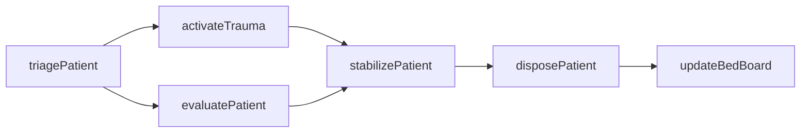
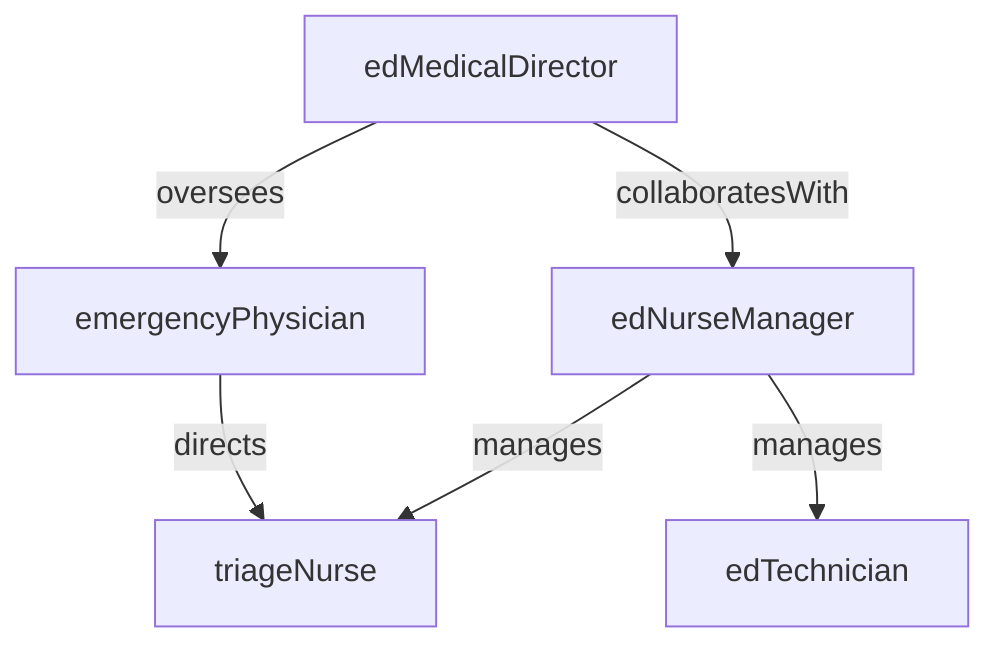

# Emergency Department

> Business-as-Code definition for the Emergency Department department. Models responsibilities, actions, events, and searches.

## Overview

The Emergency Department provides immediate evaluation and stabilization of patients presenting with acute injuries, illnesses, and medical emergencies. The department operates a 24/7 triage and treatment workflow, coordinates trauma activations, manages patient flow through the ED, and arranges dispositions including admission, transfer, and discharge.

## Responsibilities

| Responsibility | Description |
|---------------|-------------|
| triagePatients | Assess arriving patients using the Emergency Severity Index to determine acuity and treatment priority |
| deliverEmergencyCare | Provide acute medical evaluation, stabilization, and treatment for emergency presentations |
| coordinateTraumaResponse | Activate and lead the trauma team for critically injured patients per trauma center protocols |
| managePatientFlow | Monitor ED census, bed availability, and throughput to minimize wait times and boarding |
| arrangeDisposition | Determine and coordinate patient discharge, hospital admission, or transfer to another facility |

## Roles

| Role | Description |
|------|-------------|
| edMedicalDirector | Provides clinical leadership, oversees quality metrics, and sets emergency medicine protocols |
| emergencyPhysician | Evaluates, diagnoses, and treats patients in the emergency department |
| edNurseManager | Manages ED nursing staff, scheduling, and unit operations |
| triageNurse | Performs initial patient assessment and assigns acuity levels at the point of arrival |
| edTechnician | Assists with procedures, splinting, wound care, and patient transport within the ED |

## Entities

| Entity | Description |
|--------|-------------|
| EdVisit | Episode of care from patient arrival through disposition including triage, treatment, and outcome |
| TriageAssessment | Initial evaluation documenting chief complaint, vital signs, and Emergency Severity Index level |
| TraumaActivation | Formal trauma team activation record with mechanism of injury, team roster, and time stamps |
| BedBoard | Real-time display of ED bed occupancy, patient status, and pending dispositions |
| DischargeInstruction | Patient education document with diagnosis, medications, follow-up, and return precautions |

## Actions

| Action | Description |
|--------|-------------|
| triagePatient | Assess an arriving patient, collect vital signs, and assign an Emergency Severity Index acuity level |
| evaluatePatient | Perform a focused history and physical examination and order diagnostic workup |
| stabilizePatient | Initiate emergency interventions to stabilize vital signs and address life-threatening conditions |
| activateTrauma | Call a trauma activation and assemble the multidisciplinary trauma team |
| disposePatient | Determine final disposition including admission, discharge, or interfacility transfer |
| updateBedBoard | Refresh bed status, patient location, and anticipated disposition on the ED tracking board |

## Events

| Event | Description |
|-------|-------------|
| patientTriaged | Patient assessed at triage and assigned an acuity level |
| patientEvaluated | Emergency physician completed assessment and initiated the diagnostic workup |
| patientStabilized | Critical interventions completed and patient vital signs stabilized |
| traumaActivated | Trauma team activation called and multidisciplinary team assembled |
| patientDisposed | Final disposition determined and patient admitted, discharged, or transferred |
| edCapacityAlert | ED census exceeded threshold triggering diversion or surge protocols |

## Searches

| Search | Description |
|--------|-------------|
| findWaitingPatients | List patients triaged but not yet assigned to a treatment bed |
| getBedAvailability | View current ED bed occupancy and available treatment spaces |
| getPatientsByAcuity | List active ED patients grouped by Emergency Severity Index level |
| findPendingDispositions | Retrieve patients with completed workups awaiting final disposition decisions |
| getTraumaActivations | List trauma activations within a date range with outcomes |

## Workflow



## Actor Relationships



## Related Processes

| Process | APQC ID | Relationship |
|---------|---------|-------------|
| Deliver Services | 5.0 | Core owner of emergency evaluation, stabilization, and acute care delivery |
| Manage Customer Service | 6.0 | Manages patient flow, wait times, and communication with patients and families |

## Related Departments

| Department | Relationship |
|-----------|-------------|
| Patient Admissions | Coordinates bed placement for patients admitted from the ED |
| Radiology | Provides stat diagnostic imaging for trauma and acute presentations |
| Laboratory | Processes stat lab orders to support rapid clinical decision-making |
| Nursing | Receives admitted patients and continues care initiated in the ED |

## Usage

```typescript
import { db } from '@headlessly/db'

const ed = await db.departments.get('emergencyDepartment')
const waiting = await db.departments.search('findWaitingPatients', { acuity: [1, 2] })
const beds = await db.departments.search('getBedAvailability', { area: 'main-ed' })
```
