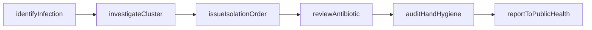
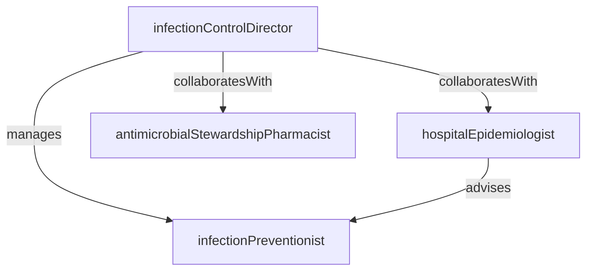

# Infection Control

> Business-as-Code definition for the Infection Control department. Models responsibilities, actions, events, and searches.

## Overview

Infection Control prevents, detects, and manages healthcare-associated infections through surveillance programs, outbreak investigation, hand hygiene monitoring, environmental rounding, and antimicrobial stewardship. The department develops and enforces infection prevention policies, tracks pathogen trends, and reports notifiable conditions to public health authorities.

## Responsibilities

| Responsibility | Description |
|---------------|-------------|
| conductSurveillance | Monitor and track healthcare-associated infections using standardized definitions and data sources |
| investigateOutbreaks | Identify clusters of infections, determine sources, and implement containment measures |
| enforceHandHygiene | Audit hand hygiene compliance, provide feedback, and drive improvement across clinical areas |
| manageAntimicrobialStewardship | Guide appropriate antibiotic use, review restricted agents, and track resistance patterns |
| reportNotifiableConditions | Submit required infection data to state and federal public health agencies per regulatory mandates |

## Roles

| Role | Description |
|------|-------------|
| infectionPreventionist | Conducts surveillance, investigates outbreaks, and educates staff on prevention practices |
| infectionControlDirector | Leads the infection prevention program, chairs the infection control committee, and sets departmental policy |
| hospitalEpidemiologist | Provides physician-level expertise on infectious disease epidemiology and outbreak management |
| antimicrobialStewardshipPharmacist | Reviews antibiotic orders, recommends de-escalation, and tracks resistance patterns |

## Entities

| Entity | Description |
|--------|-------------|
| SurveillanceRecord | Documented case of a healthcare-associated infection with organism, site, and contributing factors |
| OutbreakInvestigation | Formal investigation of an infection cluster including timeline, case definitions, and control measures |
| HandHygieneAudit | Observation record documenting compliance with hand hygiene protocols by unit and role |
| Antibiogram | Annual summary of organism susceptibility patterns used to guide empiric antibiotic selection |
| IsolationPrecaution | Order placing a patient under contact, droplet, or airborne precautions with specified PPE requirements |

## Actions

| Action | Description |
|--------|-------------|
| identifyInfection | Review microbiology data and clinical records to confirm a healthcare-associated infection case |
| investigateCluster | Analyze a group of related infections to determine the source and transmission pathway |
| auditHandHygiene | Observe and document hand hygiene compliance during direct patient care activities |
| reviewAntibiotic | Evaluate an antibiotic order for appropriateness, recommend alternatives, or approve restricted agents |
| issueIsolationOrder | Place a patient under appropriate isolation precautions based on suspected or confirmed pathogen |
| reportToPublicHealth | Submit notifiable condition reports to local and state health departments as required |

## Events

| Event | Description |
|-------|-------------|
| infectionIdentified | Healthcare-associated infection case confirmed and entered into the surveillance system |
| outbreakDeclared | Cluster of infections meets outbreak threshold and formal investigation initiated |
| handHygieneAuditCompleted | Hand hygiene observation session finished with compliance rate documented |
| antibioticReviewCompleted | Antimicrobial stewardship review finished with recommendation communicated to the prescriber |
| isolationOrderIssued | Patient placed under infection control precautions with PPE requirements communicated |
| publicHealthReportFiled | Notifiable condition report submitted to the appropriate public health authority |

## Searches

| Search | Description |
|--------|-------------|
| findActiveInfections | List current healthcare-associated infections by organism, unit, or infection type |
| getInfectionRates | Retrieve standardized infection ratios and rates by unit and time period |
| findIsolatedPatients | List patients currently under isolation precautions by type |
| getHandHygieneCompliance | View hand hygiene compliance rates by unit, role, or observation period |
| findPendingAntibioticReviews | List antibiotic orders awaiting stewardship review |

## Workflow



## Actor Relationships



## Related Processes

| Process | APQC ID | Relationship |
|---------|---------|-------------|
| Deliver Services | 5.0 | Monitors infection outcomes across all clinical service delivery areas |
| Manage Customer Service | 6.0 | Responds to patient and family concerns about infection risk and isolation protocols |

## Related Departments

| Department | Relationship |
|-----------|-------------|
| Nursing | Partners on isolation compliance, hand hygiene auditing, and prevention bundle execution |
| Laboratory | Receives microbiology culture data that drives surveillance and outbreak detection |
| Patient Safety | Collaborates on hospital-acquired condition tracking and quality improvement initiatives |
| Pharmacy | Works jointly on antimicrobial stewardship and resistance trend monitoring |

## Usage

```typescript
import { db } from '@headlessly/db'

const ic = await db.departments.get('infectionControl')
const active = await db.departments.search('findActiveInfections', { unit: 'ICU' })
const compliance = await db.departments.search('getHandHygieneCompliance', { period: 'last-month' })
```
