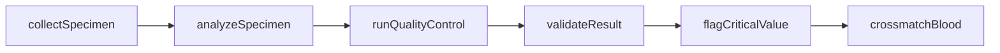
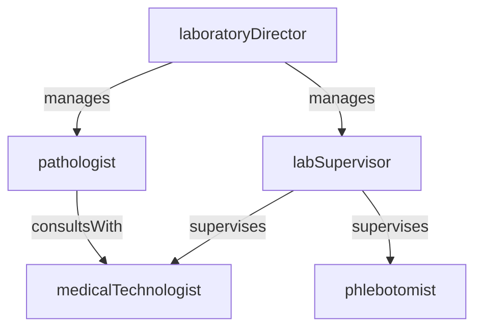

# Laboratory

> Business-as-Code definition for the Laboratory department. Models responsibilities, actions, events, and searches.

## Overview

The clinical laboratory collects, processes, and analyzes biological specimens to support diagnosis, treatment monitoring, and disease surveillance. The department operates clinical chemistry, hematology, microbiology, blood bank, and anatomical pathology sections while maintaining CLIA certification and CAP accreditation standards.

## Responsibilities

| Responsibility | Description |
|---------------|-------------|
| processSpecimens | Collect, accessioning, and prepare biological specimens for analytical testing |
| performAnalyticalTesting | Execute laboratory assays across chemistry, hematology, microbiology, and pathology disciplines |
| reportResults | Validate, release, and communicate laboratory results to ordering providers through the LIS |
| maintainQualityControl | Run QC materials, monitor assay performance, and manage proficiency testing programs |
| manageBloodBank | Perform blood typing, crossmatching, antibody screening, and manage blood product inventory |

## Roles

| Role | Description |
|------|-------------|
| laboratoryDirector | Oversees all laboratory operations, compliance, staffing, and quality management systems |
| pathologist | Interprets anatomical specimens, reviews complex results, and provides diagnostic consultations |
| medicalTechnologist | Performs analytical testing, validates results, and troubleshoots instrument issues |
| phlebotomist | Collects blood specimens from patients following proper identification and collection protocols |
| labSupervisor | Manages day-to-day section operations, staff scheduling, and inventory |

## Entities

| Entity | Description |
|--------|-------------|
| LabOrder | Physician request for specific laboratory tests with clinical indication and collection requirements |
| Specimen | Biological sample collected from a patient with tracking identifiers and chain-of-custody metadata |
| LabResult | Validated test result with reference ranges, flags, and interpretive comments |
| QualityControlRecord | Documentation of QC material performance, Levey-Jennings tracking, and corrective actions |
| BloodProduct | Typed and screened blood component available for transfusion with expiration and storage data |

## Actions

| Action | Description |
|--------|-------------|
| collectSpecimen | Draw blood or collect a biological sample following patient identification and labeling protocols |
| analyzeSpecimen | Process a specimen through the appropriate analytical instrument or manual testing procedure |
| validateResult | Review test results against QC data and reference ranges before releasing to the ordering provider |
| flagCriticalValue | Alert the ordering provider when a result falls outside critical life-threatening thresholds |
| crossmatchBlood | Perform compatibility testing between donor blood products and patient serum |
| runQualityControl | Execute daily QC materials and assess assay performance against established control limits |

## Events

| Event | Description |
|-------|-------------|
| specimenCollected | Biological specimen obtained from patient and accessioned into the laboratory system |
| specimenAnalyzed | Analytical testing completed on a specimen with raw results generated |
| resultValidated | Lab result reviewed, approved, and released to the electronic health record |
| criticalValueFlagged | Life-threatening result identified and verbally communicated to the ordering provider |
| bloodProductIssued | Crossmatched blood product released for patient transfusion |
| qcFailureDetected | Quality control material result fell outside acceptable limits requiring investigation |

## Searches

| Search | Description |
|--------|-------------|
| findPendingSpecimens | List specimens received but not yet analyzed |
| getResultsByPatient | Retrieve all laboratory results for a specific patient within a date range |
| findCriticalValues | List results flagged as critical values awaiting provider notification |
| getQcStatus | View current quality control performance and any out-of-range flags by analyzer |
| findBloodProductInventory | Check available blood products by type, Rh factor, and expiration |

## Workflow



## Actor Relationships



## Related Processes

| Process | APQC ID | Relationship |
|---------|---------|-------------|
| Deliver Services | 5.0 | Core owner of specimen analysis, result reporting, and blood bank operations |
| Manage Customer Service | 6.0 | Communicates critical values and responds to provider result inquiries |

## Related Departments

| Department | Relationship |
|-----------|-------------|
| Nursing | Coordinates specimen collection schedules and receives result notifications at the bedside |
| Pharmacy | Provides drug levels and therapeutic monitoring results for dosing decisions |
| Infection Control | Supplies microbiology culture and susceptibility data for surveillance and outbreak investigation |
| Emergency Department | Prioritizes stat lab orders for acute patient presentations |

## Usage

```typescript
import { db } from '@headlessly/db'

const lab = await db.departments.get('laboratory')
const pending = await db.departments.search('findPendingSpecimens', { section: 'chemistry' })
const criticals = await db.departments.search('findCriticalValues', { status: 'unreported' })
```
