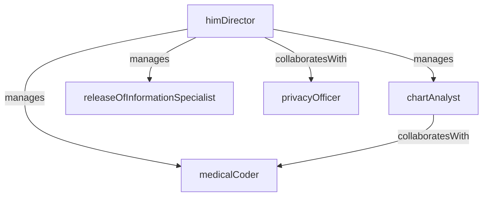

# Medical Records

> Business-as-Code definition for the Medical Records department. Models responsibilities, actions, events, and searches.

## Overview

Medical Records (Health Information Management) maintains the integrity, accuracy, and security of patient health information across the organization. The department oversees medical coding, chart completion, records retention, release of information, and compliance with HIPAA and regulatory documentation standards.

## Responsibilities

| Responsibility | Description |
|---------------|-------------|
| maintainMedicalRecords | Ensure completeness, accuracy, and integrity of all patient health records |
| performMedicalCoding | Assign ICD, CPT, and HCPCS codes to diagnoses and procedures for billing and reporting |
| manageRecordsRetention | Enforce retention schedules and securely archive or destroy records per policy and regulation |
| processReleaseOfInformation | Handle authorized requests for patient records from patients, providers, and legal entities |
| ensureHipaaCompliance | Audit access logs, enforce privacy policies, and train staff on protected health information handling |

## Roles

| Role | Description |
|------|-------------|
| himDirector | Leads the health information management department and sets coding, privacy, and retention policies |
| medicalCoder | Reviews clinical documentation and assigns diagnosis and procedure codes per coding guidelines |
| releaseOfInformationSpecialist | Processes and validates requests for disclosure of protected health information |
| chartAnalyst | Reviews patient charts for completeness and follows up with providers on deficiencies |
| privacyOfficer | Monitors HIPAA compliance, investigates breaches, and manages privacy risk assessments |

## Entities

| Entity | Description |
|--------|-------------|
| PatientChart | Complete medical record containing clinical notes, orders, results, and documentation for a patient |
| CodingAssignment | Set of ICD/CPT/HCPCS codes assigned to an encounter for billing and statistical reporting |
| ReleaseOfInformationRequest | Authorized request to disclose patient health information to a third party |
| ChartDeficiency | Identified gap in medical record documentation requiring provider completion |
| RetentionSchedule | Policy defining how long different record types must be retained before archival or destruction |

## Actions

| Action | Description |
|--------|-------------|
| codeEncounter | Review clinical documentation and assign appropriate diagnosis and procedure codes |
| auditChart | Analyze a patient chart for documentation completeness and coding accuracy |
| processRelease | Validate authorization, retrieve records, and fulfill a release of information request |
| resolveDeficiency | Notify the responsible provider of a chart deficiency and track completion |
| archiveRecord | Move aged records to long-term storage per the retention schedule |
| investigateBreach | Assess a potential HIPAA violation, document findings, and report as required |

## Events

| Event | Description |
|-------|-------------|
| encounterCoded | Diagnosis and procedure codes assigned to a patient encounter |
| chartAudited | Chart review completed with deficiency findings documented |
| releaseProcessed | Patient records disclosed to an authorized requesting party |
| deficiencyResolved | Provider completed the missing documentation in a chart deficiency |
| recordArchived | Patient record moved to long-term storage per retention policy |
| breachInvestigated | Potential HIPAA breach investigated and disposition documented |

## Searches

| Search | Description |
|--------|-------------|
| findUncodedEncounters | List patient encounters pending medical coding assignment |
| getOpenDeficiencies | Retrieve chart deficiencies awaiting provider completion by unit or provider |
| findPendingReleases | List release of information requests awaiting processing |
| getRecordsByPatient | Retrieve all chart components and documents for a specific patient |
| findExpiringRetentions | Identify records approaching their retention expiration date |

## Workflow


## Actor Relationships



## Related Processes

| Process | APQC ID | Relationship |
|---------|---------|-------------|
| Deliver Services | 5.0 | Supports clinical documentation and coding that enables accurate care delivery records |
| Manage Customer Service | 6.0 | Fulfills patient and third-party requests for health information access |

## Related Departments

| Department | Relationship |
|-----------|-------------|
| Revenue Cycle Management | Provides coded encounters that drive charge capture and claims submission |
| Nursing | Receives and archives clinical documentation generated by nursing staff |
| Credentialing | Supports peer review by providing clinical documentation for practice evaluation |
| Information Technology | Collaborates on EHR configuration, access controls, and audit logging |

## Usage

```typescript
import { db } from '@headlessly/db'

const him = await db.departments.get('medicalRecords')
const uncoded = await db.departments.search('findUncodedEncounters', { daysOld: 3 })
const deficiencies = await db.departments.search('getOpenDeficiencies', { provider: 'dr-smith' })
```
