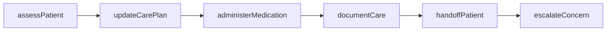
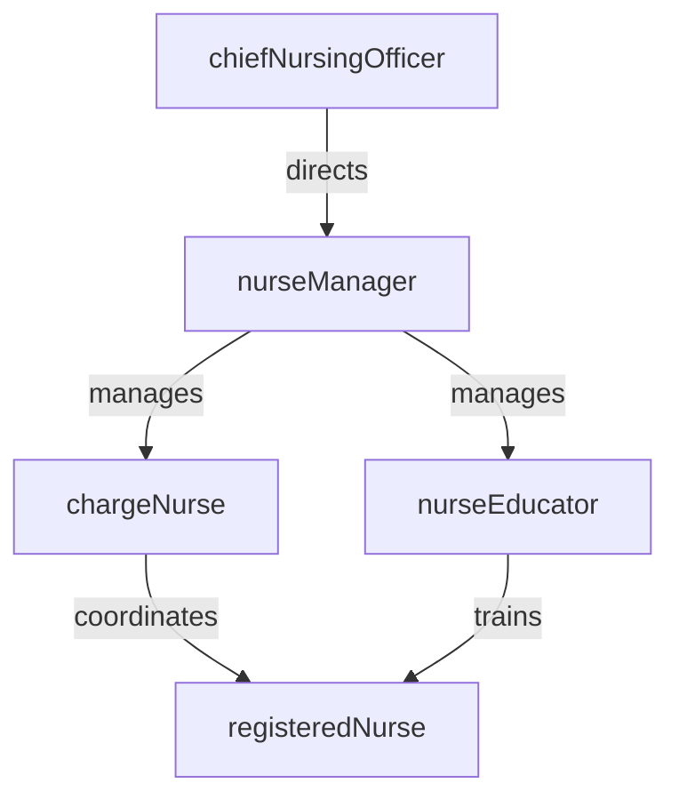

# Nursing

> Business-as-Code definition for the Nursing department. Models responsibilities, actions, events, and searches.

## Overview

Nursing delivers direct patient care across inpatient and outpatient settings, coordinating clinical assessments, medication administration, care planning, and patient education. The department manages nursing staff assignments, enforces clinical protocols, and ensures continuity of care throughout the patient journey.

## Responsibilities

| Responsibility | Description |
|---------------|-------------|
| deliverPatientCare | Perform bedside assessments, administer treatments, and monitor patient status across units |
| coordinateCare | Collaborate with physicians, therapists, and specialists to execute interdisciplinary care plans |
| administerMedications | Verify orders, prepare medications, and administer drugs following the five rights of medication safety |
| manageNursingStaff | Schedule shifts, assign patient loads, and ensure adequate nurse-to-patient ratios |
| enforceProtocols | Implement and audit compliance with clinical protocols, fall prevention, and pressure injury bundles |
| educatePatients | Provide patient and family education on diagnoses, self-care, and discharge instructions |

## Roles

| Role | Description |
|------|-------------|
| chiefNursingOfficer | Sets nursing strategy, staffing models, and clinical quality standards for the organization |
| nurseManager | Manages unit operations, staff scheduling, budgets, and performance evaluations |
| chargeNurse | Coordinates shift-level patient assignments and serves as the unit resource during a shift |
| registeredNurse | Delivers direct patient care including assessments, medication administration, and documentation |
| nurseEducator | Develops training programs, orients new staff, and maintains clinical competency standards |

## Entities

| Entity | Description |
|--------|-------------|
| CarePlan | Individualized plan of nursing interventions, goals, and expected outcomes for a patient |
| NursingAssessment | Structured clinical evaluation documenting patient condition, vital signs, and risk scores |
| MedicationAdministrationRecord | Time-stamped log of all medications administered to a patient including dose, route, and nurse |
| ShiftAssignment | Mapping of nurses to patients and units for a given shift period |
| ClinicalProtocol | Standardized evidence-based care guideline for a specific condition or intervention |

## Actions

| Action | Description |
|--------|-------------|
| assessPatient | Perform a head-to-toe nursing assessment and document findings in the EHR |
| administerMedication | Verify the order, prepare, and give medication following the five rights protocol |
| updateCarePlan | Revise nursing interventions and goals based on patient response and clinical changes |
| documentCare | Record all nursing activities, observations, and patient interactions in the medical record |
| handoffPatient | Communicate patient status, pending tasks, and concerns during shift change using SBAR |
| assignNurses | Allocate patient assignments to nursing staff based on acuity and competency |
| escalateConcern | Notify the rapid response team or physician of a deteriorating patient condition |

## Events

| Event | Description |
|-------|-------------|
| patientAssessed | Initial or ongoing nursing assessment completed and documented |
| medicationAdministered | Medication given to patient and recorded in the medication administration record |
| carePlanUpdated | Nursing care plan revised with new interventions or modified goals |
| shiftHandoffCompleted | Patient information transferred between outgoing and incoming nursing staff |
| nurseAssigned | Nurse-patient assignment finalized for a shift |
| rapidResponseActivated | Rapid response team called for a patient showing signs of clinical deterioration |
| protocolViolationDetected | Deviation from an established clinical protocol identified during audit |

## Searches

| Search | Description |
|--------|-------------|
| findPatientsByUnit | List all current patients assigned to a specific nursing unit |
| getPendingMedications | Retrieve medications due for administration within a time window |
| getStaffSchedule | View nursing staff assignments and shift coverage for a unit |
| findOverdueAssessments | Identify patients whose scheduled nursing assessments are past due |
| getHighAcuityPatients | List patients with elevated acuity scores requiring closer monitoring |

## Workflow



## Actor Relationships



## Related Processes

| Process | APQC ID | Relationship |
|---------|---------|-------------|
| Deliver Services | 5.0 | Core owner of bedside care delivery and clinical intervention execution |
| Manage Customer Service | 6.0 | Supports patient experience through education, communication, and care coordination |

## Related Departments

| Department | Relationship |
|-----------|-------------|
| Pharmacy | Receives medication orders and coordinates drug administration schedules |
| Patient Safety | Reports incidents and participates in quality improvement initiatives |
| Case Management | Collaborates on discharge planning and care transitions |
| Medical Records | Documents clinical care that becomes part of the permanent health record |

## Usage

```typescript
import { db } from '@headlessly/db'

const nursing = await db.departments.get('nursing')
const patients = await db.departments.search('findPatientsByUnit', { unit: 'ICU' })
const meds = await db.departments.search('getPendingMedications', { unit: '3-East', window: '2h' })
```
