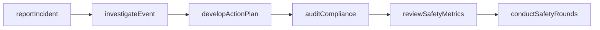
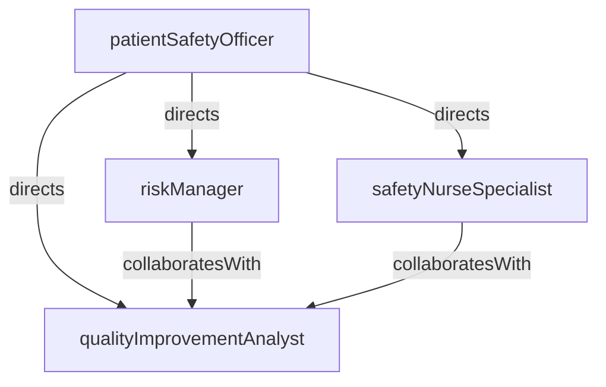

# Patient Safety

> Business-as-Code definition for the Patient Safety department. Models responsibilities, actions, events, and searches.

## Overview

Patient Safety designs and oversees programs that prevent harm, detect adverse events, and drive continuous quality improvement across the organization. The department manages incident reporting systems, conducts root cause analyses, monitors safety metrics, and ensures compliance with regulatory and accreditation standards such as The Joint Commission.

## Responsibilities

| Responsibility | Description |
|---------------|-------------|
| manageIncidentReporting | Operate the facility-wide incident reporting system and encourage a just culture of reporting |
| conductRootCauseAnalysis | Investigate serious safety events to identify contributing factors and systemic vulnerabilities |
| monitorSafetyMetrics | Track hospital-acquired conditions, falls, medication errors, and other safety indicators |
| driveQualityImprovement | Lead corrective action plans, safety bundles, and evidence-based practice changes |
| ensureRegulatoryCompliance | Maintain readiness for Joint Commission, CMS, and state health department surveys |

## Roles

| Role | Description |
|------|-------------|
| patientSafetyOfficer | Leads the patient safety program, sets strategy, and reports to executive leadership |
| qualityImprovementAnalyst | Analyzes safety data, identifies trends, and prepares performance dashboards |
| riskManager | Evaluates clinical risk exposures, manages claims, and coordinates with legal counsel |
| safetyNurseSpecialist | Conducts bedside audits, coaches staff on safety practices, and supports event investigations |

## Entities

| Entity | Description |
|--------|-------------|
| SafetyIncidentReport | Documented report of an adverse event, near miss, or unsafe condition filed by staff |
| RootCauseAnalysis | Structured investigation identifying causal and contributing factors of a serious safety event |
| CorrectiveActionPlan | Documented set of interventions designed to prevent recurrence of a safety event |
| SafetyDashboard | Real-time display of key safety metrics including falls, infections, and medication errors |
| RegulatoryFinding | Deficiency or citation identified during an external survey or accreditation review |

## Actions

| Action | Description |
|--------|-------------|
| reportIncident | File a safety incident report documenting the event, involved parties, and immediate actions taken |
| investigateEvent | Conduct a structured investigation of a reported safety event to determine root causes |
| developActionPlan | Create a corrective action plan with measurable interventions and accountability assignments |
| auditCompliance | Perform clinical audits to assess adherence to safety protocols and regulatory standards |
| reviewSafetyMetrics | Analyze trends in safety indicators and present findings to the quality committee |
| conductSafetyRounds | Walk clinical areas to observe practices, engage staff, and identify potential hazards |

## Events

| Event | Description |
|-------|-------------|
| incidentReported | Safety incident report submitted by a staff member into the reporting system |
| investigationCompleted | Root cause analysis or event investigation finalized with findings documented |
| actionPlanApproved | Corrective action plan reviewed and approved by the safety committee |
| complianceAuditCompleted | Clinical safety audit finished with results documented and shared with unit leadership |
| safetyAlertIssued | Organization-wide safety alert distributed in response to an emerging risk or sentinel event |
| regulatoryFindingReceived | Deficiency identified during a regulatory survey requiring corrective response |

## Searches

| Search | Description |
|--------|-------------|
| findOpenIncidents | List safety incidents awaiting investigation or resolution |
| getSafetyMetrics | Retrieve safety performance indicators for a unit or time period |
| findPendingActionPlans | List corrective action plans with open or overdue interventions |
| getIncidentsByCategory | Group reported incidents by type such as falls, medication errors, or pressure injuries |
| findRegulatoryFindings | Retrieve open regulatory deficiencies requiring corrective action |

## Workflow



## Actor Relationships



## Related Processes

| Process | APQC ID | Relationship |
|---------|---------|-------------|
| Deliver Services | 5.0 | Monitors safety of clinical service delivery and drives improvement interventions |
| Manage Customer Service | 6.0 | Investigates patient complaints related to safety events and adverse outcomes |

## Related Departments

| Department | Relationship |
|-----------|-------------|
| Nursing | Largest source of incident reports and primary implementer of safety bundles |
| Infection Control | Collaborates on hospital-acquired infection prevention and surveillance |
| Pharmacy | Partners on medication safety initiatives and adverse drug event analysis |
| Credentialing | Shares peer review findings relevant to provider safety performance |

## Usage

```typescript
import { db } from '@headlessly/db'

const safety = await db.departments.get('patientSafety')
const incidents = await db.departments.search('findOpenIncidents', { severity: 'serious' })
const metrics = await db.departments.search('getSafetyMetrics', { unit: 'surgical', period: 'last-quarter' })
```
