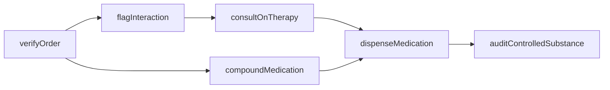
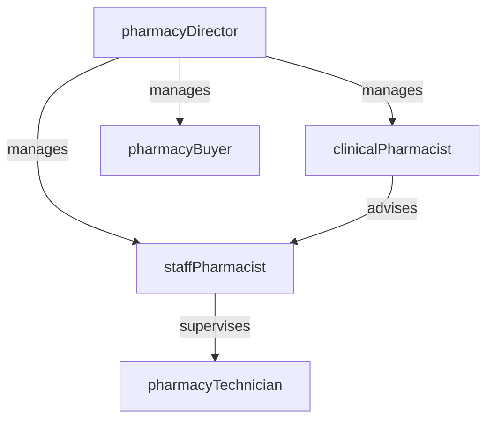

# Pharmacy

> Business-as-Code definition for the Pharmacy department. Models responsibilities, actions, events, and searches.

## Overview

Pharmacy manages the procurement, compounding, dispensing, and monitoring of medications across the facility. The department maintains the formulary, screens orders for drug interactions and allergies, and provides clinical pharmacy consultations to optimize therapeutic outcomes.

## Responsibilities

| Responsibility | Description |
|---------------|-------------|
| dispenseMedications | Prepare and dispense medications accurately per physician orders and facility protocols |
| manageFormulary | Maintain the approved drug formulary, evaluate new agents, and manage therapeutic substitutions |
| reviewDrugInteractions | Screen medication orders for contraindications, allergies, and drug-drug interactions |
| compoundPreparations | Prepare sterile and non-sterile compounded medications following USP standards |
| providePharmacyConsultations | Advise clinical teams on drug selection, dosing adjustments, and pharmacokinetic monitoring |

## Roles

| Role | Description |
|------|-------------|
| pharmacyDirector | Oversees pharmacy operations, formulary governance, regulatory compliance, and department budget |
| clinicalPharmacist | Provides clinical consultations, reviews complex drug therapy, and participates in patient rounds |
| staffPharmacist | Verifies and dispenses medication orders, counsels patients, and monitors drug utilization |
| pharmacyTechnician | Prepares medications, manages inventory, and assists pharmacists with dispensing operations |
| pharmacyBuyer | Manages drug procurement, vendor relationships, and controlled substance inventory |

## Entities

| Entity | Description |
|--------|-------------|
| MedicationOrder | Physician-authorized prescription specifying drug, dose, route, frequency, and duration |
| Formulary | Approved list of medications available for prescribing within the facility |
| DrugInteractionAlert | System-generated warning when a new order conflicts with existing medications or allergies |
| CompoundingRecord | Batch documentation for compounded preparations including ingredients, lot numbers, and expiration |
| ControlledSubstanceLog | Chain-of-custody record for Schedule II-V controlled substances |

## Actions

| Action | Description |
|--------|-------------|
| verifyOrder | Review a medication order for accuracy, appropriateness, and potential interactions |
| dispenseMedication | Prepare, label, and release a medication for patient administration |
| flagInteraction | Generate an alert when a drug-drug or drug-allergy interaction is detected |
| compoundMedication | Prepare a custom medication formulation per physician specifications and USP standards |
| consultOnTherapy | Advise the care team on optimal drug selection, dosing, or therapeutic alternatives |
| auditControlledSubstance | Reconcile controlled substance inventory against dispensing records |

## Events

| Event | Description |
|-------|-------------|
| orderVerified | Medication order reviewed and approved by a pharmacist |
| medicationDispensed | Medication prepared, labeled, and released for patient administration |
| interactionFlagged | Drug interaction or allergy conflict detected and escalated to the prescriber |
| compoundCompleted | Compounded medication preparation finished and quality-checked |
| formularyUpdated | Drug added, removed, or restricted on the facility formulary |
| controlledSubstanceDiscrepancy | Mismatch found between controlled substance inventory count and dispensing records |

## Searches

| Search | Description |
|--------|-------------|
| findPendingOrders | List medication orders awaiting pharmacist verification |
| getFormularyDrugs | Search the formulary by drug name, class, or therapeutic category |
| findInteractionAlerts | Retrieve unresolved drug interaction alerts by severity |
| getControlledSubstanceLog | View dispensing and inventory history for a controlled substance |
| findExpiringInventory | List medications approaching expiration date for rotation or disposal |

## Workflow



## Actor Relationships



## Related Processes

| Process | APQC ID | Relationship |
|---------|---------|-------------|
| Deliver Services | 5.0 | Core owner of medication preparation, dispensing, and clinical pharmacy services |
| Manage Customer Service | 6.0 | Supports patient safety through drug interaction screening and therapy consultations |

## Related Departments

| Department | Relationship |
|-----------|-------------|
| Nursing | Administers dispensed medications and reports adverse drug reactions |
| Laboratory | Provides lab values for pharmacokinetic monitoring and dose adjustments |
| Patient Safety | Collaborates on medication error prevention and adverse event investigations |

## Usage

```typescript
import { db } from '@headlessly/db'

const pharmacy = await db.departments.get('pharmacy')
const pending = await db.departments.search('findPendingOrders', { status: 'awaiting-verification' })
const alerts = await db.departments.search('findInteractionAlerts', { severity: 'high' })
```
