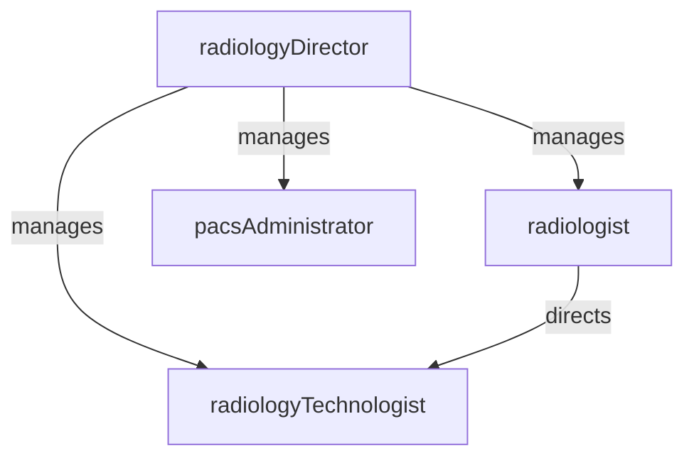

# Radiology

> Business-as-Code definition for the Radiology department. Models responsibilities, actions, events, and searches.

## Overview

Radiology provides diagnostic and interventional imaging services including X-ray, CT, MRI, ultrasound, and fluoroscopy. The department manages imaging orders, acquires and stores images in PACS, delivers radiologist interpretations, and maintains equipment quality assurance and radiation safety programs.

## Responsibilities

| Responsibility | Description |
|---------------|-------------|
| performDiagnosticImaging | Acquire diagnostic images using appropriate modalities based on clinical indications |
| interpretStudies | Provide timely radiologist interpretations and generate structured reports for ordering providers |
| manageImagingEquipment | Maintain, calibrate, and quality-test imaging equipment per manufacturer and regulatory standards |
| enforceRadiationSafety | Monitor radiation exposure, enforce ALARA principles, and manage dosimetry programs |
| coordinateImagingSchedule | Schedule and prioritize imaging exams based on clinical urgency and resource availability |

## Roles

| Role | Description |
|------|-------------|
| radiologyDirector | Oversees radiology operations, equipment planning, quality programs, and departmental budget |
| radiologist | Interprets diagnostic images and provides clinical consultations to referring providers |
| radiologyTechnologist | Operates imaging equipment, positions patients, and acquires diagnostic-quality images |
| pacsAdministrator | Manages the picture archiving and communication system, image routing, and storage infrastructure |

## Entities

| Entity | Description |
|--------|-------------|
| ImagingOrder | Physician request specifying the exam type, clinical indication, and patient preparation instructions |
| DiagnosticStudy | Set of acquired images for a specific exam with associated metadata and technical parameters |
| RadiologyReport | Radiologist interpretation of a diagnostic study including findings, impressions, and recommendations |
| PacsArchive | Digital archive storing all diagnostic images with retrieval, routing, and lifecycle management |
| QualityAssuranceRecord | Documentation of equipment calibration, phantom testing, and dose audits |

## Actions

| Action | Description |
|--------|-------------|
| scheduleExam | Book an imaging appointment based on order priority, modality availability, and patient readiness |
| acquireImages | Position the patient and operate imaging equipment to obtain diagnostic-quality images |
| interpretStudy | Review acquired images, correlate with clinical history, and generate a structured radiology report |
| communicateCriticalFinding | Directly notify the ordering provider of urgent or unexpected imaging findings |
| performQualityCheck | Execute equipment calibration tests and dose audits per regulatory requirements |
| routeImages | Transmit images to PACS, referring providers, or external facilities via DICOM protocols |

## Events

| Event | Description |
|-------|-------------|
| examScheduled | Imaging appointment confirmed and added to the modality worklist |
| imagesAcquired | Diagnostic images captured and transmitted to PACS for storage |
| studyInterpreted | Radiologist completed interpretation and signed the radiology report |
| criticalFindingCommunicated | Urgent finding verbally communicated to the ordering provider and documented |
| qualityCheckCompleted | Equipment quality assurance test performed and results recorded |
| examCancelled | Scheduled imaging exam cancelled due to clinical or logistical reasons |

## Searches

| Search | Description |
|--------|-------------|
| findPendingInterpretations | List imaging studies awaiting radiologist read and report |
| getExamsByPatient | Retrieve all imaging studies and reports for a specific patient |
| findScheduledExams | View upcoming imaging appointments by modality, date, or technologist |
| getCriticalFindings | List studies with critical or urgent findings requiring follow-up |
| getEquipmentQaStatus | Retrieve the most recent quality assurance results for imaging equipment |

## Workflow


## Actor Relationships



## Related Processes

| Process | APQC ID | Relationship |
|---------|---------|-------------|
| Deliver Services | 5.0 | Core owner of diagnostic imaging acquisition, interpretation, and reporting |
| Manage Customer Service | 6.0 | Communicates critical results and responds to referring provider inquiries |

## Related Departments

| Department | Relationship |
|-----------|-------------|
| Emergency Department | Provides stat imaging for trauma and acute presentations |
| Nursing | Coordinates patient transport, preparation, and post-procedure monitoring |
| Laboratory | Shares diagnostic data that complements imaging findings for clinical correlation |
| Information Technology | Supports PACS, RIS, and DICOM infrastructure and integrations |

## Usage

```typescript
import { db } from '@headlessly/db'

const radiology = await db.departments.get('radiology')
const pending = await db.departments.search('findPendingInterpretations', { modality: 'CT' })
const criticals = await db.departments.search('getCriticalFindings', { period: 'last-24h' })
```
