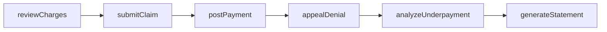
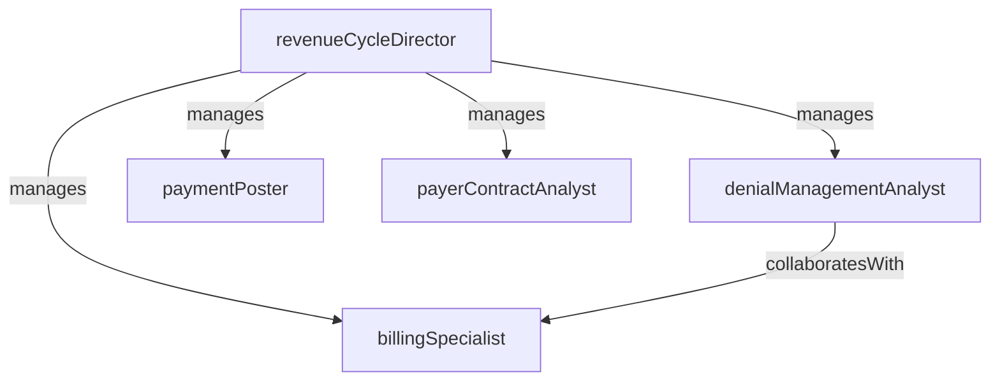

# Revenue Cycle Management

> Business-as-Code definition for the Revenue Cycle Management department. Models responsibilities, actions, events, and searches.

## Overview

Revenue Cycle Management oversees the financial lifecycle of patient encounters from charge capture through final payment collection. The department manages medical billing, claims submission, payment posting, denial management, and payer contract analysis to maximize reimbursement and minimize revenue leakage across the organization.

## Responsibilities

| Responsibility | Description |
|---------------|-------------|
| captureCharges | Ensure all billable services, procedures, and supplies are accurately captured and coded |
| submitClaims | Generate and transmit clean claims to payers following regulatory and contractual requirements |
| manageDenials | Investigate, appeal, and resolve payer denials to recover lost revenue |
| postPayments | Apply payer and patient payments, adjustments, and contractual write-offs to patient accounts |
| analyzePayerContracts | Evaluate payer reimbursement rates against contracted terms and identify underpayments |
| managePatientCollections | Generate patient statements, establish payment plans, and pursue outstanding balances |

## Roles

| Role | Description |
|------|-------------|
| revenueCycleDirector | Leads the revenue cycle department, sets KPI targets, and oversees end-to-end billing operations |
| billingSpecialist | Generates claims, corrects billing errors, and resubmits rejected claims |
| denialManagementAnalyst | Investigates claim denials, identifies root causes, and prepares appeals with supporting documentation |
| paymentPoster | Applies insurance and patient payments to accounts and reconciles remittance advices |
| payerContractAnalyst | Models payer contract terms, identifies underpayments, and supports contract negotiation |

## Entities

| Entity | Description |
|--------|-------------|
| Claim | Insurance claim containing patient, provider, diagnosis, procedure, and charge data for reimbursement |
| ChargeEntry | Individual billable line item capturing a service, procedure, or supply with associated revenue codes |
| RemittanceAdvice | Payer explanation of benefits detailing allowed amounts, adjustments, and payment for each claim line |
| DenialRecord | Documentation of a denied claim including denial reason code, appeal status, and resolution |
| PayerContract | Agreement between the facility and an insurance payer defining reimbursement rates and terms |

## Actions

| Action | Description |
|--------|-------------|
| reviewCharges | Audit charge entries for completeness, accuracy, and correct coding before claim generation |
| submitClaim | Generate and transmit a clean claim to the appropriate payer via the clearinghouse |
| postPayment | Apply payer or patient payment to the correct account and reconcile against the remittance advice |
| appealDenial | Prepare supporting clinical documentation and submit a formal appeal for a denied claim |
| analyzeUnderpayment | Compare actual reimbursement to contracted rates and flag underpaid claims for recovery |
| generateStatement | Create and send a patient balance statement with payment options and due date |

## Events

| Event | Description |
|-------|-------------|
| chargesReviewed | Charge entries audited and approved for claim generation |
| claimSubmitted | Clean claim transmitted to the payer via the clearinghouse |
| paymentPosted | Payer or patient payment applied to the account and reconciled |
| claimDenied | Payer rejected or denied a claim requiring investigation and potential appeal |
| appealSubmitted | Formal appeal with supporting documentation submitted to the payer |
| underpaymentIdentified | Reimbursement shortfall detected when comparing payment to contracted rates |

## Searches

| Search | Description |
|--------|-------------|
| findUnsubmittedCharges | List charge entries not yet included in a submitted claim |
| getPendingClaims | Retrieve claims submitted but not yet adjudicated by the payer |
| findOpenDenials | List denied claims awaiting investigation or appeal |
| getAgingReport | View accounts receivable aging by payer, bucket, and facility |
| findUnderpayments | Identify claims where payment fell below contracted reimbursement rates |
| getPatientBalances | List outstanding patient balances with last statement date and payment history |

## Workflow



## Actor Relationships



## Related Processes

| Process | APQC ID | Relationship |
|---------|---------|-------------|
| Perform Revenue Accounting | 9.2 | Core owner of charge capture, billing, collections, and accounts receivable management |
| Deliver Services | 5.0 | Captures financial data generated by clinical service delivery |

## Related Departments

| Department | Relationship |
|-----------|-------------|
| Medical Records | Receives coded encounters that drive charge capture and claim generation |
| Patient Admissions | Relies on accurate registration and insurance verification data for clean claims |
| Case Management | Coordinates on authorization status and denial prevention strategies |
| Finance | Reports revenue performance, AR aging, and collection metrics to financial leadership |

## Usage

```typescript
import { db } from '@headlessly/db'

const rcm = await db.departments.get('revenueCycleManagement')
const denials = await db.departments.search('findOpenDenials', { payer: 'medicare' })
const aging = await db.departments.search('getAgingReport', { bucket: '90-plus' })
```
