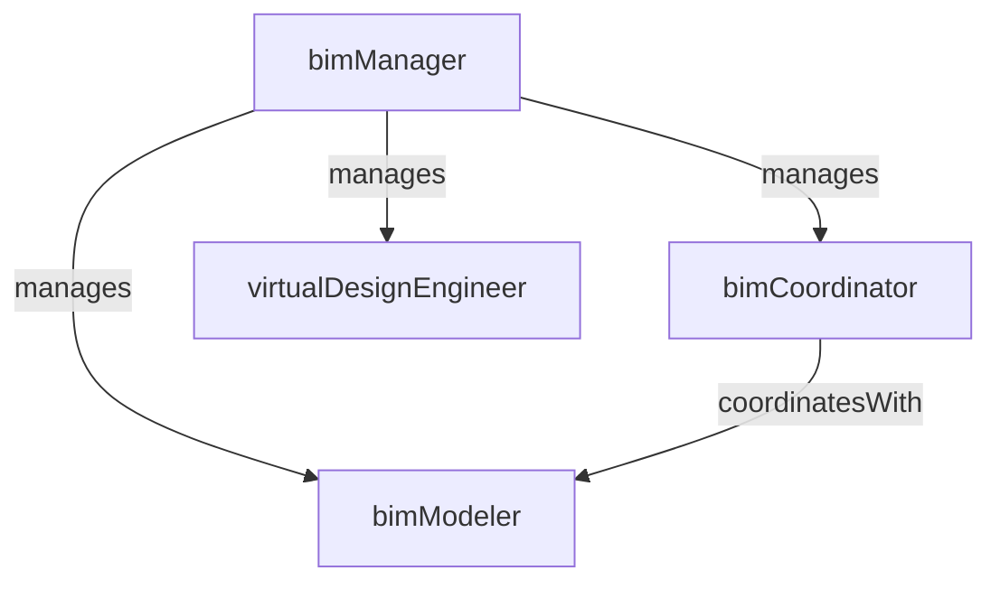

# Building Information Modeling

> Business-as-Code definition for the Building Information Modeling department. Models responsibilities, actions, events, and searches.

## Overview

Building Information Modeling (BIM) manages the creation, coordination, and maintenance of 3D digital models that represent the physical and functional characteristics of a construction project. The department performs clash detection, supports model-based quantity extraction, and enables 4D/5D visualization to improve design coordination, reduce rework, and enhance project delivery.

## Responsibilities

| Responsibility | Description |
|---------------|-------------|
| coordinateDesignModels | Federate and align architectural, structural, and MEP models into a single coordinated model |
| performClashDetection | Run automated interference checks between disciplines and manage clash resolution workflows |
| maintainBimExecutionPlan | Define modeling standards, LOD requirements, and data exchange protocols for the project |
| supportQuantityExtraction | Extract material quantities and counts from the model to support estimating and procurement |
| produce4dSimulations | Link the 3D model to the construction schedule to create time-lapse construction simulations |

## Roles

| Role | Description |
|------|-------------|
| bimManager | Leads the BIM function, sets modeling standards, and coordinates with project stakeholders |
| bimCoordinator | Federates discipline models, runs clash detection, and facilitates coordination meetings |
| bimModeler | Creates and maintains 3D models for specific disciplines or construction phases |
| virtualDesignEngineer | Develops 4D/5D simulations, model-based analyses, and digital twin prototypes |

## Entities

| Entity | Description |
|--------|-------------|
| FederatedModel | Combined 3D model integrating architectural, structural, and MEP discipline models |
| ClashReport | Results of an automated interference check showing conflicts between model elements |
| BimExecutionPlan | Project document defining BIM scope, standards, LOD requirements, and deliverable schedule |
| ModelElement | A discrete component in the BIM model such as a wall, duct, beam, or pipe |
| ScheduleSimulation | 4D visualization linking model elements to construction schedule activities |

## Actions

| Action | Description |
|--------|-------------|
| federateModels | Combine discipline-specific models into a single coordinated federated model |
| runClashDetection | Execute automated interference checks between building systems and disciplines |
| resolveClash | Coordinate with design teams to modify conflicting elements and eliminate a detected clash |
| extractQuantities | Pull material quantities and counts from the model for estimating or procurement |
| createScheduleSimulation | Link model elements to CPM schedule activities to produce a 4D construction simulation |
| publishModelUpdate | Release a new version of the coordinated model to the project team |

## Events

| Event | Description |
|-------|-------------|
| modelsFederated | Discipline models were combined into an updated federated model |
| clashDetectionCompleted | An automated clash detection run was executed and a clash report was generated |
| clashResolved | A design conflict was resolved through coordination and the model was updated |
| quantitiesExtracted | Material quantities were pulled from the model and delivered to the requesting department |
| simulationCreated | A 4D schedule simulation was produced and shared with the project team |
| modelUpdatePublished | A new version of the coordinated model was released to stakeholders |

## Searches

| Search | Description |
|--------|-------------|
| findOpenClashes | Retrieve unresolved clashes from the latest clash detection run by discipline or severity |
| getModelVersionHistory | Query the revision history of the federated model by date or milestone |
| getQuantitiesBySystem | Extract aggregated quantities from the model by building system or CSI division |
| findModelElements | Search for specific model elements by type, material, or location within the building |
| getSimulationTimeline | Retrieve the 4D simulation timeline showing construction sequence by phase |

## Workflow


## Actor Relationships



## Related Processes

| Process | APQC ID | Relationship |
|---------|---------|-------------|
| Produce/Manufacture/Deliver Product | 4.3 | Provides coordinated digital models that guide construction execution and reduce rework |
| Manage Enterprise Asset Lifecycle | 10.2 | Delivers as-built models that become the digital twin foundation for facility management |

## Related Departments

| Department | Relationship |
|-----------|-------------|
| Estimating | Supplies model-based quantity data that improves takeoff speed and accuracy |
| Field Operations | Provides 3D models and layout data used by field teams for construction coordination |
| Project Controls | Enables 4D schedule visualization for progress monitoring and stakeholder reporting |
| Construction Safety | Supports hazard identification and safety planning through 3D site logistics modeling |

## Usage

```typescript
import { db } from '@headlessly/db'

const dept = await db.departments.get('buildingInformationModeling')
const clashes = await db.departments.search('findOpenClashes', { discipline: 'MEP', severity: 'hard' })
const quantities = await db.departments.search('getQuantitiesBySystem', { system: 'structural-steel' })
```
