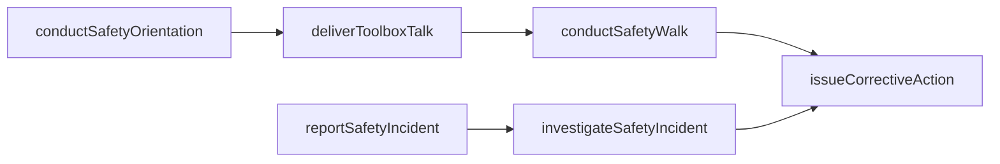
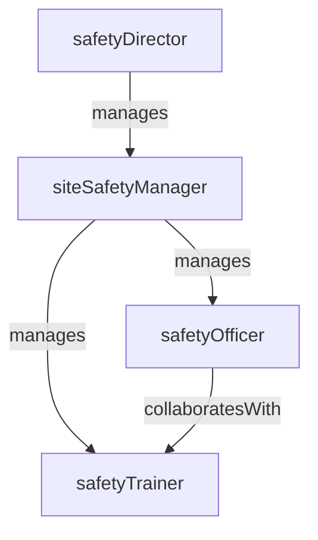

# Construction Safety

> Business-as-Code definition for the Construction Safety department. Models responsibilities, actions, events, and searches.

## Overview

Construction Safety manages job site safety programs, conducts inspections and toolbox talks, investigates incidents, and ensures compliance with OSHA and site-specific safety requirements. The department drives a zero-incident culture by proactively identifying hazards and enforcing safe work practices across all trades on the construction site.

## Responsibilities

| Responsibility | Description |
|---------------|-------------|
| conductJobSiteInspections | Perform daily and weekly safety walks to identify hazards and verify compliance |
| facilitateToolboxTalks | Deliver short daily safety briefings to crews before work begins |
| investigateIncidents | Conduct root cause investigations for injuries, near-misses, and property damage events |
| enforceSafetyCompliance | Monitor compliance with OSHA standards, site safety plans, and contractor safety requirements |
| manageSafetyOrientation | Administer site-specific safety orientation for all workers entering the job site |

## Roles

| Role | Description |
|------|-------------|
| safetyDirector | Sets corporate safety policy, owns safety metrics, and manages the safety team across projects |
| siteSafetyManager | Leads day-to-day safety operations on a specific construction project site |
| safetyOfficer | Conducts inspections, issues corrective actions, and monitors field compliance |
| safetyTrainer | Develops and delivers safety orientation, toolbox talks, and specialized training |

## Entities

| Entity | Description |
|--------|-------------|
| SafetyInspectionReport | Documented findings from a job site safety walk including observations and corrective actions |
| IncidentReport | Formal record of a workplace injury, near-miss, or property damage event on the job site |
| ToolboxTalkRecord | Documentation of a pre-work safety briefing including topic, attendees, and date |
| SiteSafetyPlan | Project-specific safety plan defining hazard controls, emergency procedures, and PPE requirements |
| CorrectiveActionNotice | Written notice requiring a contractor or crew to correct a specific safety violation |

## Actions

| Action | Description |
|--------|-------------|
| conductSafetyWalk | Perform a physical safety inspection of active work areas on the job site |
| deliverToolboxTalk | Conduct a pre-shift safety briefing for a crew and record attendance |
| reportSafetyIncident | Document a workplace injury, near-miss, or property damage event |
| investigateSafetyIncident | Perform a root cause investigation and identify corrective actions for an incident |
| issueCorrectiveAction | Issue a written corrective action notice for a safety violation |
| conductSafetyOrientation | Administer site safety orientation for new workers arriving on the project |

## Events

| Event | Description |
|-------|-------------|
| safetyWalkCompleted | A job site safety inspection was conducted and findings were documented |
| toolboxTalkDelivered | A pre-shift safety briefing was conducted and attendance was recorded |
| safetyIncidentReported | A workplace injury, near-miss, or property damage event was formally documented |
| investigationCompleted | A root cause investigation was closed with corrective actions assigned |
| correctiveActionIssued | A written safety violation notice was issued to a contractor or crew |
| workerOriented | A new worker completed site-specific safety orientation and was cleared to work |

## Searches

| Search | Description |
|--------|-------------|
| findOpenIncidents | Retrieve unresolved safety incidents and their investigation status by project |
| getSafetyMetrics | Query TRIR, DART, and near-miss rates for a project or time period |
| findOutstandingCorrectiveActions | List corrective action notices not yet resolved by the responsible party |
| getOrientationStatus | Check safety orientation completion for workers on a specific project |
| getToolboxTalkHistory | Retrieve toolbox talk records by project, topic, or date range |

## Workflow



## Actor Relationships



## Related Processes

| Process | APQC ID | Relationship |
|---------|---------|-------------|
| Produce/Manufacture/Deliver Product | 4.3 | Ensures construction execution meets workplace safety standards |
| Manage Environmental Health and Safety | 10.3 | Implements the enterprise EHS program on construction job sites |

## Related Departments

| Department | Relationship |
|-----------|-------------|
| Field Operations | Coordinates daily safety inspections and toolbox talks with field supervisors |
| Subcontractor Management | Enforces subcontractor safety compliance and reviews subcontractor safety records |
| Project Controls | Provides incident and safety metric data for project reporting dashboards |
| Building Information Modeling | Uses 3D models for hazard identification and safety planning during preconstruction |

## Usage

```typescript
import { db } from '@headlessly/db'

const dept = await db.departments.get('constructionSafety')
const incidents = await db.departments.search('findOpenIncidents', { project: 'proj-2025-017' })
const metrics = await db.departments.search('getSafetyMetrics', { period: '2025-Q1' })
```
