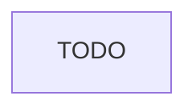

# Construction Safety

> Business-as-Code definition for the Construction Safety department. Models responsibilities, actions, events, and searches.

## Overview

Job site safety inspections, toolbox talks, incident investigation, and OSHA compliance

## Responsibilities

| Responsibility | Description |
|---------------|-------------|
| TODO | TODO |

## Roles

| Role | Description |
|------|-------------|
| TODO | TODO |

## Entities

| Entity | Description |
|--------|-------------|
| TODO | TODO |

## Actions

| Action | Description |
|--------|-------------|
| TODO | TODO |

## Events

| Event | Description |
|-------|-------------|
| TODO | TODO |

## Searches

| Search | Description |
|--------|-------------|
| TODO | TODO |

## Workflow



## Actor Relationships


## Related Processes

| Process | APQC ID | Relationship |
|---------|---------|-------------|
| TODO | TODO | TODO |

## Related Departments

| Department | Relationship |
|-----------|-------------|
| TODO | TODO |

## Usage

```typescript
import { db } from '@headlessly/db'

const dept = await db.departments.get('constructionSafety')
// TODO: Example queries
```
