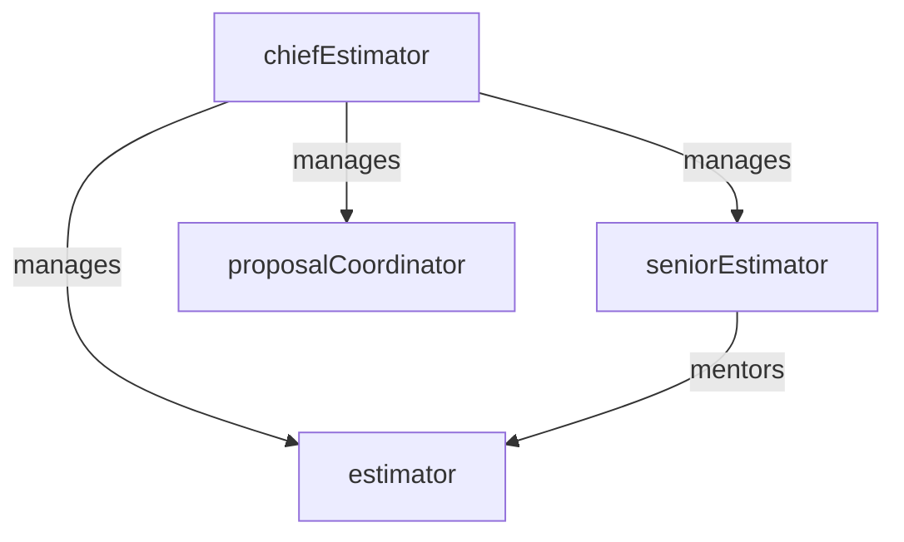

# Estimating

> Business-as-Code definition for the Estimating department. Models responsibilities, actions, events, and searches.

## Overview

Estimating develops accurate cost projections for construction projects by performing quantity takeoffs, soliciting subcontractor and supplier pricing, analyzing historical cost data, and assembling competitive bid proposals. The department serves as the foundation for project profitability by establishing the cost baseline before construction begins.

## Responsibilities

| Responsibility | Description |
|---------------|-------------|
| performQuantityTakeoffs | Measure and quantify materials, labor, and equipment from construction drawings and specifications |
| solicitSubcontractorBids | Issue bid invitations to subcontractors and suppliers and evaluate returned pricing |
| assembleCostEstimates | Build detailed cost estimates by trade, CSI division, and work breakdown structure |
| prepareBidProposals | Package estimates into formal bid proposals with qualifications, exclusions, and alternates |
| maintainCostDatabase | Update historical unit cost data from completed projects to improve future estimate accuracy |

## Roles

| Role | Description |
|------|-------------|
| chiefEstimator | Leads the estimating team, reviews final estimates, and makes bid/no-bid decisions |
| seniorEstimator | Develops full project estimates for complex or high-value pursuits |
| estimator | Performs quantity takeoffs, prices trades, and assembles estimate components |
| proposalCoordinator | Compiles bid documents, manages proposal schedules, and coordinates submission logistics |

## Entities

| Entity | Description |
|--------|-------------|
| CostEstimate | Detailed breakdown of projected costs by trade, material, labor, equipment, and overhead |
| QuantityTakeoff | Measured quantities of materials and work items extracted from construction documents |
| BidProposal | Formal pricing submission to an owner or general contractor including scope, price, and qualifications |
| SubcontractorQuote | Pricing received from a subcontractor or supplier for a defined scope of work |
| CostDatabase | Historical repository of unit costs, productivity rates, and pricing trends from past projects |

## Actions

| Action | Description |
|--------|-------------|
| createEstimate | Initiate a new cost estimate for a project or bid opportunity |
| performTakeoff | Measure and quantify materials and labor from construction drawings |
| requestSubQuotes | Issue invitations to bid to subcontractors and suppliers for specific scopes |
| compileEstimate | Assemble trade pricing, takeoff quantities, and markups into a complete cost estimate |
| submitBidProposal | Finalize and submit the bid proposal to the owner or general contractor |
| reconcileActualCosts | Compare actual project costs against the original estimate to update the cost database |

## Events

| Event | Description |
|-------|-------------|
| estimateCreated | A new cost estimate was initiated for a bid opportunity |
| takeoffCompleted | Quantity takeoff was finished and material/labor quantities were documented |
| subQuotesReceived | Subcontractor or supplier pricing was received and logged for evaluation |
| estimateFinalized | The complete cost estimate was reviewed, approved, and locked for bid submission |
| bidSubmitted | The formal bid proposal was submitted to the owner or general contractor |
| estimateReconciled | Actual project costs were compared against the estimate and variances were documented |

## Searches

| Search | Description |
|--------|-------------|
| findActiveEstimates | Retrieve estimates currently in progress by project or bid due date |
| getHistoricalUnitCosts | Query the cost database for unit pricing by trade, material, or region |
| findPendingSubQuotes | List subcontractor bids requested but not yet received |
| getBidHitRate | Calculate the win rate on submitted bids over a given period |
| getEstimateVsActual | Compare original estimate against actual costs for a completed project |

## Workflow


## Actor Relationships



## Related Processes

| Process | APQC ID | Relationship |
|---------|---------|-------------|
| Plan for and Align Supply Chain Resources | 4.2 | Provides cost baselines that inform procurement and subcontractor planning |
| Produce/Manufacture/Deliver Product | 4.3 | Establishes the cost framework against which construction execution is measured |

## Related Departments

| Department | Relationship |
|-----------|-------------|
| Project Controls | Receives the cost estimate as the baseline for budget tracking and earned value analysis |
| Subcontractor Management | Coordinates subcontractor bid solicitation and scope alignment during estimating |
| Field Operations | Provides constructability input and productivity assumptions used in the estimate |
| Building Information Modeling | Supplies model-based quantity data that accelerates takeoff accuracy |

## Usage

```typescript
import { db } from '@headlessly/db'

const dept = await db.departments.get('estimating')
const active = await db.departments.search('findActiveEstimates', { status: 'in-progress' })
const unitCosts = await db.departments.search('getHistoricalUnitCosts', { trade: 'concrete' })
```
