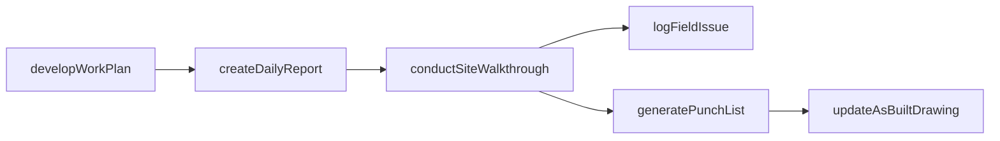
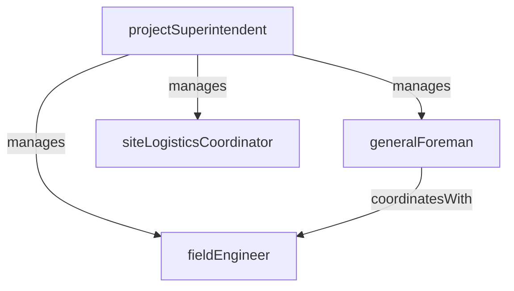

# Field Operations

> Business-as-Code definition for the Field Operations department. Models responsibilities, actions, events, and searches.

## Overview

Field Operations manages on-site construction execution including crew supervision, daily work planning, progress tracking, and coordination among trades. The department is responsible for translating project plans into physical construction while maintaining quality, safety, and schedule compliance on the job site.

## Responsibilities

| Responsibility | Description |
|---------------|-------------|
| superviseConstructionCrews | Direct and manage craft labor and crew assignments across active work areas |
| trackDailyProgress | Record daily construction output, labor hours, equipment usage, and weather conditions |
| coordinateTradeSequencing | Schedule and sequence multiple trades to avoid conflicts and maintain workflow continuity |
| manageSiteLogistics | Oversee material laydown, equipment staging, temporary utilities, and site access |
| resolveFieldIssues | Address design conflicts, unforeseen conditions, and constructability problems in real time |

## Roles

| Role | Description |
|------|-------------|
| projectSuperintendent | Leads all field operations on a project site and owns schedule and quality outcomes |
| generalForeman | Manages multiple craft crews and coordinates daily work assignments |
| fieldEngineer | Supports the field team with survey layout, document control, and quantity tracking |
| siteLogisticsCoordinator | Plans material deliveries, crane picks, equipment moves, and temporary facilities |

## Entities

| Entity | Description |
|--------|-------------|
| DailyFieldReport | Record of work performed, labor counts, equipment usage, weather, and site conditions for a day |
| WorkPlan | Short-interval plan detailing crew assignments, tasks, and sequencing for a work area |
| FieldIssue | Documentation of a design conflict, unforeseen condition, or constructability problem found on site |
| PunchList | Itemized list of incomplete or deficient work items requiring correction before closeout |
| AsBuiltDrawing | Drawing updated to reflect actual construction conditions as built in the field |

## Actions

| Action | Description |
|--------|-------------|
| createDailyReport | Log daily field activities including work completed, labor, equipment, and conditions |
| developWorkPlan | Prepare a short-interval plan assigning crews and tasks for an upcoming period |
| logFieldIssue | Document a design conflict or unforeseen condition encountered during construction |
| conductSiteWalkthrough | Perform a physical inspection of active work areas to verify progress and quality |
| generatePunchList | Compile a list of incomplete or deficient items for a completed work area |
| updateAsBuiltDrawing | Mark up construction drawings to reflect actual field conditions |

## Events

| Event | Description |
|-------|-------------|
| dailyReportSubmitted | The daily field report was completed and submitted for the project record |
| workPlanIssued | A short-interval work plan was finalized and distributed to crews |
| fieldIssueLogged | A design conflict or unforeseen site condition was documented and escalated |
| milestoneReached | A significant construction milestone was achieved on the project |
| punchListGenerated | A punch list was compiled for a substantially complete work area |
| asBuiltUpdated | An as-built drawing was updated to reflect actual field conditions |

## Searches

| Search | Description |
|--------|-------------|
| getDailyReports | Retrieve daily field reports for a project by date range |
| findOpenFieldIssues | List unresolved field issues by project, area, or priority |
| getCrewProductivity | Query labor productivity rates by trade, area, or time period |
| findPunchListItems | Retrieve open punch list items by area, trade, or responsible party |
| getMilestoneStatus | Check completion status of key project milestones |

## Workflow



## Actor Relationships



## Related Processes

| Process | APQC ID | Relationship |
|---------|---------|-------------|
| Produce/Manufacture/Deliver Product | 4.3 | Executes physical construction work that delivers the project scope |
| Manage Enterprise Asset Lifecycle | 10.2 | Manages construction equipment deployed on the job site |

## Related Departments

| Department | Relationship |
|-----------|-------------|
| Project Controls | Provides daily progress data used for schedule tracking and earned value calculations |
| Construction Safety | Coordinates job site safety inspections, toolbox talks, and incident response |
| Subcontractor Management | Manages the on-site work of subcontracted trades and enforces contract compliance |
| Estimating | Provides constructability feedback and actual productivity data for future estimates |

## Usage

```typescript
import { db } from '@headlessly/db'

const dept = await db.departments.get('fieldOperations')
const reports = await db.departments.search('getDailyReports', { project: 'proj-2025-017', date: '2025-03-15' })
const issues = await db.departments.search('findOpenFieldIssues', { priority: 'critical' })
```
