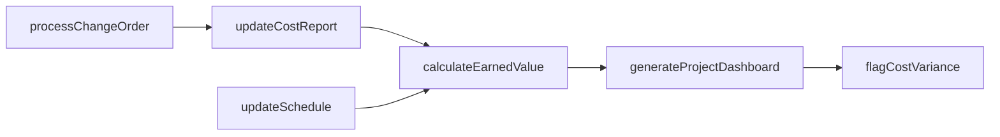
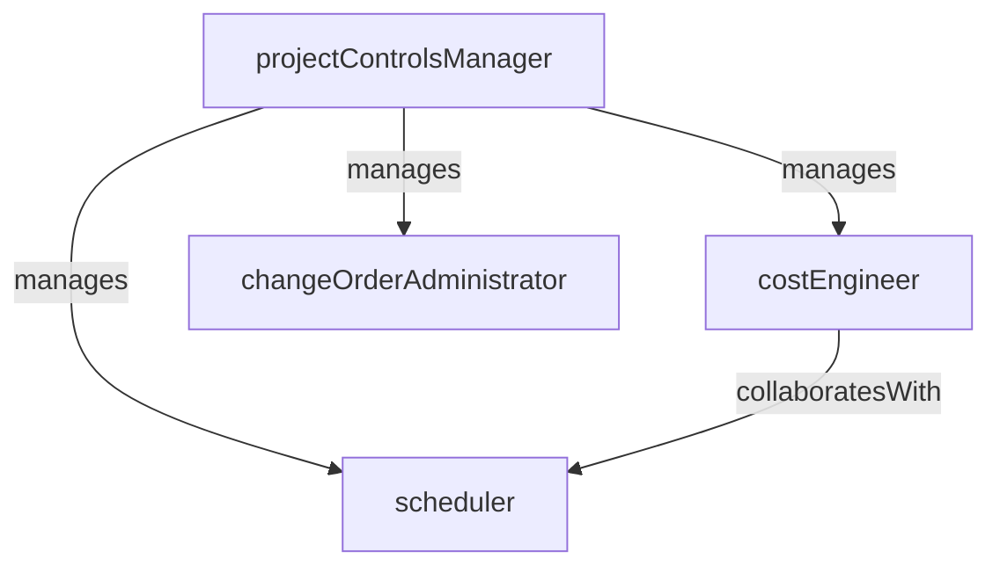

# Project Controls

> Business-as-Code definition for the Project Controls department. Models responsibilities, actions, events, and searches.

## Overview

Project Controls monitors and manages construction project performance through cost tracking, schedule management, earned value analysis, and change order administration. The department provides the data-driven oversight that keeps projects on budget and on schedule by detecting variances early and recommending corrective actions.

## Responsibilities

| Responsibility | Description |
|---------------|-------------|
| trackProjectCosts | Record committed and actual costs against the project budget and forecast cost at completion |
| manageProjectSchedule | Maintain the CPM schedule, update progress, and analyze critical path and float |
| performEarnedValueAnalysis | Calculate CPI, SPI, and estimate-at-completion metrics to assess project health |
| administerChangeOrders | Process, price, and track contract change orders and their impact on budget and schedule |
| produceProjectReports | Generate monthly cost reports, schedule updates, and executive dashboards |

## Roles

| Role | Description |
|------|-------------|
| projectControlsManager | Leads the project controls team and owns cost/schedule reporting for a project or portfolio |
| costEngineer | Tracks committed and actual costs, prepares forecasts, and analyzes cost variances |
| scheduler | Builds and maintains the CPM schedule, updates progress, and performs schedule analysis |
| changeOrderAdministrator | Processes contract change orders, tracks approval status, and maintains the change log |

## Entities

| Entity | Description |
|--------|-------------|
| ProjectBudget | Approved cost baseline broken down by cost code, phase, and work breakdown structure element |
| CpmSchedule | Critical path method schedule showing activities, durations, dependencies, and milestones |
| EarnedValueReport | Periodic report of planned value, earned value, actual cost, CPI, SPI, and forecast metrics |
| ChangeOrder | Formal modification to the contract scope, price, or schedule |
| CostForecast | Projected cost at completion based on current spending trends and known changes |

## Actions

| Action | Description |
|--------|-------------|
| updateCostReport | Post new committed and actual costs and recalculate the cost forecast |
| updateSchedule | Incorporate progress updates and recalculate the critical path and float |
| calculateEarnedValue | Compute CPI, SPI, and estimate-at-completion from current cost and schedule data |
| processChangeOrder | Review, price, and route a change order through the approval workflow |
| generateProjectDashboard | Produce an executive summary combining cost, schedule, and risk status |
| flagCostVariance | Escalate a cost code that has exceeded its budget threshold for management review |

## Events

| Event | Description |
|-------|-------------|
| costReportUpdated | The monthly cost report was updated with new actuals and a revised forecast |
| scheduleUpdated | The CPM schedule was updated with current progress and a new data date |
| earnedValueCalculated | CPI and SPI metrics were computed and published for the reporting period |
| changeOrderProcessed | A change order was priced, approved, and incorporated into the budget and schedule |
| dashboardPublished | The project executive dashboard was generated and distributed to stakeholders |
| costVarianceFlagged | A cost code exceeded its budget threshold and was escalated for review |

## Searches

| Search | Description |
|--------|-------------|
| getProjectBudgetStatus | Retrieve current budget, committed, actual, and forecast-at-completion by cost code |
| getCriticalPathActivities | List activities on the critical path with remaining duration and total float |
| findOpenChangeOrders | Retrieve change orders pending pricing, approval, or incorporation |
| getEarnedValueMetrics | Query CPI, SPI, and EAC for a project or cost code over time |
| findBudgetOverruns | List cost codes where actuals or forecast exceed the approved budget |

## Workflow



## Actor Relationships



## Related Processes

| Process | APQC ID | Relationship |
|---------|---------|-------------|
| Produce/Manufacture/Deliver Product | 4.3 | Provides cost and schedule oversight for construction project execution |
| Manage Enterprise Asset Lifecycle | 10.2 | Tracks capital project costs that will be capitalized upon completion |

## Related Departments

| Department | Relationship |
|-----------|-------------|
| Estimating | Receives the original cost estimate as the baseline for budget tracking |
| Field Operations | Collects daily progress data used to update the schedule and earned value calculations |
| Subcontractor Management | Coordinates subcontractor change orders and payment application verification |
| Building Information Modeling | Leverages model data for 4D schedule visualization and quantity verification |

## Usage

```typescript
import { db } from '@headlessly/db'

const dept = await db.departments.get('projectControls')
const budget = await db.departments.search('getProjectBudgetStatus', { project: 'proj-2025-017' })
const overruns = await db.departments.search('findBudgetOverruns', { threshold: 0.05 })
```
