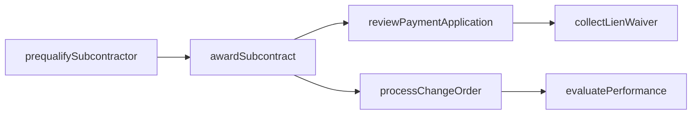
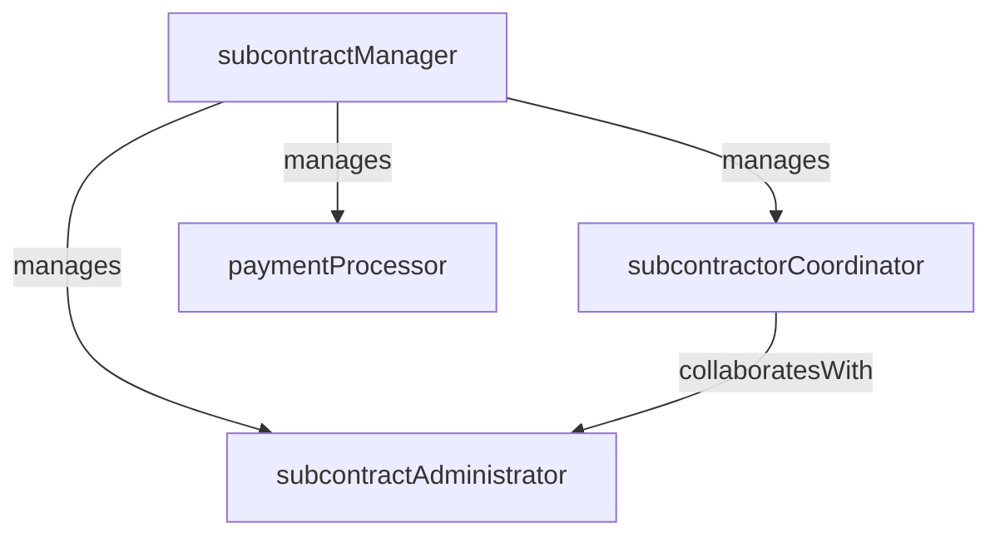

# Subcontractor Management

> Business-as-Code definition for the Subcontractor Management department. Models responsibilities, actions, events, and searches.

## Overview

Subcontractor Management oversees the full lifecycle of subcontractor relationships from prequalification and bid leveling through contract execution, performance evaluation, and closeout. The department ensures that subcontracted scopes are delivered on time, within budget, and in compliance with contract terms, safety requirements, and quality standards.

## Responsibilities

| Responsibility | Description |
|---------------|-------------|
| prequalifySubcontractors | Evaluate subcontractor financial strength, safety record, and capability before invitation to bid |
| administerSubcontracts | Draft, negotiate, execute, and manage subcontract agreements and amendments |
| evaluateSubcontractorPerformance | Track schedule compliance, quality, safety, and cost performance for each subcontractor |
| processPaymentApplications | Review, verify, and approve subcontractor payment applications and retention releases |
| trackLienWaivers | Collect and maintain lien waivers from subcontractors and their lower-tier suppliers |

## Roles

| Role | Description |
|------|-------------|
| subcontractManager | Leads the subcontractor management function and owns subcontract strategy and risk mitigation |
| subcontractAdministrator | Drafts subcontracts, processes amendments, and manages contract compliance documentation |
| subcontractorCoordinator | Interfaces with subcontractors on scheduling, submittals, and day-to-day coordination |
| paymentProcessor | Reviews payment applications, verifies quantities, and processes progress payments |

## Entities

| Entity | Description |
|--------|-------------|
| SubcontractAgreement | Executed contract between the general contractor and a subcontractor defining scope, price, and terms |
| PrequalificationRecord | Assessment of a subcontractor's financial health, insurance, safety record, and past performance |
| PaymentApplication | Subcontractor's periodic request for payment with supporting documentation and schedule of values |
| LienWaiver | Legal document from a subcontractor or supplier waiving lien rights upon receipt of payment |
| PerformanceScorecard | Periodic evaluation of a subcontractor's schedule, quality, safety, and cost performance |

## Actions

| Action | Description |
|--------|-------------|
| prequalifySubcontractor | Evaluate a subcontractor's qualifications and approve or reject for bidding eligibility |
| awardSubcontract | Execute a subcontract agreement with the selected subcontractor for a defined scope |
| reviewPaymentApplication | Verify quantities, retainage, and compliance before approving a subcontractor payment |
| evaluatePerformance | Score a subcontractor's performance on schedule, quality, safety, and cost metrics |
| processChangeOrder | Price, negotiate, and incorporate a scope change into the subcontract agreement |
| collectLienWaiver | Request and record a lien waiver from a subcontractor upon payment |

## Events

| Event | Description |
|-------|-------------|
| subcontractorPrequalified | A subcontractor was evaluated and approved for bidding eligibility |
| subcontractAwarded | A subcontract agreement was executed and the subcontractor was mobilized |
| paymentApplicationApproved | A subcontractor payment application was verified and approved for payment |
| performanceEvaluated | A subcontractor's periodic performance scorecard was completed |
| changeOrderIncorporated | A scope change was priced, approved, and added to the subcontract |
| lienWaiverCollected | A lien waiver was received from a subcontractor and filed in the project record |

## Searches

| Search | Description |
|--------|-------------|
| findPrequalifiedSubcontractors | List subcontractors approved for bidding by trade, region, or project size |
| getSubcontractStatus | Retrieve the current status of all subcontracts on a project including committed value and payments |
| findPendingPayments | List subcontractor payment applications awaiting review or approval |
| getPerformanceScores | Query subcontractor performance ratings by trade, project, or evaluation period |
| findOutstandingLienWaivers | List subcontractors with lien waivers not yet collected for payments made |

## Workflow



## Actor Relationships



## Related Processes

| Process | APQC ID | Relationship |
|---------|---------|-------------|
| Produce/Manufacture/Deliver Product | 4.3 | Manages subcontracted scopes that deliver major portions of the construction work |
| Procure Materials and Services | 4.1 | Administers the procurement and contracting of subcontractor services |

## Related Departments

| Department | Relationship |
|-----------|-------------|
| Estimating | Coordinates subcontractor bid solicitation and scope leveling during the estimating phase |
| Field Operations | Supervises subcontractor work on site and provides daily performance feedback |
| Project Controls | Tracks subcontractor costs, change orders, and payment status against the project budget |
| Construction Safety | Enforces subcontractor safety compliance and reviews safety incident records |

## Usage

```typescript
import { db } from '@headlessly/db'

const dept = await db.departments.get('subcontractorManagement')
const prequalified = await db.departments.search('findPrequalifiedSubcontractors', { trade: 'electrical' })
const pending = await db.departments.search('findPendingPayments', { project: 'proj-2025-017' })
```
