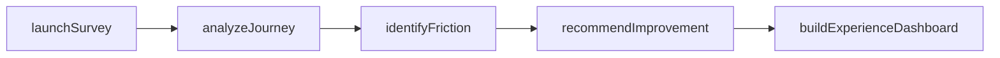
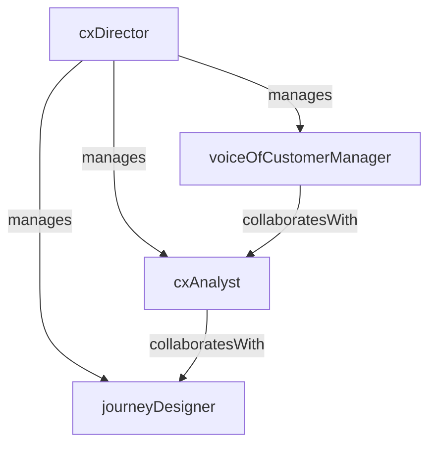

# Customer Experience

> Business-as-Code definition for the Customer Experience department. Models responsibilities, actions, events, and searches.

## Overview

Voice of customer, NPS programs, journey mapping, and experience optimization

## Responsibilities

| Responsibility | Description |
|---------------|-------------|
| runVoiceOfCustomer | Collect, analyze, and act on customer feedback through surveys, interviews, and signals |
| manageNpsProgram | Administer Net Promoter Score surveys and drive improvements based on results |
| mapCustomerJourneys | Document and analyze end-to-end customer journeys to identify friction and opportunities |
| optimizeTouchpoints | Improve key interaction points across onboarding, support, billing, and product usage |
| reportExperienceMetrics | Produce dashboards and reports on CSAT, NPS, CES, and journey completion rates |

## Roles

| Role | Description |
|------|-------------|
| cxDirector | Leads the customer experience function and champions customer-centric initiatives |
| cxAnalyst | Analyzes survey data, journey metrics, and behavioral patterns to generate insights |
| journeyDesigner | Maps and redesigns customer journeys to reduce friction and improve outcomes |
| voiceOfCustomerManager | Manages feedback programs including NPS, CSAT, and customer advisory boards |

## Entities

| Entity | Description |
|--------|-------------|
| JourneyMap | Visual representation of a customer journey with stages, touchpoints, and emotions |
| SurveyResponse | Individual customer response to an NPS, CSAT, or CES survey |
| ExperienceMetric | Key indicator of customer experience quality (NPS, CSAT, CES, time-to-value) |
| TouchpointAssessment | Evaluation of a specific customer interaction point with improvement recommendations |
| FeedbackTheme | Aggregated pattern from customer feedback identifying a systemic issue or opportunity |

## Actions

| Action | Description |
|--------|-------------|
| launchSurvey | Deploy an NPS, CSAT, or custom survey to a target customer segment |
| analyzeJourney | Map and evaluate a customer journey to identify pain points and opportunities |
| identifyFriction | Detect and document touchpoints causing customer frustration or drop-off |
| recommendImprovement | Propose specific changes to processes, products, or touchpoints based on CX data |
| buildExperienceDashboard | Create or update a dashboard visualizing key customer experience metrics |
| conductCustomerInterview | Run qualitative interviews with customers to deepen understanding of experience gaps |

## Events

| Event | Description |
|-------|-------------|
| surveyLaunched | Customer feedback survey deployed to the target audience |
| surveyResultsAnalyzed | Survey response data aggregated and insights documented |
| journeyMapPublished | Customer journey map completed and shared with stakeholders |
| frictionPointIdentified | Significant customer pain point discovered and prioritized for action |
| improvementImplemented | CX-recommended change shipped and measured for impact |

## Searches

| Search | Description |
|--------|-------------|
| getNpsScores | Retrieve NPS scores filtered by segment, cohort, or time period |
| findFrictionPoints | List identified customer pain points by journey stage or severity |
| listJourneyMaps | Search customer journey maps by persona, product, or lifecycle stage |
| getSurveyResults | Retrieve survey response data by campaign or customer segment |
| findFeedbackThemes | Search aggregated feedback themes by category or frequency |

## Workflow



## Actor Relationships



## Related Processes

| Process | APQC ID | Relationship |
|---------|---------|-------------|
| Measure Customer Satisfaction | 6.1.3 | Core owner of NPS, CSAT, and customer experience measurement programs |
| Manage Customer Service | 6.1 | Drives experience improvements across all customer service touchpoints |

## Related Departments

| Department | Relationship |
|-----------|-------------|
| Customer Support | Receives CSAT and ticket feedback data to identify support experience gaps |
| Customer Success Management | Shares journey insights to improve proactive account management |
| Product Management | Provides customer feedback themes and friction data to influence product priorities |

## Usage

```typescript
import { db } from '@headlessly/db'

const cx = await db.departments.get('customerExperience')
const nps = await db.departments.search('getNpsScores', { segment: 'enterprise' })
const friction = await db.departments.search('findFrictionPoints', { severity: 'high' })
```
