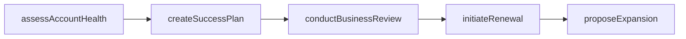
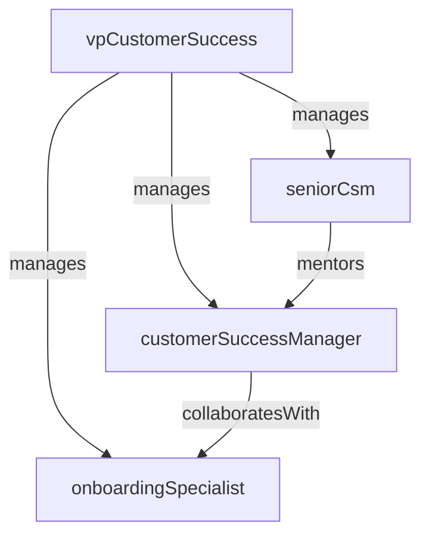

# Customer Success Management

> Business-as-Code definition for the Customer Success Management department. Models responsibilities, actions, events, and searches.

## Overview

Account health monitoring, renewal management, and expansion revenue

## Responsibilities

| Responsibility | Description |
|---------------|-------------|
| monitorAccountHealth | Track usage patterns, engagement scores, and risk indicators across accounts |
| manageRenewals | Drive contract renewals by proactively addressing churn risks and demonstrating value |
| identifyExpansion | Uncover upsell and cross-sell opportunities within the existing customer base |
| conductBusinessReviews | Lead quarterly business reviews with customers to align on goals and outcomes |
| onboardNewCustomers | Guide new customers through implementation, training, and initial value realization |

## Roles

| Role | Description |
|------|-------------|
| vpCustomerSuccess | Leads the customer success organization and sets retention and growth targets |
| seniorCsm | Manages strategic enterprise accounts and drives executive-level relationships |
| customerSuccessManager | Owns a portfolio of accounts, monitors health, and drives adoption and renewals |
| onboardingSpecialist | Guides new customers through setup, configuration, and initial enablement |

## Entities

| Entity | Description |
|--------|-------------|
| Account | Customer organization with associated contracts, contacts, and health metrics |
| HealthScore | Composite metric reflecting account engagement, usage, and risk level |
| RenewalOpportunity | Upcoming contract renewal with timeline, value, and risk assessment |
| SuccessPlan | Documented plan outlining customer goals, milestones, and success criteria |
| BusinessReview | Quarterly review presentation summarizing value delivered and next steps |

## Actions

| Action | Description |
|--------|-------------|
| assessAccountHealth | Evaluate account usage metrics, support tickets, and engagement signals |
| createSuccessPlan | Define customer goals, milestones, and mutual action items |
| initiateRenewal | Begin the renewal process with pricing, terms, and value documentation |
| conductBusinessReview | Present quarterly performance summary and align on upcoming priorities |
| flagChurnRisk | Identify and escalate accounts showing signs of disengagement or dissatisfaction |
| proposeExpansion | Present upsell or cross-sell opportunities based on customer usage patterns |

## Events

| Event | Description |
|-------|-------------|
| accountOnboarded | New customer completed onboarding and achieved initial value milestone |
| healthScoreUpdated | Account health score recalculated based on latest engagement data |
| renewalCompleted | Customer contract renewed for a new term |
| churnRiskFlagged | Account identified as at-risk for non-renewal or downgrade |
| expansionClosed | Upsell or cross-sell opportunity converted to a new or expanded contract |

## Searches

| Search | Description |
|--------|-------------|
| findAtRiskAccounts | List accounts with declining health scores or flagged churn risk |
| getUpcomingRenewals | Retrieve renewals due within a specified time window |
| listSuccessPlans | Search success plans by account, status, or milestone |
| getExpansionPipeline | Retrieve active upsell and cross-sell opportunities |
| findAccountsByHealth | Filter accounts by health score range or engagement tier |

## Workflow



## Actor Relationships



## Related Processes

| Process | APQC ID | Relationship |
|---------|---------|-------------|
| Manage Customer Service | 6.1 | Owns proactive account management and customer retention workflows |
| Manage Customer Loyalty Programs | 6.4 | Drives customer advocacy, expansion, and long-term loyalty |

## Related Departments

| Department | Relationship |
|-----------|-------------|
| Customer Support | Receives support signals that inform account health assessments |
| Sales | Partners on renewal negotiations, expansion deals, and account transitions |
| Product Management | Shares customer feedback and adoption patterns to influence product priorities |

## Usage

```typescript
import { db } from '@headlessly/db'

const csm = await db.departments.get('customerSuccessManagement')
const atRisk = await db.departments.search('findAtRiskAccounts', { healthBelow: 50 })
const renewals = await db.departments.search('getUpcomingRenewals', { daysOut: 90 })
```
