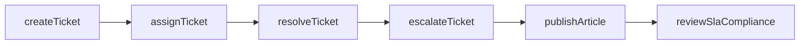
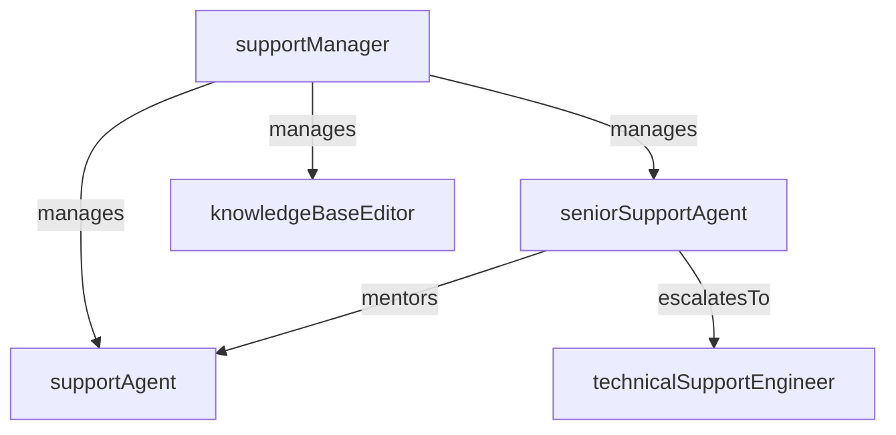

# Customer Support

> Business-as-Code definition for the Customer Support department. Models responsibilities, actions, events, and searches.

## Overview

Ticket resolution, live chat, phone support, and escalation management

## Responsibilities

| Responsibility | Description |
|---------------|-------------|
| resolveTickets | Triage, investigate, and resolve customer support requests across all channels |
| manageSupportChannels | Operate live chat, email, phone, and self-service support channels |
| handleEscalations | Route complex or high-priority issues to specialized teams for resolution |
| maintainKnowledgeBase | Create and update help articles, FAQs, and troubleshooting guides |
| trackServiceLevels | Monitor response times, resolution rates, and CSAT against SLA targets |

## Roles

| Role | Description |
|------|-------------|
| supportManager | Leads the customer support team and sets operational targets |
| seniorSupportAgent | Handles complex tickets, mentors junior agents, and manages escalations |
| supportAgent | Resolves customer inquiries across chat, email, and phone channels |
| knowledgeBaseEditor | Authors and maintains self-service help content and documentation |

## Entities

| Entity | Description |
|--------|-------------|
| Ticket | Customer support request with status, priority, and resolution history |
| KnowledgeArticle | Self-service help document addressing a common question or issue |
| SlaPolicy | Service level agreement defining target response and resolution times |
| CannedResponse | Pre-approved response template for common support scenarios |
| EscalationRecord | Log of escalated tickets with routing path and resolution details |

## Actions

| Action | Description |
|--------|-------------|
| createTicket | Open a new support ticket from a customer inquiry |
| assignTicket | Route a ticket to the appropriate agent or team based on issue type |
| resolveTicket | Close a ticket with a documented resolution and customer confirmation |
| escalateTicket | Elevate a ticket to a higher-tier team or engineering for further investigation |
| publishArticle | Create or update a knowledge base article for self-service resolution |
| reviewSlaCompliance | Audit ticket metrics against SLA targets and flag breaches |

## Events

| Event | Description |
|-------|-------------|
| ticketCreated | New support ticket opened from a customer inquiry |
| ticketAssigned | Ticket routed to an agent or team for handling |
| ticketResolved | Support ticket resolved and closed with customer acknowledgment |
| ticketEscalated | Ticket elevated to a specialized team due to complexity or severity |
| slaBreach | Ticket response or resolution time exceeded the SLA target |

## Searches

| Search | Description |
|--------|-------------|
| findOpenTickets | List unresolved tickets filtered by priority, assignee, or channel |
| getTicketMetrics | Retrieve support KPIs including average response time and CSAT |
| searchKnowledgeBase | Search help articles by keyword or category |
| findEscalatedTickets | List tickets currently escalated to higher-tier teams |
| getSlaBreaches | Retrieve tickets that exceeded SLA response or resolution targets |

## Workflow



## Actor Relationships



## Related Processes

| Process | APQC ID | Relationship |
|---------|---------|-------------|
| Manage Customer Service Requests | 6.2 | Core owner of ticket intake, resolution, and SLA management |
| Manage Customer Complaints | 6.3 | Handles complaint intake and routes to appropriate resolution paths |

## Related Departments

| Department | Relationship |
|-----------|-------------|
| Technical Support | Receives escalated tickets requiring advanced troubleshooting |
| Customer Success Management | Shares customer health signals and recurring issue patterns |
| Customer Experience | Provides CSAT and feedback data to inform experience improvements |

## Usage

```typescript
import { db } from '@headlessly/db'

const support = await db.departments.get('customerSupport')
const tickets = await db.departments.search('findOpenTickets', { priority: 'high' })
const metrics = await db.departments.search('getTicketMetrics', { period: 'last-30-days' })
```
