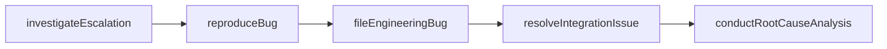
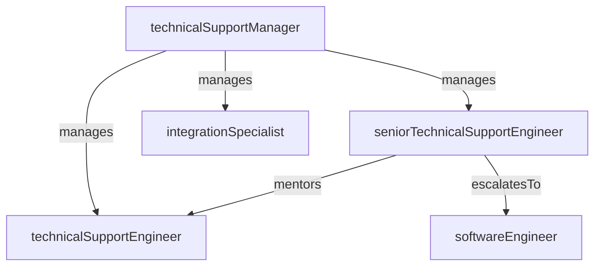

# Technical Support

> Business-as-Code definition for the Technical Support department. Models responsibilities, actions, events, and searches.

## Overview

Advanced troubleshooting, bug reproduction, and engineering escalation

## Responsibilities

| Responsibility | Description |
|---------------|-------------|
| performAdvancedTroubleshooting | Diagnose complex technical issues involving APIs, integrations, and platform behavior |
| reproduceBugs | Recreate reported defects in controlled environments to confirm root cause |
| manageEngineeringEscalations | Route confirmed bugs and platform issues to engineering with detailed reproduction steps |
| maintainTechnicalDocumentation | Author and update troubleshooting guides, runbooks, and integration references |
| analyzeIssuePatterns | Identify recurring technical problems to drive systemic fixes and preventive measures |

## Roles

| Role | Description |
|------|-------------|
| technicalSupportManager | Leads the technical support team and manages escalation workflows |
| seniorTechnicalSupportEngineer | Handles the most complex issues, mentors team, and liaises directly with engineering |
| technicalSupportEngineer | Investigates escalated tickets, reproduces bugs, and documents findings |
| integrationSpecialist | Focuses on customer integration issues including API usage, webhooks, and SDK problems |

## Entities

| Entity | Description |
|--------|-------------|
| EscalatedTicket | Support ticket elevated to technical support requiring advanced investigation |
| BugReport | Documented defect with reproduction steps, environment details, and severity |
| TroubleshootingGuide | Step-by-step technical document for diagnosing specific issue categories |
| IntegrationCase | Customer case related to API, SDK, or third-party integration problems |
| RootCauseAnalysis | Post-resolution document identifying the underlying cause and systemic fix |

## Actions

| Action | Description |
|--------|-------------|
| investigateEscalation | Analyze an escalated ticket to identify the root cause of the technical issue |
| reproduceBug | Recreate a reported defect in a test environment to confirm the behavior |
| fileEngineeringBug | Submit a confirmed bug to engineering with reproduction steps and impact assessment |
| createTroubleshootingGuide | Author a new technical guide for a recurring issue category |
| resolveIntegrationIssue | Diagnose and fix customer integration problems involving APIs or SDKs |
| conductRootCauseAnalysis | Perform post-resolution analysis to identify systemic causes and prevention steps |

## Events

| Event | Description |
|-------|-------------|
| escalationReceived | New technical escalation received from the customer support team |
| bugReproduced | Reported defect successfully reproduced and confirmed in a test environment |
| engineeringBugFiled | Confirmed bug submitted to engineering backlog with full reproduction details |
| integrationIssueResolved | Customer integration problem diagnosed and resolved |
| rootCauseAnalysisCompleted | Post-incident analysis finished with findings and recommendations documented |

## Searches

| Search | Description |
|--------|-------------|
| findOpenEscalations | List escalated tickets currently under technical investigation |
| getBugReports | Search filed bug reports by severity, status, or affected service |
| listTroubleshootingGuides | Search troubleshooting documentation by topic or product area |
| findIntegrationCases | Retrieve open integration-related cases by customer or API endpoint |
| getRecurringIssues | Identify issue patterns that occur across multiple customers or accounts |

## Workflow



## Actor Relationships



## Related Processes

| Process | APQC ID | Relationship |
|---------|---------|-------------|
| Manage Customer Service Requests | 6.2 | Handles advanced technical escalations from frontline support |
| Manage Product and Service Quality | 6.5 | Drives systemic quality improvements through issue pattern analysis |

## Related Departments

| Department | Relationship |
|-----------|-------------|
| Customer Support | Receives escalated tickets requiring technical depth beyond frontline capability |
| Engineering | Submits confirmed bugs and collaborates on root cause analysis and fixes |
| DevOps & Platform | Partners on environment reproduction, log analysis, and infrastructure-level issues |

## Usage

```typescript
import { db } from '@headlessly/db'

const techSupport = await db.departments.get('technicalSupport')
const escalations = await db.departments.search('findOpenEscalations', { severity: 'high' })
const bugs = await db.departments.search('getBugReports', { status: 'confirmed' })
```
