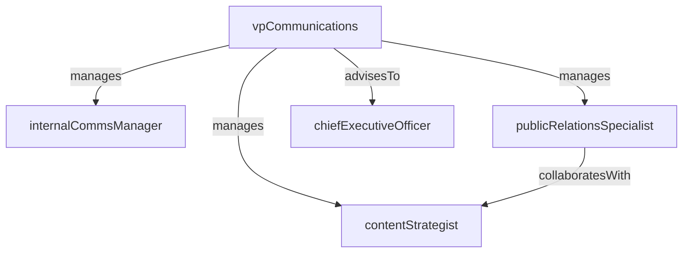

# Corporate Communications

> Business-as-Code definition for the Corporate Communications department. Models responsibilities, actions, events, and searches.

## Overview

Internal/external communications, media relations, brand voice

## Responsibilities

| Responsibility | Description |
|---------------|-------------|
| manageInternalComms | Craft and distribute internal announcements, newsletters, and leadership messages |
| handleMediaRelations | Manage press inquiries, media outreach, and journalist relationships |
| maintainBrandVoice | Ensure consistent tone, messaging, and brand guidelines across all channels |
| coordinateCrisisCommunications | Lead rapid-response communications during incidents, outages, or PR events |
| produceExecutiveContent | Develop speeches, blog posts, and thought-leadership content for executives |

## Roles

| Role | Description |
|------|-------------|
| vpCommunications | Leads the communications function and advises executives on messaging strategy |
| internalCommsManager | Manages employee communications channels and engagement programs |
| publicRelationsSpecialist | Handles media outreach, press releases, and analyst briefings |
| contentStrategist | Plans and produces editorial content aligned with brand narrative |

## Entities

| Entity | Description |
|--------|-------------|
| PressRelease | Official public statement distributed to media outlets |
| InternalAnnouncement | Company-wide or team-specific communication to employees |
| MediaContact | Journalist, analyst, or influencer relationship record |
| CrisisPlaybook | Pre-approved response plan for various incident scenarios |
| BrandGuideline | Document defining brand voice, tone, visual identity, and usage rules |

## Actions

| Action | Description |
|--------|-------------|
| draftPressRelease | Write and review a press release for public distribution |
| publishInternalAnnouncement | Distribute an internal communication to employees |
| briefMedia | Conduct a media briefing or press conference |
| activateCrisisResponse | Initiate crisis communications protocol and stakeholder notifications |
| reviewBrandCompliance | Audit communications materials for brand guideline adherence |
| scheduleExecutiveBriefing | Arrange media or analyst briefings for executive spokespersons |

## Events

| Event | Description |
|-------|-------------|
| pressReleasePublished | Press release distributed to media outlets and posted publicly |
| internalAnnouncementSent | Company-wide internal communication delivered to employees |
| mediaBriefingCompleted | Press briefing or interview session concluded |
| crisisResponseActivated | Crisis communications protocol initiated in response to an incident |
| brandGuidelineUpdated | Brand voice or identity guidelines revised and published |

## Searches

| Search | Description |
|--------|-------------|
| findPressReleases | Search press releases by date, topic, or distribution status |
| getMediaContacts | Retrieve journalist and analyst contacts by beat or publication |
| listInternalAnnouncements | List recent internal communications by audience or channel |
| findCrisisPlaybooks | Search crisis response plans by scenario type |

## Workflow


## Actor Relationships



## Related Processes

| Process | APQC ID | Relationship |
|---------|---------|-------------|
| Build and Sustain Relationships with External Stakeholders | 1.3 | Manages external stakeholder communications and media relations |
| Communicate with Stakeholders | 1.3.2 | Owns stakeholder messaging, investor relations, and public statements |

## Related Departments

| Department | Relationship |
|-----------|-------------|
| Office of the CEO | Produces executive communications and speech content |
| Marketing | Coordinates on brand messaging, campaigns, and public positioning |
| Human Resources | Collaborates on employee engagement and internal culture communications |

## Usage

```typescript
import { db } from '@headlessly/db'

const comms = await db.departments.get('corporateCommunications')
const releases = await db.departments.search('findPressReleases', { year: 2025 })
const contacts = await db.departments.search('getMediaContacts', { beat: 'technology' })
```
