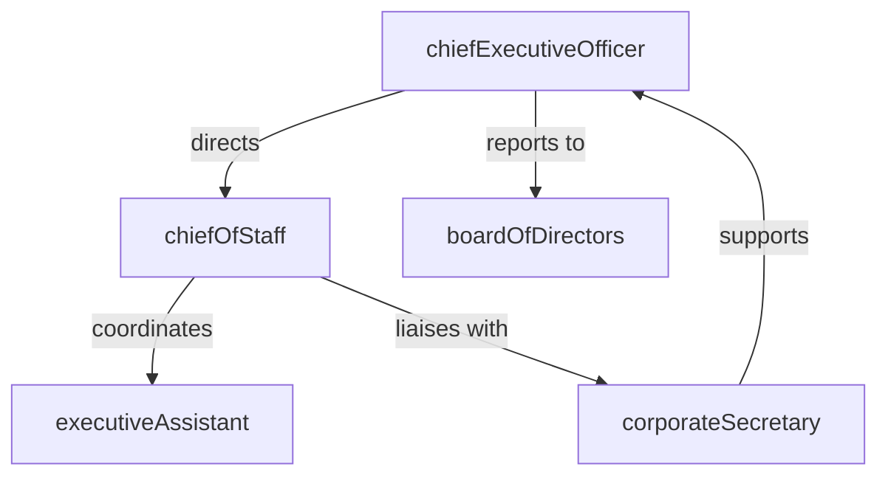

# Office of the CEO

> Business-as-Code definition for the Office of the CEO department. Models responsibilities, actions, events, and searches.

## Overview

Executive leadership and corporate governance

## Responsibilities

| Responsibility | Description |
|---------------|-------------|
| setCompanyVision | Define and communicate the long-term vision and mission for the organization |
| overseeGovernance | Ensure board-level governance, fiduciary duties, and regulatory compliance |
| driveStrategicDecisions | Make final decisions on major investments, partnerships, and organizational changes |
| manageBoardRelations | Maintain productive relationships with the board of directors and key stakeholders |
| shapeOrganizationalCulture | Establish and reinforce company values, culture, and leadership principles |

## Roles

| Role | Description |
|------|-------------|
| chiefExecutiveOfficer | Sets overall company direction and bears ultimate accountability for performance |
| chiefOfStaff | Coordinates cross-functional initiatives and manages executive operations |
| executiveAssistant | Manages scheduling, communications, and administrative support for the CEO |
| corporateSecretary | Oversees board meeting logistics, governance records, and compliance filings |

## Entities

| Entity | Description |
|--------|-------------|
| BoardResolution | Formal decision or directive issued by the board of directors |
| StrategicObjective | High-level goal aligned to the company mission and annual plan |
| ExecutiveBriefing | Summary document prepared for leadership review on key initiatives |
| GovernancePolicy | Corporate policy defining decision-making authority and compliance requirements |
| StakeholderReport | Periodic report to investors, board members, or key partners |

## Actions

| Action | Description |
|--------|-------------|
| setStrategicDirection | Establish company-wide priorities and multi-year strategic goals |
| conductBoardMeeting | Convene and lead board of directors meetings |
| approveInvestment | Authorize major capital expenditures or strategic investments |
| issueExecutiveDirective | Communicate binding decisions across the organization |
| reviewCompanyPerformance | Assess financial and operational metrics against strategic objectives |
| alignLeadershipTeam | Synchronize executive team on priorities, blockers, and cross-functional goals |

## Events

| Event | Description |
|-------|-------------|
| strategicDirectionSet | Company-wide strategic priorities formally established for the planning period |
| boardMeetingConcluded | Board session completed with resolutions documented and ratified |
| investmentApproved | Major investment or acquisition authorized by CEO and board |
| executiveDirectiveIssued | Binding organizational directive communicated to leadership |
| performanceReviewCompleted | Quarterly or annual company performance assessment finalized |

## Searches

| Search | Description |
|--------|-------------|
| getStrategicObjectives | Retrieve current strategic goals and their progress status |
| findBoardResolutions | List board resolutions filtered by date range or topic |
| getExecutiveBriefings | Retrieve recent briefing documents prepared for leadership |
| findGovernancePolicies | Search governance policies by category or compliance domain |

## Workflow


## Actor Relationships



## Related Processes

| Process | APQC ID | Relationship |
|---------|---------|-------------|
| Develop and Manage Business Planning | 1.1 | Owns strategic vision that drives annual business planning |
| Manage Governance and Compliance | 1.3 | Accountable for board governance and regulatory compliance |

## Related Departments

| Department | Relationship |
|-----------|-------------|
| Strategy & Planning | Translates CEO vision into actionable strategic plans |
| Corporate Communications | Amplifies executive messaging to internal and external audiences |
| Financial Planning & Analysis | Provides financial data for board reporting and investment decisions |

## Usage

```typescript
import { db } from '@headlessly/db'

const ceo = await db.departments.get('officeOfTheCeo')
const objectives = await db.departments.search('getStrategicObjectives', { status: 'active' })
const resolutions = await db.departments.search('findBoardResolutions', { year: 2025 })
```
