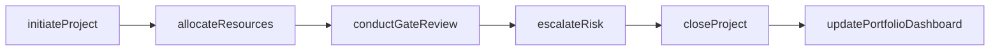
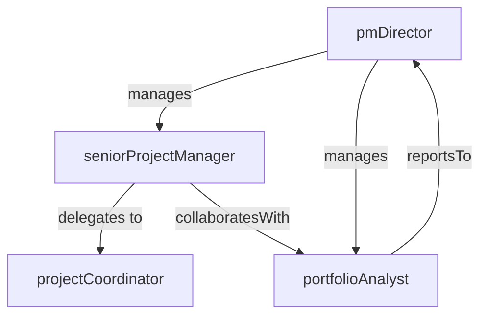

# Project Management Office

> Business-as-Code definition for the Project Management Office department. Models responsibilities, actions, events, and searches.

## Overview

Enterprise project governance, methodology, and portfolio management

## Responsibilities

| Responsibility | Description |
|---------------|-------------|
| governProjectPortfolio | Manage the portfolio of enterprise projects ensuring alignment with strategic goals |
| enforceProjectMethodology | Define and maintain standard project management frameworks, templates, and gates |
| trackProjectPerformance | Monitor project health, milestones, budgets, and risk across the portfolio |
| manageResourceAllocation | Coordinate cross-functional resource planning and capacity management |
| reportPortfolioStatus | Produce executive dashboards and status reports on project portfolio health |

## Roles

| Role | Description |
|------|-------------|
| pmDirector | Leads the PMO function and sets project governance standards |
| seniorProjectManager | Manages large-scale, cross-functional strategic projects |
| projectCoordinator | Supports project scheduling, documentation, and stakeholder communication |
| portfolioAnalyst | Analyzes portfolio-level metrics, resource utilization, and risk exposure |

## Entities

| Entity | Description |
|--------|-------------|
| Project | Scoped initiative with defined deliverables, timeline, and budget |
| Portfolio | Collection of projects managed collectively for strategic alignment |
| Milestone | Key checkpoint or deliverable within a project timeline |
| ResourcePlan | Allocation of people and budget across active projects |
| RiskRegister | Log of identified project risks with mitigation strategies and owners |

## Actions

| Action | Description |
|--------|-------------|
| initiateProject | Charter and kick off a new project with defined scope and sponsors |
| conductGateReview | Evaluate project readiness to proceed at each stage gate |
| allocateResources | Assign people and budget to projects based on priority and capacity |
| escalateRisk | Flag project risks or blockers to executive sponsors for resolution |
| closeProject | Finalize deliverables, capture lessons learned, and archive project |
| updatePortfolioDashboard | Refresh portfolio-level status metrics and executive reporting |

## Events

| Event | Description |
|-------|-------------|
| projectInitiated | New project formally chartered and approved to begin |
| gateReviewPassed | Project cleared a stage-gate review and advanced to the next phase |
| riskEscalated | Project risk elevated to executive sponsors for intervention |
| milestoneCompleted | Key project milestone delivered on or ahead of schedule |
| projectClosed | Project formally completed with deliverables accepted and lessons captured |

## Searches

| Search | Description |
|--------|-------------|
| findActiveProjects | List all in-progress projects filtered by status or department |
| getPortfolioHealth | Retrieve portfolio-level health scores and summary metrics |
| listOverdueMillestones | Find milestones past their target completion date |
| findOpenRisks | Search for unmitigated risks across the project portfolio |
| getResourceUtilization | Check resource allocation and availability across active projects |

## Workflow



## Actor Relationships



## Related Processes

| Process | APQC ID | Relationship |
|---------|---------|-------------|
| Manage Enterprise Programs and Projects | 1.4 | Core owner of project governance and portfolio management |
| Develop and Manage Business Planning | 1.1 | Ensures project portfolio aligns with strategic business plans |

## Related Departments

| Department | Relationship |
|-----------|-------------|
| Strategy & Planning | Receives strategic priorities that drive project selection and prioritization |
| Engineering | Coordinates on technical project delivery and resource allocation |
| Financial Planning & Analysis | Partners on project budgeting, cost tracking, and capital expenditure approvals |

## Usage

```typescript
import { db } from '@headlessly/db'

const pmo = await db.departments.get('projectManagementOffice')
const projects = await db.departments.search('findActiveProjects', { status: 'in-progress' })
const risks = await db.departments.search('findOpenRisks', { severity: 'high' })
```
