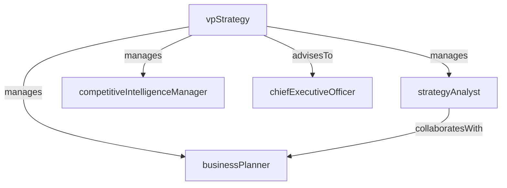

# Strategy & Planning

> Business-as-Code definition for the Strategy & Planning department. Models responsibilities, actions, events, and searches.

## Overview

Strategic planning, competitive analysis, and long-term vision

## Responsibilities

| Responsibility | Description |
|---------------|-------------|
| developStrategicPlan | Create and maintain multi-year strategic plans with measurable milestones |
| conductCompetitiveAnalysis | Monitor market trends, competitor activity, and industry dynamics |
| managePortfolioStrategy | Evaluate and prioritize business unit investments and growth opportunities |
| facilitateOkrProcess | Drive organization-wide goal-setting through OKR or balanced scorecard frameworks |
| assessMarketOpportunities | Identify and size new market segments, partnerships, and expansion paths |

## Roles

| Role | Description |
|------|-------------|
| vpStrategy | Leads strategic planning function and advises the executive team |
| strategyAnalyst | Conducts market research, financial modeling, and competitive intelligence |
| businessPlanner | Translates strategic objectives into operational plans and timelines |
| competitiveIntelligenceManager | Manages ongoing competitor monitoring and threat assessment programs |

## Entities

| Entity | Description |
|--------|-------------|
| StrategicPlan | Multi-year plan documenting vision, goals, and resource allocation |
| CompetitiveReport | Analysis of competitor positioning, strengths, and market share |
| MarketAssessment | Evaluation of market size, growth potential, and entry feasibility |
| OkrSet | Quarterly objectives and key results aligned to strategic priorities |
| PortfolioReview | Periodic evaluation of business unit performance and investment mix |

## Actions

| Action | Description |
|--------|-------------|
| defineStrategicPriorities | Establish the key strategic themes for the planning period |
| analyzeCompetitor | Research and document competitor capabilities and market positioning |
| buildFinancialModel | Create scenario-based financial projections for strategic options |
| presentStrategyReview | Deliver strategic progress updates to executive leadership |
| evaluatePartnership | Assess potential partnerships, acquisitions, or joint ventures |
| setQuarterlyOkrs | Cascade organizational OKRs from strategic priorities |

## Events

| Event | Description |
|-------|-------------|
| strategicPlanApproved | Multi-year strategic plan ratified by executive leadership |
| competitiveReportPublished | New competitive intelligence report distributed to stakeholders |
| marketOpportunityIdentified | Viable new market or segment flagged for further evaluation |
| okrsFinalized | Quarterly OKRs locked and communicated across the organization |
| portfolioReviewCompleted | Business unit portfolio evaluation concluded with recommendations |

## Searches

| Search | Description |
|--------|-------------|
| getStrategicPlan | Retrieve the current strategic plan and its status |
| findCompetitiveReports | Search competitive intelligence reports by competitor or date |
| listMarketAssessments | List market assessments filtered by region or segment |
| getOkrProgress | Check OKR completion rates for the current quarter |
| findPartnershipEvaluations | Retrieve partnership or acquisition evaluations by status |

## Workflow


## Actor Relationships



## Related Processes

| Process | APQC ID | Relationship |
|---------|---------|-------------|
| Develop and Manage Business Planning | 1.1 | Core owner of strategic planning and goal-setting processes |
| Define the Business Concept and Long-Term Vision | 1.1.1 | Responsible for articulating long-term vision and competitive strategy |

## Related Departments

| Department | Relationship |
|-----------|-------------|
| Office of the CEO | Receives strategic direction and reports progress on plan execution |
| Financial Planning & Analysis | Partners on financial modeling and investment prioritization |
| Product Management | Aligns product roadmap with strategic market opportunities |

## Usage

```typescript
import { db } from '@headlessly/db'

const strategy = await db.departments.get('strategyPlanning')
const plan = await db.departments.search('getStrategicPlan', { status: 'current' })
const reports = await db.departments.search('findCompetitiveReports', { competitor: 'acmeCorp' })
```
