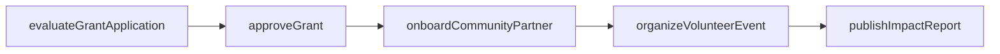
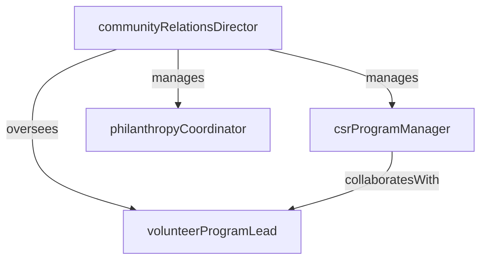

# Community Relations

> Business-as-Code definition for the Community Relations department. Models responsibilities, actions, events, and searches.

## Overview

Corporate social responsibility, philanthropy, and community engagement

## Responsibilities

| Responsibility | Description |
|---------------|-------------|
| manageCSRPrograms | Develop and operate corporate social responsibility initiatives aligned with company values and strategy |
| administratePhilanthropy | Oversee charitable giving, grant programs, and corporate foundation activities |
| coordinateVolunteerPrograms | Organize employee volunteer events, skills-based service projects, and paid volunteer time off |
| buildCommunityPartnerships | Establish and maintain relationships with nonprofits, civic organizations, and community leaders |
| measureSocialImpact | Track and report on the outcomes and effectiveness of community investment programs |

## Roles

| Role | Description |
|------|-------------|
| communityRelationsDirector | Leads community engagement strategy and serves as the primary external community liaison |
| csrProgramManager | Designs and manages corporate social responsibility programs and sustainability initiatives |
| philanthropyCoordinator | Administers grant applications, donation requests, and corporate foundation operations |
| volunteerProgramLead | Organizes employee volunteer events and manages partnerships with community organizations |

## Entities

| Entity | Description |
|--------|-------------|
| CommunityPartnership | A formal relationship with a nonprofit, civic group, or educational institution |
| Grant | A financial award given to a nonprofit organization for a defined purpose and period |
| VolunteerEvent | An organized community service activity for employee participation |
| ImpactReport | A periodic report documenting the outcomes and social impact of community investment programs |
| DonationRequest | An inbound request for corporate charitable contribution or in-kind support |

## Actions

| Action | Description |
|--------|-------------|
| evaluateGrantApplication | Review a nonprofit's grant request against program criteria and funding priorities |
| approveGrant | Authorize a charitable grant and initiate disbursement |
| organizeVolunteerEvent | Plan and coordinate an employee volunteer activity with a community partner |
| publishImpactReport | Compile and release the annual community investment and social impact report |
| sponsorEvent | Provide financial or in-kind support for a community event or initiative |
| onboardCommunityPartner | Formalize a new partnership with a nonprofit or community organization |

## Events

| Event | Description |
|-------|-------------|
| grantAwarded | A charitable grant was approved and funds were committed to the recipient |
| volunteerEventCompleted | An organized employee volunteer activity was successfully held |
| partnershipEstablished | A formal community partnership agreement was signed |
| impactReportPublished | The annual social impact report was released to stakeholders |
| donationProcessed | A corporate charitable contribution was disbursed |
| sponsorshipApproved | A community event sponsorship was authorized and funds allocated |

## Searches

| Search | Description |
|--------|-------------|
| findActivePartnerships | List current community partnerships by region, focus area, or partner organization |
| listGrantsByStatus | Retrieve grants filtered by pending, approved, disbursed, or closed status |
| getVolunteerParticipation | Check employee volunteer hours and participation rates by department or event |
| searchDonationHistory | Look up past donations by recipient, amount, or date range |

## Workflow



## Actor Relationships



## Related Processes

| Process | APQC ID | Relationship |
|---------|---------|-------------|
| Manage External Relations | 12.1 | Core process for community engagement and stakeholder management |
| Manage Public Relations | 12.2 | Coordinates on CSR messaging and community-facing communications |

## Related Departments

| Department | Relationship |
|-----------|-------------|
| Government Relations | Aligns on civic partnerships and policy-related community programs |
| Corporate Communications | Partners on CSR storytelling and social impact reporting |
| Human Resources | Coordinates on employee volunteer programs and engagement initiatives |

## Usage

```typescript
import { db } from '@headlessly/db'

const dept = await db.departments.get('communityRelations')
const partnerships = await db.departments.search('findActivePartnerships', { region: 'west-coast' })
const grants = await db.departments.search('listGrantsByStatus', { status: 'approved' })
```
