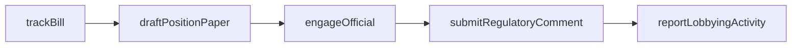
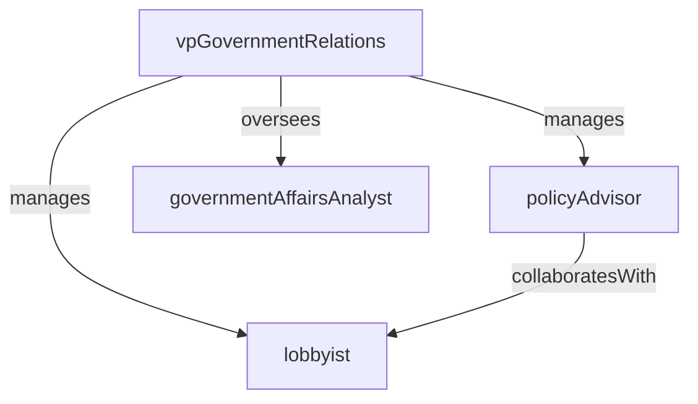

# Government Relations

> Business-as-Code definition for the Government Relations department. Models responsibilities, actions, events, and searches.

## Overview

Lobbying, regulatory engagement, and public policy advocacy

## Responsibilities

| Responsibility | Description |
|---------------|-------------|
| monitorLegislation | Track proposed and enacted legislation, regulations, and executive actions across relevant jurisdictions |
| advocatePolicy | Develop and advance the organization's positions on public policy issues affecting the business |
| manageGovernmentEngagement | Build and maintain relationships with elected officials, regulators, and government agencies |
| coordinateLobbyingActivities | Oversee in-house and contracted lobbying efforts and ensure compliance with disclosure requirements |

## Roles

| Role | Description |
|------|-------------|
| vpGovernmentRelations | Sets government affairs strategy and serves as the organization's primary political liaison |
| policyAdvisor | Researches policy issues, drafts position papers, and prepares testimony and comment letters |
| lobbyist | Engages directly with legislators and regulators to advocate the organization's positions |
| governmentAffairsAnalyst | Monitors legislative calendars, tracks bill status, and produces regulatory intelligence reports |

## Entities

| Entity | Description |
|--------|-------------|
| Legislation | A proposed or enacted law tracked for its potential impact on the organization |
| PolicyPosition | A formal statement of the organization's stance on a specific public policy issue |
| LobbyingActivity | A record of advocacy interactions with government officials including date, topic, and outcome |
| RegulatoryComment | A formal comment submitted in response to a proposed rule or regulatory proceeding |

## Actions

| Action | Description |
|--------|-------------|
| trackBill | Monitor the progress of a specific piece of legislation through the legislative process |
| draftPositionPaper | Prepare a formal policy position statement on a legislative or regulatory issue |
| submitRegulatoryComment | File a public comment in response to a proposed government regulation |
| briefExecutive | Prepare leadership on upcoming government meetings, hearings, or policy developments |
| engageOfficial | Conduct an advocacy meeting with an elected official or government staff member |
| reportLobbyingActivity | File required lobbying disclosure reports with the appropriate government authority |

## Events

| Event | Description |
|-------|-------------|
| legislationIntroduced | A new bill or regulation relevant to the organization was introduced |
| positionApproved | A formal policy position was approved by leadership for external advocacy |
| regulatoryCommentSubmitted | A public comment was filed with a government agency on a proposed rule |
| legislationEnacted | A tracked bill was signed into law or a final rule was promulgated |
| officialEngaged | An advocacy meeting with a government official was completed |
| lobbyingReportFiled | A required lobbying disclosure report was submitted to the relevant authority |

## Searches

| Search | Description |
|--------|-------------|
| findActiveLegislation | List tracked bills and regulations by status, jurisdiction, or policy area |
| searchPolicyPositions | Look up the organization's formal positions by topic or issue |
| listLobbyingActivities | Retrieve lobbying interactions filtered by date, official, or subject matter |
| getUpcomingDeadlines | Find regulatory comment deadlines and lobbying disclosure due dates |

## Workflow



## Actor Relationships



## Related Processes

| Process | APQC ID | Relationship |
|---------|---------|-------------|
| Manage External Relations | 12.1 | Core process for government and public affairs management |
| Manage Legal and Ethical Compliance | 12.2 | Governs lobbying disclosure and political activity compliance |

## Related Departments

| Department | Relationship |
|-----------|-------------|
| Regulatory Compliance | Coordinates on regulatory monitoring and policy impact assessments |
| Corporate Legal | Partners on regulatory filings and compliance with lobbying laws |
| Investor Relations | Aligns messaging on policy issues that affect investor communications |

## Usage

```typescript
import { db } from '@headlessly/db'

const dept = await db.departments.get('governmentRelations')
const bills = await db.departments.search('findActiveLegislation', { jurisdiction: 'federal', status: 'pending' })
const positions = await db.departments.search('searchPolicyPositions', { topic: 'data-privacy' })
```
