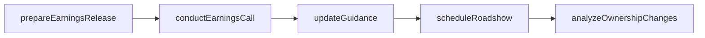
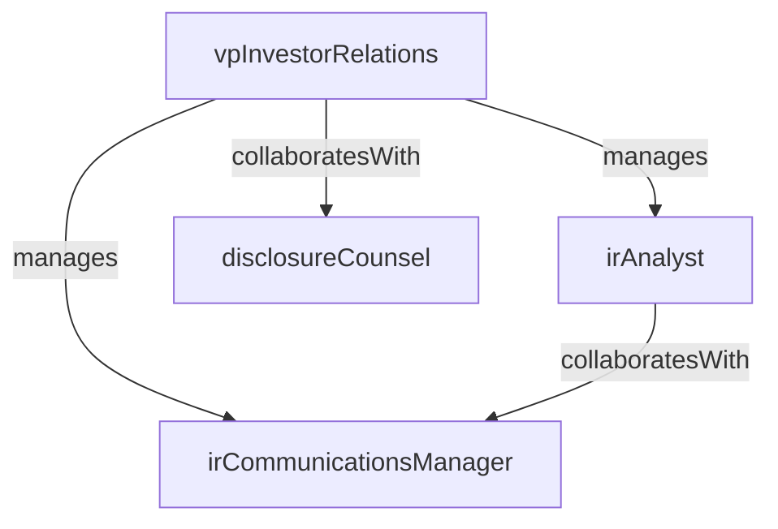

# Investor Relations

> Business-as-Code definition for the Investor Relations department. Models responsibilities, actions, events, and searches.

## Overview

Shareholder communications, earnings reporting, and investor engagement

## Responsibilities

| Responsibility | Description |
|---------------|-------------|
| manageEarningsProcess | Coordinate the preparation and delivery of quarterly and annual earnings releases and calls |
| engageInvestors | Conduct roadshows, conferences, and one-on-one meetings with institutional and retail investors |
| monitorShareholderBase | Track changes in institutional ownership, activist activity, and analyst coverage |
| publishFinancialDisclosures | Prepare SEC filings, proxy statements, and annual reports for regulatory compliance |
| communicateCompanyNarrative | Develop and maintain the equity story, investor presentations, and guidance frameworks |

## Roles

| Role | Description |
|------|-------------|
| vpInvestorRelations | Leads the IR program and serves as the primary spokesperson to the investment community |
| irAnalyst | Prepares financial models, peer analyses, and shareholder intelligence reports |
| disclosureCounsel | Ensures SEC compliance for earnings releases, proxy filings, and material disclosures |
| irCommunicationsManager | Manages the investor website, press releases, and event logistics for investor conferences |

## Entities

| Entity | Description |
|--------|-------------|
| EarningsRelease | A public disclosure of quarterly or annual financial results |
| InvestorPresentation | A slide deck or document prepared for investor meetings, roadshows, or conferences |
| AnalystCoverage | A record of sell-side analysts covering the company and their ratings and price targets |
| ShareholderRegister | A report of institutional and significant shareholders and their ownership positions |
| SECFiling | A regulatory filing such as a 10-K, 10-Q, 8-K, or proxy statement submitted to the SEC |

## Actions

| Action | Description |
|--------|-------------|
| prepareEarningsRelease | Draft and finalize the quarterly earnings press release and financial tables |
| conductEarningsCall | Host the quarterly earnings conference call with analysts and investors |
| scheduleRoadshow | Plan and execute a series of investor meetings in target cities or virtually |
| updateGuidance | Revise forward-looking financial guidance based on updated business outlook |
| analyzeOwnershipChanges | Review 13-F filings and trading data to identify shifts in the shareholder base |
| publishAnnualReport | Produce and distribute the annual report to shareholders and regulatory bodies |

## Events

| Event | Description |
|-------|-------------|
| earningsReleased | Quarterly or annual financial results were publicly disclosed |
| earningsCallCompleted | The quarterly earnings conference call with investors was held |
| guidanceUpdated | Forward-looking financial guidance was revised and communicated to the market |
| analystRatingChanged | A sell-side analyst upgraded, downgraded, or initiated coverage on the company |
| secFilingSubmitted | A required SEC filing was submitted to the regulatory authority |
| roadshowCompleted | A planned series of investor meetings was concluded |

## Searches

| Search | Description |
|--------|-------------|
| getAnalystCoverage | List sell-side analysts covering the company with their latest ratings and targets |
| findTopShareholders | Retrieve the largest institutional shareholders by ownership percentage |
| listUpcomingEvents | Find scheduled earnings calls, conferences, and roadshows within a date range |
| searchSECFilings | Look up regulatory filings by type, date, or content keywords |

## Workflow



## Actor Relationships



## Related Processes

| Process | APQC ID | Relationship |
|---------|---------|-------------|
| Manage External Relations | 12.1 | Core process for investor and shareholder communications |
| Manage Public Relations | 12.2 | Coordinates messaging alignment between investor and public audiences |

## Related Departments

| Department | Relationship |
|-----------|-------------|
| Financial Planning & Analysis | Provides financial data and models for earnings preparation |
| Corporate Legal | Partners on SEC filings, disclosure review, and Regulation FD compliance |
| Government Relations | Aligns on policy issues that may affect investor sentiment |

## Usage

```typescript
import { db } from '@headlessly/db'

const dept = await db.departments.get('investorRelations')
const analysts = await db.departments.search('getAnalystCoverage', { rating: 'buy' })
const shareholders = await db.departments.search('findTopShareholders', { minOwnership: 0.01 })
```
