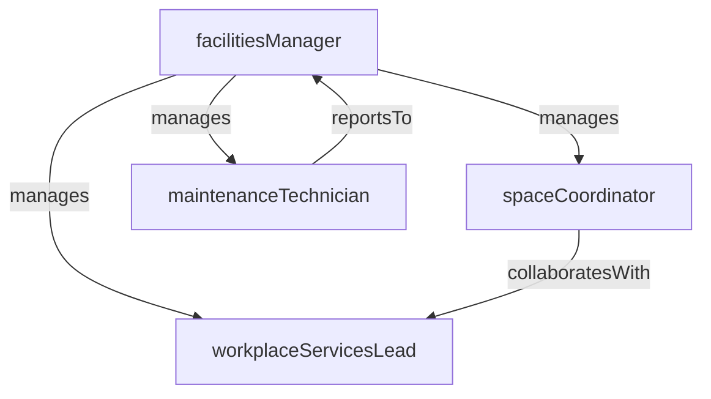

# Facilities Management

> Business-as-Code definition for the Facilities Management department. Models responsibilities, actions, events, and searches.

## Overview

Office operations, space planning, maintenance, and workplace services

## Responsibilities

| Responsibility | Description |
|---------------|-------------|
| manageWorkplaceOperations | Oversee day-to-day building operations including HVAC, lighting, and security systems |
| planSpaceUtilization | Design and optimize office layouts, seating assignments, and shared spaces |
| coordinateMaintenance | Schedule and manage preventive and corrective maintenance for all facilities |
| overseeVendorServices | Manage janitorial, catering, landscaping, and other workplace service providers |
| ensureHealthSafety | Maintain compliance with fire codes, occupancy limits, and workplace safety regulations |

## Roles

| Role | Description |
|------|-------------|
| facilitiesManager | Oversees all building operations and workplace services delivery |
| spaceCoordinator | Plans and manages space allocation, moves, and office reconfigurations |
| maintenanceTechnician | Performs hands-on building repairs and preventive maintenance tasks |
| workplaceServicesLead | Coordinates reception, mail room, catering, and employee amenities |

## Entities

| Entity | Description |
|--------|-------------|
| Facility | A physical building or campus managed by the department |
| WorkOrder | A maintenance or repair request tracked through completion |
| SpacePlan | A floor layout defining desk assignments and room configurations |
| ServiceContract | An agreement with a vendor for ongoing workplace services |
| MaintenanceSchedule | A calendar of planned preventive maintenance activities |

## Actions

| Action | Description |
|--------|-------------|
| submitWorkOrder | Create a new maintenance or repair request |
| assignSpace | Allocate desks, offices, or meeting rooms to teams or individuals |
| scheduleInspection | Plan a periodic building or safety inspection |
| procureService | Engage a vendor for a specific workplace service |
| approveAccessRequest | Grant building or floor access to an employee or contractor |
| closeWorkOrder | Mark a maintenance request as completed and verified |

## Events

| Event | Description |
|-------|-------------|
| workOrderSubmitted | A new maintenance request was logged in the system |
| workOrderCompleted | A maintenance or repair task was finished and verified |
| spaceReassigned | Desk or office allocation was changed for a team or individual |
| inspectionPassed | A scheduled facility inspection was completed with no violations |
| serviceContractRenewed | A vendor service agreement was extended or renegotiated |
| emergencyReported | An urgent building issue such as a leak or power outage was escalated |

## Searches

| Search | Description |
|--------|-------------|
| findOpenWorkOrders | List all unresolved maintenance requests by facility or priority |
| getSpaceUtilization | Retrieve current occupancy rates and vacancy data by floor or building |
| listUpcomingInspections | Find scheduled inspections within a date range |
| searchServiceContracts | Look up vendor contracts by provider, service type, or expiration date |

## Workflow


## Actor Relationships



## Related Processes

| Process | APQC ID | Relationship |
|---------|---------|-------------|
| Plan and Acquire Assets | 10.1 | Core process for facilities lifecycle management |
| Design and Construct Productive Assets | 10.2 | Governs capital improvements and building investments |

## Related Departments

| Department | Relationship |
|-----------|-------------|
| Real Estate | Coordinates on site selection and lease requirements |
| Procurement & Asset Management | Partners on vendor sourcing and asset tracking |
| People Operations | Coordinates on workplace safety programs and employee wellbeing initiatives |

## Usage

```typescript
import { db } from '@headlessly/db'

const dept = await db.departments.get('facilitiesManagement')
const openOrders = await db.departments.search('findOpenWorkOrders', { status: 'open', facility: 'HQ' })
const utilization = await db.departments.search('getSpaceUtilization', { building: 'main-campus' })
```
